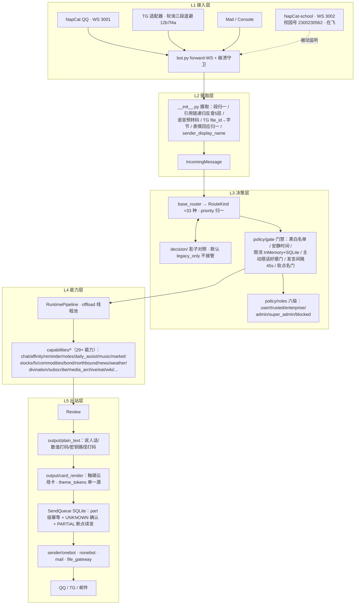
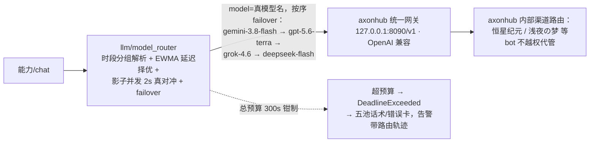
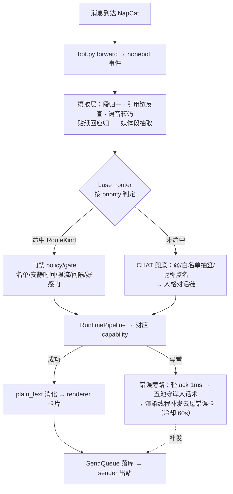

# 守岸人 Bot 交接总报告（2026-09-15 · 用户 mandate 全量更正版）

> **文件身份**：用户 2026-09-15 显式要求的交接报告（AGENTS.md「不再新建带日期交接文档」规矩的用户裁定例外件，先例：`docs/handover-c-20260913.md`）。本文件把此前散在各批次文档里的口径**全部更正、统一**为今日真实状态；此后一切增量仍按维护规矩写入 `docs/HANDBOOK.md`，本文件不再滚动更新（过期即归档）。
>
> **给 AI 的阅读顺序**（最省 token）：根目录 `HANDOFF-NEXT.md`（接手提示词，≤200 行）→ 本文件 §1/§2（架构与流程各读一遍）→ §3 九个统一（按需查权威文件）→ AGENTS.md 第六部分台账按需。**不要**读 `ChatBot_Runtime/`、`ChatBot_Archive/`、任何生成物（`docs/auto-facts.md` 除外，它是机器事实册）。

---

## §1 架构文档（统一口径）

### 1.1 一句话身份

QQ 聊天机器人「守岸人」（鸣潮角色人格、泰缇斯系统第二实例、非 AI 设定），NoneBot2 + OneBot V11（NapCat 正向 WS 127.0.0.1:3001，webhook 8080），附带 Telegram / Mail / Console 适配器。主包 `plugins/bot_unified_runtime/`，Python 3.12，venv 在**兄弟目录** `../ChatBot_Runtime/venv`（不在工作区内）。运行数据根 `ChatBot_Runtime/`（SQLite 群/cookie/日志/缓存，**不可删改**），源码树内相对路径经 `scripts/runtime_paths.py` 全部重映射。

### 1.2 五层架构图（唯一权威口径）



### 1.3 LLM 子链（2026-09-15 链路收敛后口径，旧「26 渠道链 / 17 条」口径作废）



**关键区分（链路收敛后的新纪律）**：**模型名**（model name，OpenAI 兼容 API 的 `model` 字段，bot 侧 failover 单位）≠ **渠道**（channel，axonhub 内部的供应商通道，用户在 axonhub 侧调配）。bot 只发模型名，渠道选择全权归 axonhub——`BOT_MODEL_REGISTRY` 保持为空，链上 id 即模型名，经 `_spec_for` 兜底合成 spec 指向 `BOT_CHAT_BASE_URL`。单跳超时 connect 5s / read 30s（`12b7f4a` 分类拆分）；总预算 `BOT_CHAT_FAILOVER_MAX_SECONDS=300`。计费账本 `llm/ledger.py` 默认关（账单计价已接 `483f852`）。

### 1.4 支撑面

- **control_plane**（默认关）：uvicorn 8742，Bearer + Host 白名单（`eba69b4` DNS rebinding 防护），`/health` `/status` 只读。WebUI 三阶段规格见 §4。
- **人格栈**：personas/shorekeeper 源文件（改前读 AGENTS 规则 8 + `sync_persona_source.py --check` 机械门）；chat 注入 13 分区标签上下文 + 好感/心情/怪癖/身份四层 + 称谓边界（AddressingContext）。
- **定时面**：群摘要 21:30 · daily_assist 早 09:00 / 两餐 11:15-17:15 / 晚 21:00 · reminders 每分钟扫描 · NTP 授时重启 ~65s 起每 10 分钟校时。
- **统一错误报告卡**：能力异常 → 毫秒级文本回执 + 专用线程池 ≈3-33s 后补发云母诊断卡；冷却 60s 降级纯文本；全链 fail-open。

### 1.5 目录地图（完整版见 AGENTS.md 第二部分）

```
ChatBot\                    唯一代码区（本工作区）
├── AGENTS.md               规则+全貌+台账（唯一入口，AI 自动加载）
├── HANDOFF-NEXT.md         接手提示词（新 AI 第二读）
├── COMMANDS.md             命令人读版（command_catalog.py 生成）
├── bot.py                  启动+崩溃守卫+TG 轮询退避
├── docs\                   HANDBOOK(单一活文档) + 本报告 + 规格与契约族
├── plugins\bot_unified_runtime\   主包（config.py 529 字段 bot_* 口径）
├── scripts\                dev.ps1 统一入口 + runtime_paths + 各生成器
├── tests\                  回归树（全离线 mock；用例数以实跑为准）
└── personas\shorekeeper\   人格源（灵魂，红线写死 affinity.py）
ChatBot_Runtime\            运行数据+venv（兄弟目录，不扫描不修改）
ChatBot_Archive\            归档（压缩包+manifest）
```

---

## §2 处理流程文档（统一口径）

### 2.1 消息主链路（一条消息的一生）



### 2.2 LLM 请求生命周期（chat 为例）

1. **组装**：人设全文 + 13 分区运行时上下文 + 反注入包裹 → messages。
2. **路由**：`resolve_active_priority_group` 按当前时刻命中分组（现单组「全天」）→ `route_ids` 给出候选序（EWMA 择优 + 影子并发 2s）。
3. **执行**：逐候选 `providers.py` OpenAI 兼容 POST → axonhub；单跳 connect 5s/read 30s；失败记 attempt 轨迹换下一个模型名。
4. **终点**：成功→文本回流渲染；预算 300s 烧穿→`DeadlineExceeded`；全部失败→`LLMProviderError`（error_kind 区分 network/timeout/server）。
5. **失败面**：告警带 `[kind, chain=N, last=轨迹]`；私聊五池守岸人话术（游标轮换不重复）；群聊 A-19 降级池温和短句（拦截族仍静默）；重错误补发云母诊断卡。

### 2.3 触发判定流程

触发词/命令 → `base_router` matcher 族（priority 从高到低：ADMIN > SUBSCRIBE > 各能力 > NATURAL_COMMAND > CHAT 兜底）→ RouteKind → 能力工厂。**触发词真相源**：`echo.py _HELP_ENTRIES`（79 topics，以 `command_catalog.py --write` 生成物为准）；词族规范化=T-Spec（英文 32 词/拼音全拼+缩写 136 词/繁體补齐/昵称动词），`\b` 词边界防劫持；机器门=route-matrix 覆盖门 + 触发体检棘轮（24→0 清零）+ `test_catalog_document_matches_registry`。

### 2.4 出站与可靠性

SendQueue（SQLite）：part 级幂等去重 → 发送后 UNKNOWN 确认轮询 → PARTIAL 断点 90s 退避续发 → max_attempts=3 终态 FAILED_FINAL。TG 轮询任务三段退避（3→60s 指数×5 后 300s 平顶，仅档位切换打日志）。Mail/文件走 sender 各适配器；下载有 SSRF 护栏（`check_download_url` + 落点复查）。

### 2.5 定时任务一览

| 任务 | 时刻 | 载体 | 失败语义 |
|---|---|---|---|
| 群摘要推送 | 21:30 | digest 调度器（白名单 dedupe 按日） | ⚠️ 存量缺陷两处待修（台账 #33：读零行 + LLM 未接线） |
| daily_assist 早/晚报+两餐 | 09:00 / 11:15 / 17:15 / 21:00 | capabilities/daily_assist.py（推送名单空=整链不注册） | LLM 失败回退原文 |
| 提醒投递 | 每分钟 | reminders.py（≤20/会话） | 迟到>30min 顺延 / 超 24h 作废+守岸人短句告知 |
| NTP 授时 | ~65s 起每 10 分钟 | runtime/timesync.py（±1.5s 钳制、mode=4-only、伪造应答拒收） | 防火墙拦 UDP123 回退系统钟（预期） |
| 好感度惰性回归 / 心情半衰 / 记忆夜间反思 | 内部 | character/* | 静默 |

---

## §3 九个统一（用户 2026-09-15 点名，全量写齐）

> 每条统一 = 统一口径 + 权威文件 + 机器门禁 + 残余。**旧口径冲突处以本节为准。**

### 统一① 架构口径统一
- **口径**：五层（接入/摄取/决策/能力/出站）+ LLM 子链 + 定时面，唯二图源=AGENTS.md 第三部分与本报告 §1。
- **权威**：AGENTS.md 第三部分；本报告 §1（更正版）。
- **门禁**：无（文档层）；架构事实由 `doc_sync.py` 机器册兜底（RouteKind/模板/键数）。
- **残余**：`docs/design/` B2-B5 四规格开放问题待用户裁决（台账 #4）。

### 统一② 流程与流程图统一
- **口径**：消息一生 / LLM 生命周期 / 触发判定 / 出站可靠性 / 定时任务，五张图一套（本报告 §2），旧散图作废。
- **权威**：本报告 §2；细节以代码为准（`__init__.py` / `base_router.py` / `model_router.py` / `SendQueue`）。
- **残余**：mermaid 渲染素材已本地化（#8 治毕），文档图与运行时渲染共用同一语法。

### 统一③ 触发与命令语法统一
- **口径**：一条触发词必须在 help 注册表、route-matrix、command-catalog、COMMANDS.md 四处同生共死。
- **权威**：`echo.py _HELP_ENTRIES`（79 topics）；生成器 `scripts/command_catalog.py --write`。
- **门禁**：`test_catalog_document_matches_registry` + route-matrix 覆盖门（`\b` 词边界）+ 触发体检棘轮 + e2e 命令矩阵 38 例。
- **残余**：方向 2 全词族开放（40 admin topics × 英/简/繁/缩写/全拼/首字母/NL）已批未做；方向 1 的 218 缺口台账待裁决（`4252944`）。

### 统一④ 自动回复链路统一
- **口径**：一切非命令自动行为必须有「**来源门 + 限频门 + 人格话术**」三件套，缺一不上线。
- **清单**（统一后唯一列表）：chat 三触发（@/白名单抽签/昵称点名，同人点名间隔 45s）· 表情回应（五层防刷屏门）· 链接解析（发链即解析）· meme 收库（NSFW 降权）· campus 转发（三重来源门，纯监听绝不回发）· daily_assist / digest / reminders / 授时（见 §2.5）。
- **门禁**：各能力专属回归 + e2e 矩阵；防骚扰门参数全走 config（四键 reactions / 六键 campus 等）。
- **残余**：F6 meme 主动调用防骚扰门待设计评审（有意不上半吊子版，台账 #17）。

### 统一⑤ 大模型回复话术统一
- **口径**：所有面向用户的失败/降级话术池化——每池 ≥12 变体、官方语音文风（用户 2026-09-15 裁定「不要僵硬短句」）、会话游标轮换防重复、守岸人第三人称自称、禁拖尾「～」、禁泄露词（系统提示/密钥/本机/脚本/注入）。
- **五池清单**（唯一权威列表）：反注入护栏 12（chat.py `_INJECTION_GUARD_TEMPLATES`）· 人格失败 12（`_PERSONA_FAILURE_MESSAGES`）· 管理门 12（user_copy.py `ADMIN_GATE_TEMPLATES`）· 群失败 ack 12（`GROUP_FAILURE_ACK_TEMPLATES`）· 错误卡冷却 12（error_report.py `_COOLDOWN_LINES`）。人格话术规则见 `.agents/skills/shuorenhua`。
- **门禁**：`test_user_copy_unification_gate`（Q-04 自称统一+违禁词池级锁）+ `test_user_copy_pool`（池容量 8-16）+ `test_error_card_contract` / `test_error_report`（池成员断言）。
- **残余**：治理回执池 / 语音触点话术待扩池（同规格）。

### 统一⑥ 参数与配置文档统一
- **口径**：一个配置键四处同生：`config.py`（529 字段，bot_* 口径）↔ `.env`（真实 key 只在此，代码用 `env:变量名` 引用）↔ `docs/config-catalog-full.md`（A26 批次 157 键白名单已归零）↔ `docs/auto-facts.md`（机器生成**勿手改**）。
- **门禁**：`test_doc_sync_gates`（catalog covers config fields + 新批次键登记）+ `doc_sync.py --check` 常驻；热改面诚实化：SETTABLE 41 / RESTART_REQUIRED 31（`4608235`）。
- **残余**：help 页脚 7 处旧文案仍称部分键可热改（已知）；台账 #3 SQLite 限流路径不支持热改（架构取舍）。

### 统一⑦ 术语与书写语法统一
- **口径**：全中文文档；置信度四档（verified/high/low/unknown，无证据即 unknown）；「已完成」必带提交哈希或可复跑命令+实跑输出；**模型名≠渠道**（统一① LLM 子链收敛后的强制区分）；日期一律 2026-09-15 形态；哈希一律 7 位短哈希。
- **权威**：AGENTS.md 第一部分规则 + 本节。
- **残余**：历史文档中的旧口径（26 渠道链 / 「17 条网关」/ 509 字段 / 72 topics）以本报告为准作废，不逐处回改（git 可溯）。

### 统一⑧ 文档权威链统一
- **口径**：`AGENTS.md`（唯一入口：规则+全貌+台账）→ `docs/HANDBOOK.md`（单一活文档 §1-§27，一切增量入此）→ `docs/auto-facts.md`（机器事实册）→ 专项文档（rendering-contract / command-catalog / issue-ledger-p2-p3 / perf-optimization-plan / design/* / 本报告）。
- **例外件**（用户 mandate 或历史遗留，不再新增）：`docs/handover-c-20260913.md` · 本报告 · 根目录 `HANDOFF-NEXT.md`（接手提示词唯一槽位）· `docs/nightly-ops-report-20260915.md`。
- **门禁**：README.md 索引与实际文件一致性人工维护；机器事实漂移由 `doc_sync --check` 拦截。

### 统一⑨ 验证与门禁统一
- **口径**：一切「完成」判定走同一条链——域测试 → 四机器门 → 全量 `dev.ps1 -Task test` →（大改）`cross_validate.py` 双引擎互证 → 真机验收（重启后 `e2e_acceptance.py` + acceptance-manual §6.6 族）。
- **四机器门**（全量套件常驻，漂移即红）：`verify_hashes`（12 交付物 SHA-256）· `doc_sync`（机器事实册）· `command-catalog`（79 topics 对账）· `route-matrix`（触发覆盖 `\b`）。
- **命令**：`dev.ps1 -Task test|lint|typecheck|runtime-layout`；直跑 python 必须 venv 绝对路径 + `PYTHONDONTWRITEBYTECODE=1` + `--basetemp -p no:cacheprovider`。
- **残余**：全量用例数不手写——最后一次回填=90274f5（5294 passed/0 failed），此后批次（含今日）未回填终数，以下次实跑为准。

---

## §4 WebUI 全量内容（用户要求整体写入本报告）

### 4.1 现状（已落库）

- control_plane：uvicorn 8742 + Bearer + **Host 白名单**（`eba69b4`，Critical 安全修复：DNS rebinding 防护、畸形 Host 400 不回显、`BOT_CONTROL_PLANE_HOST_ALLOWLIST` 可扩展）+ `/health` `/status` 只读；M1 默认关。
- 观测现状：只有聊天命令（`/bot status/model/logs`）+ 日志文件——**无任何 Web 界面**。
- 规格文档：`docs/design/webui-dashboard-spec.md` v1（`331e2a2`，本节之上游，冲突处以本节为准——其内「17 渠道」旧口径已被统一①链路收敛取代）。

### 4.2 用户需求全集（2026-09-15 逐条收集，一条不漏）

1. **调用统计**：按群/私聊分列 + 群内按用户细分（数据已在 audit.sqlite3，缺聚合 API）。
2. **Token 四项**：输入 / 缓存创建 / 缓存命中 / 输出（providers usage 已可取；ledger 计价支持缓存两类，默认关，需开「记录面」）。
3. **账单与响应延迟**：channel_health EWMA 已有；账单计价已接（483f852）。
4. **配置在线改**：SETTABLE 41 键表单化；RESTART_REQUIRED 31 键诚实只读+生成 .env 片段。
5. **好感度排行榜**：WebUI **直接显示数值**（用户裁定）；聊天内侧维持定性不显数值——两处不同源不冲突（面板=主人观测面，聊天=人格面）。
6. **实时日志控制台**：debug/info/warning/error/critical 过滤、一键复制、**排除用户聊天内容**（隐私）、自由滚动、「问 AI」报错归因。
7. **知识库可视管理**：向量参数可见可调。
8. **插件配置控制面**：单选/多选/填空等控件类型指示（参照 AstrBot 表单）。
9. **模板候选**：AxonHub（`C:\Software\AxonHub`）作 UI 参考模板。

### 4.3 AstrBot 对照与许可证裁决

- AstrBot（`C:\Software\AstrBot`，Tauri 壳+Python 后端+已构建 SPA，文档已抓取至 `D:\Coding\02_Crawlers\Crawl AstrBot\AstrBot文档.txt`）：**AGPL-3.0——交互思路可学，代码/样式一行不搬**（含 dist 产物）。
- 诚实差距五条：观测面弱 / 配置全靠手编 .env / 统计无聚合面 / 插件市场（**有意不追**——单人自用收益为负）/ 多提供商网格（axonhub 已收口，只读展示即可）。
- 我们不追它也没有的：人格纵深/好感 v5/记忆反思/门禁 SSRF 护栏/渲染契约/发送队列幂等——守岸人本体竞争力。

### 4.4 三阶段规格（已批准方向，未排期——用户：「后面再说」「只需要探索」）

- **Phase A 只读仪表盘**：control_plane 挂零构建单文件 SPA（零外部 CDN 离线可开，MIT 模板打底+守岸人主题 token 浅色）；五块=总览 / 调用统计（24h/7d/30d × 会话/用户/能力维度）/ Token 四项堆叠 / 延迟曲线 / 好感度榜（数值+档位色阶）；新只读 API `/api/stats/calls|tokens|latency` + `/api/affinity/board`；前置=ledger 开记录面（usage 四项入行）。
- **Phase B 配置在线改**：SETTABLE 41 键表单化，写路径**必须走 `set_override` 同一函数**（门禁/审计/拒绝语义与聊天侧完全一致）；RESTART 键只读+片段生成；模型/渠道只读展示+片段生成。
- **Phase C 排队**：实时日志控制台（含隐私排除+问 AI）、知识库可视管理、插件配置控件化、会话浏览器、提醒/订阅管理。

### 4.5 状态与裁定记录

- 状态：**只探索不写码**（用户 2026-09-15 明确）；Phase A 的 API/数据面盘点已完成（规格 §二）。
- 已裁定：好感度 WebUI 显数值 ✅ · AstrBot 零抄 ✅ · 插件市场不做 ✅ · 控制面先修 bug 后谈 WebUI ✅（Host 白名单已修）。

---

## §5 项目当前真实状态快照（2026-09-15 午后）

### 5.1 已落库（今日会话主链，哈希可溯 `git log`）

- **超时根修三连**：连接/读取分类拆分+告警路由轨迹+TG 三段退避 `12b7f4a` → 真凶钉死=预算烧穿（`failover:deadline` 实锤）→ 预算 150→300s + 五池话术官方文风 `6ac897b`。
- **链路收敛**（统一①）：26 渠道 id 链→4 真模型名单组，全走 axonhub——**改动在 `.env`（gitignored），证据=可复跑命令**：`parse_priority_groups` 解析+三时刻命中实测 OK + 路由/链路回归 30 passed。
- **生产启动崩溃修复**：pydantic 标量 QQ 号键 int→str 宽容装载 `793e647`。
- **P2-4 文案两波**：极简零泄露版 `ebe6843` → 用户裁定重写 → 四池池化 ≥10 变体 `97d0aa6` → 官方语音文风终版 `6ac897b`。
- **夜间工程总报告** `d7c55b7`（105 笔对账）· WebUI 规格 `331e2a2` · ack 回执阻塞根修 `dcb7b02` · control-plane Host 白名单 `eba69b4` · SETTABLE 诚实化 `4608235` · 触发词双向机械门 `4252944` · daily_assist `da255b0` · 其余夜间审计批 20 笔见 HANDBOOK §25/§26。

### 5.2 未落库/在飞（并行代理工作树，`git status` 实况为准，先取证再收编）

| 在飞席 | 文件 | 状态 |
|---|---|---|
| campus 校园转发 | capabilities/campus.py + sources/campus_store.py + test_campus_digest.py（untracked）+ AGENTS.md 台账行 | 代码完成未提交；启用待用户四步（扫码/白名单/3002/重启） |
| glossary | character/glossary.py + test_glossary_seed.py 改 + test_glossary_recall.py 新 | 在飞 |
| sender 韧性 | sender/onebot.py + worker.py + test_media_rejection_retry_and_fallback.py 新 + render_hashes.json | 在飞 |
| persona 测试 | test_persona_prompt_and_memory.py | 在飞 |
| 机器事实册 | docs/auto-facts.md | doc_sync 重生成在飞（勿手改勿手收） |

### 5.3 等用户动作（AI 只提醒）

1. **提权重启 bot**（最大一批生效清单：链收敛/预算 300s/五池/连接分类/告警轨迹/TG 退避/启动崩溃修复/SETTABLE/夜间审计批全部累积项）。重启前置：`python scripts/pre_restart_check.py` 全 PASS；顺序**先 NapCat 后 bot.py**；重启后验收 acceptance-manual §6.6 族。
2. X cookie 灌入（`Downloads` 临时文件含 auth_token 全量凭据，灌完即删）。
3. campus 启用四步（见 5.2）。
4. push 裁定（分支领先远端数百提交，仅按明确指示推）。

### 5.4 已知问题 Top（全量见 AGENTS.md 台账 #1-#33 + issue-ledger-p2-p3.md）

- 🔴 **群摘要读零行**（shared_group.py session_id 口径错，21:30 推送静默空转）+ **推送路径 LLM 未接线**——campus 批调研发现的两处存量缺陷，未修，建议立项（台账 #33）。
- 台账 #1 测试 tmp_path 化 Wave-6（全量直跑树污染残余）；#3 限流/调度器热改不支持（架构取舍）；#6 cron 用本地时区；#17 meme 主动调用待防骚扰门设计。
- 触发词方向 2 全词族开放（已批未做）；方向 1 的 218 缺口台账待裁决。

---

## §6 给下一个 AI

接手提示词已单独维护在根目录 **`HANDOFF-NEXT.md`**（2026-09-15 全量更正版）——那是为本文件 §1-§5 的浓缩执行版，含硬规矩/自动同步铁律/常用命令/开工三步。**新会话只需让它读 `AGENTS.md` + `HANDOFF-NEXT.md` 两个文件即可满血开工**，本报告作为深读字典按需查阅。
