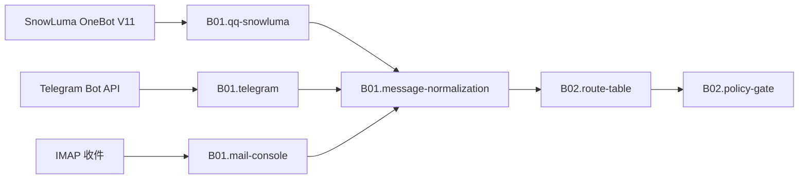

# B01 接入与协议

<!-- BOARD-AUTO:BEGIN -->
<!-- 本节由 scripts/board_doc_sync.py 生成，请勿手改；正文写在标记外 -->

## B01 接入与协议

> 把任意平台的一条原始事件，变成主链路认识的一条入站消息。

职责：

- 适配器连接与重连（QQ/SnowLuma、Telegram、Mail、Console）
- 消息段归一、引用链递归反查、语音预转码、TG file_id 转字节
- 会话键与文本边界的中央件（全仓唯一口径）
- 平台能力面（群资料、贴纸回应、媒体上传）

### 二级功能

| 二级功能 | 一句话 | 三级入口 |
|---|---|---|
| [QQ 协议端接入（SnowLuma / OneBot V11）](qq-snowluma/README.md) | forward-WS 连接、段收发、平台 API 封装与断线对账。 | [群信息](qq-snowluma/group-info.md)、[WS 连接与重连](qq-snowluma/forward-websocket.md)、[入站摄取与段归一](qq-snowluma/incoming-ingest.md)、[引用与合并转发递归反查](qq-snowluma/quote-chain-expand.md)、[群信息与平台能力边界](qq-snowluma/platform-capabilities.md) |
| [Telegram 适配器](telegram/README.md) | getUpdates 网络韧性、file_id 取字节、嵌套块级元素降级。 | [轮询韧性与退避](telegram/polling-resilience.md)、[媒体 file_id 取回](telegram/media-download.md) |
| [邮件与控制台适配器](mail-console/README.md) | 邮件收发桥接与本地控制台交互，共用同一条主链路。 | [来信解析入链](mail-console/mail-inbound.md)、[控制台一次性驱动](mail-console/console-driver.md) |
| [消息归一与身份中央件](message-normalization/README.md) | 会话键、文本边界、发送者显示名等全仓唯一口径的归一层。 | [会话键派生](message-normalization/session-keys.md)、[触发词文本边界谓词](message-normalization/text-boundary.md)、[发送者显示名归一](message-normalization/sender-display.md) |
<!-- BOARD-AUTO:END -->

## 板块职责

B01 只做到「交出一条 `IncomingMessage`」为止。这条消息归谁处理是 B02 的事，把结果发出去是 B08 的事。平台差异必须在本板块内部消化干净：出了 B01，主链路只按 `IncomingMessage` 的 `adapter` / `platform` / `session_type` 等字段分支，不再出现「如果是 QQ 就……」这类散落的形态判断。

切分口径：

- 连接面（谁把事件送进来）：`qq-snowluma`、`telegram`、`mail-console` 各管一个适配器，互不共享代码路径。
- 归一面（事件变成统一消息）：`message-normalization` 是全仓唯一口径的中央件（会话键、文本边界、发送者显示名），被所有域共用，不隶属于任何单个适配器。
- 顺序：适配器事件对象 → 段归一 → 引用链/合并转发反查 → 语音预转码与 TG 媒体取字节 → `IncomingMessage`。

## 上下游

产出契约是 `IncomingMessage`（`plugins/bot_unified_runtime/domains/core/contracts/runtime.py`）。字段面以该模型自持为准，本板块不复述。

## 退役与并入记录

按 `docs/boards/_meta/doc-classification-20260921.md` 的归类判决执行：

- `docs/snowluma-setup.md`（现役协议端）：接入选型、token 规则、与旧端的差异、能力边界，正文并入本板块 `qq-snowluma`，原文件继续作操作性步骤。
- `docs/napcat-setup.md`：2026-09-18 起协议端已换 SnowLuma，定性为回滚件。板块正文不复述其步骤，只在 `qq-snowluma` 保留一行历史口径说明——本仓文档里 09-18 之前写下的 NapCat 字样都指旧端。
- `docs/acceptance-manual.md` §0/§2（装依赖、接 QQ）：接入门槛并入本板块，手册本体留在 B10 作可执行验收规程。
- `HANDOFF-V21R4-B-20260918.md`、`docs/HANDOVER-2026-09-15.md`：归历史证据，按判决归档；本板块只承接其中仍然现役的接入口径。
- 旧路径 `plugins/bot_unified_runtime/domains/chat_reply/ingest/message_context.py`、`mail_adapter.py`、`mail_bridge.py`、`sender/` 现已是再导出垫片，真身分别在 `domains/chat_reply/ingest/`、`domains/transport/mail/`、`domains/transport/sender/`（v21r2 重组 W14/W15d）。引用一律写真身路径。
