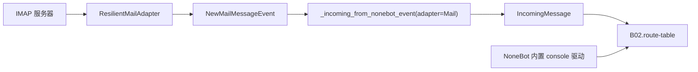

# B01.mail-console 邮件与控制台适配器

<!-- BOARD-AUTO:BEGIN -->
<!-- 本节由 scripts/board_doc_sync.py 生成，请勿手改；正文写在标记外 -->

## B01.mail-console 邮件与控制台适配器

> 邮件收发桥接与本地控制台交互，共用同一条主链路。

- 归属板块：[B01](../README.md)
- 实现落点：`plugins/bot_unified_runtime/domains/transport/mail/mail_adapter.py`、`plugins/bot_unified_runtime/domains/transport/mail/mail_bridge.py`
- 帮助主题：邮件
- 配置键前缀：`bot_mail_`（逐键以目录册为准）

### 三级入口

| 三级入口 | 路由席位 | 能力 id | 别名/帮助页 | 优先级 |
|---|---|---|---|---|
| [来信解析入链](mail-inbound.md) | — | — | — | — |
| [控制台一次性驱动](console-driver.md) | — | — | — | — |
<!-- BOARD-AUTO:END -->

## 这个功能解决什么

邮件是一条「外部世界会主动写进来」的通道：有人给管理邮箱发信，守岸人要能读到、能回，还要能在管理员不在 QQ/TG 时把运维消息递到人手上。它和 console 一起放在这个功能簇里，是因为两者都跑在同一条主链路上——事件一经摄取就变成 `IncomingMessage`，后面路由、门禁、渲染、发送与 QQ 消息毫无二致；区别只在适配器与投递方向。

IMAP 是个容易出事的协议：连接会半开、`UNSEEN` 搜索会挂死、状态机偶尔报非法命令。所以这一簇的大半代码不是在「读邮件」，而是在「出事的时候别把 bot 带走」。

## 处理流程

## 边界与降级

- 两道独立开关：`bot_mail_bridge_enabled`（整条桥，缺省 False）与 `bot_mail_auto_reply_enabled`（收到来信要不要自动回，缺省 False）；另有 `bot_mail_notify_telegram_enabled` 控制「来信转发给 TG 管理员」。任一键关则该路径直接不动作，不是报错。
- 暂停态：`MailBridgeState.paused` 为真时自动回复停发，状态持久化在 `bot_mail_bridge_state_file`（跨重启保留）。
- 身份与别名：来信人按 `bot_mail_sender_aliases` 映射成可读名；未解析出的别名可由 `unresolved_mail_aliases` 列给管理员，绝不猜人。
- 去重：`mail_event_id` / `mail_event_fingerprint` / `mail_event_dedupe_id` 三元组，防同一封邮件被重复摄取。
- 预览长度 `bot_mail_notify_preview_chars` 限住进通知的正文字数；正文里的敏感串照全局纪律由出站打码层处理。
- console 侧：仓库里没有实现文件，见 `console-driver` 页的现役说明。

## 测试与验收

`tests/test_mail_adapter_resilience.py`（重连退避、搜索超时、错误摘要、任务收尾）、`tests/test_mail_bridge.py`（命令解析、状态持久化、去重、别名、通知构造）、`tests/test_nonebot_event_adapters.py`。
真机：`docs/acceptance-manual.md` 的检查表（§5）不含邮件专项——这是手册的既有缺口，按原样登记不代修。现役验收＝自发一封测试信到管理邮箱，观察「被摄取 → 按两道开关决定是否回 → TG 管理员收到且只收到一条通知」。帮助主题 `/bot help 邮件` 属「配置说明项」，命令面是 `/mail …` 一族，逐参数以 `docs/command-catalog.md` 为准。

## 现行缺陷

- 邮件出站通知属审计点名的 A 类旁路同族（绕 review/render）：`docs/audit-20260921.md` §4.1 登记表明确记为「本波未定性」，不做断言；收编方案在 `docs/design/capability-orchestration-adoption-spec.md` §4.2（Wave 4.2，未做）。
- `docs/issue-ledger-p2-p3.md` 在册：`aiosmtplib` 被 mail 适配器钉死在旧版本区间，pip-audit 报出的漏洞项无法在本仓升级（AGENTS 台账 #27 ④）。
