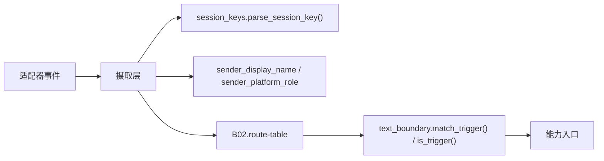

# B01.message-normalization 消息归一与身份中央件

<!-- BOARD-AUTO:BEGIN -->
<!-- 本节由 scripts/board_doc_sync.py 生成，请勿手改；正文写在标记外 -->

## B01.message-normalization 消息归一与身份中央件

> 会话键、文本边界、发送者显示名等全仓唯一口径的归一层。

- 归属板块：[B01](../README.md)
- 实现落点：`plugins/bot_unified_runtime/domains/core/session_keys.py`、`plugins/bot_unified_runtime/domains/core/text_boundary.py`、`plugins/bot_unified_runtime/domains/core/board_placement.py`

### 三级入口

| 三级入口 | 路由席位 | 能力 id | 别名/帮助页 | 优先级 |
|---|---|---|---|---|
| [会话键派生](session-keys.md) | — | — | — | — |
| [触发词文本边界谓词](text-boundary.md) | — | — | — | — |
| [发送者显示名归一](sender-display.md) | — | — | — | — |
<!-- BOARD-AUTO:END -->

## 这个功能解决什么

这一簇管三件「看起来很小、错了很贵」的事：

1. 会话键长什么样。同一棵代码树里曾同时存在 `group_123_456`（NoneBot `get_session_id()` 的真实形态）与 `group:123`（出站 `SendRequest` 与合成消息的命名空间），判据各自只认一种——群摘要查零行、私聊名单门永远不命中这类 bug 因此反复出现。
2. 触发词什么时候算命中。边界字符集一度有六份手抄副本，其中一份混进「了的呢吗呀啊哈」虚词，导致 312 句日常中文里 68.1% 被语音能力劫持。
3. 这条消息是谁发的、该怎么称呼。显示名与平台角色在摄取层一次填好，下游不再各自从事件里刨。

三件事各自只有一个真身文件，全仓共用，任何第二份实现都算违规。

## 处理流程

## 边界与降级

- 会话键判据是 fail-closed 的：半截键（`group_123456` 缺发送者段）、段内夹换行的脏串一律不判群——真实适配器不发这种形态，宁可少判也不让拼脏的键拿到群身份。
- 不覆盖的形态如实登记：官方 QQ 适配器的 `guild_<g>_channel_<c>_<u>`、`friend_<openid>`、console 的 `<channel>_<user>` 都不判群。手上已经有 `IncomingMessage` 时，正解是走契约字段（`message.session_type` / `message.group_id`，见 `domains/chat_reply/policy/rate_limit.py:is_group_session`），这几个中央件只管「拿到的是一个字符串键」的场景。
- 触发词判定宁可不触发也不误触发：`casefold` 会改变长度的极端字符（ß→ss）让折叠串偏移与原串偏移错位，这种输入直接退回逐字精确匹配。
- 繁简口径：靠把繁體条目登记进调用方词表解决，中央件不做 s2t 转换器。
- 三件都是纯函数：零 I/O、零网络、零 config 依赖，可被任意域离线复用。

## 测试与验收

`tests/test_session_keys_central.py`、`tests/test_session_keys_wiring.py`、`tests/test_text_boundary_central.py`、`tests/test_text_boundary_wiring.py`、`tests/test_voice_boundary_central_gate.py`、`tests/test_tts_hijack_guard.py`、`tests/test_b07_sender_level_ingest.py`。
「接线是否到位」由 wiring 族把守（不只判中央件自身，还判消费方有没有真用它）。真机侧没有独立条目——它的验收方式就是全量门禁绿 + 上述行为锁在位。

## 现行缺陷

- `docs/audit-20260921.md` V3-5：边界「判定逻辑已收编且有委托门，但取值仍有手抄副本」——`domains/media/capabilities/media_archive.py` 与 `domains/meme/capabilities/randpic.py` 仍各留一条逐字同串，且现行测试把「改造前的手抄串」钉成字节现状锁。属 P2，收敛前不得单方面改中央取值。
- 中央件的权威字符集与扩展字符集分三段登记（权威集、虚词集、称呼集）；新增调用方必须显式选段，不许再造第四个字符串常量。
