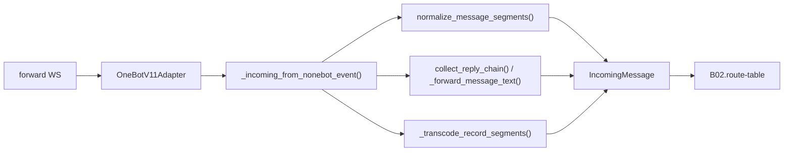

# B01.qq-snowluma QQ 协议端接入（SnowLuma / OneBot V11）

<!-- BOARD-AUTO:BEGIN -->
<!-- 本节由 scripts/board_doc_sync.py 生成，请勿手改；正文写在标记外 -->

## B01.qq-snowluma QQ 协议端接入（SnowLuma / OneBot V11）

> forward-WS 连接、段收发、平台 API 封装与断线对账。

- 归属板块：[B01](../README.md)
- 实现落点：`plugins/bot_unified_runtime/domains/transport/sender/onebot.py`、`plugins/bot_unified_runtime/domains/transport/sender/nonebot.py`、`plugins/bot_unified_runtime/message_context.py`
- 路由席位：`GROUP_INFO`
- 能力 id：`bot.group_info`
- 帮助主题：接入, 合并转发, 群信息
- 配置键前缀：`bot_onebot_`, `bot_snowluma_`（逐键以目录册为准）

### 三级入口

| 三级入口 | 路由席位 | 能力 id | 别名/帮助页 | 优先级 |
|---|---|---|---|---|
| [群信息](group-info.md) | GROUP_INFO | bot.group_info | 群信息 | 41 |
| [WS 连接与重连](forward-websocket.md) | — | — | — | — |
| [入站摄取与段归一](incoming-ingest.md) | — | — | — | — |
| [引用与合并转发递归反查](quote-chain-expand.md) | — | — | — | — |
| [群信息与平台能力边界](platform-capabilities.md) | — | — | — | — |
<!-- BOARD-AUTO:END -->

## 这个功能解决什么

QQ 侧唯一的进/出通道。SnowLuma 以 OneBot V11 正向 WebSocket 连进本机，NoneBot 的 `OneBotV11Adapter` 负责收事件与发指令；这一簇在适配器之上做三件事：把段列表归一成统一文本与段（段类型以摄取层的归一表为准），把协议端查得到的事实查回来（查询面以各 `get_*` 调用为准），把出站请求变成合法的 V11 段交给发送队列。

用户视角：在 QQ 里 @ 守岸人、发链接、发图发语音、回复一条合并转发问「这个讲了什么」，全部走这一条路进来。

## 处理流程

## 边界与降级

- 协议端没起来：重连节奏由适配器自管（间隔以适配器的实现为准），`bot.py` 的日志过滤只把重复堆栈稀疏化——日志变少不等于没在重试。这期间出站落 `bot_unavailable` 告警，任务留在队列不丢。
- 合并转发：只在确有 forward 段时才调 `get_forward_msg`；失败固定打一条 warning（早期版本全吞，「转发无回应」现场毫无线索，为此补的观测）。
- 语音：落盘是 ffmpeg 解不动的裸流时经 `get_record(out_format=mp3)` 预转码（硬超时以该调用的常量为准）；任何失败保持原段，转写按自己的降级面回话。
- 群 API 查不到的（群链接、群相册、群等级/标签）直说查不了，绝不编；公告与精华只对管理员，成员名单不整列，只给统计数。
- 私聊表情回应：QQ 侧本就没有这条通道，SnowLuma 对非群消息直接报 `not supported on private messages`；守卫在派发前拦下，不发即不失败。
- 历史口径：本仓 2026-09-18 之前的文档里「NapCat」指旧协议端，保留原文不改写；现役是 SnowLuma。

## 测试与验收

离线：`tests/test_nonebot_event_adapters.py`、`test_forward_message_ingest.py`、`test_forward_and_mood.py`、`test_poke_notice_ingest.py`、`test_b07_sender_level_ingest.py`、`test_text_at_mention.py`、`test_group_info.py`、`test_nonebot_sender.py`、`test_onebot_chunk_budget_floor.py`、`test_perf_forward.py`、`test_reactions.py`。
真机：`docs/acceptance-manual.md` §2（接 QQ）、§6.3/§6.4（逐能力）、§6.5（重启前置与已知边界）；协议端侧步骤在 `docs/snowluma-setup.md`。用例数与 topic 数以最近一次 `dev.ps1 -Task test` 实跑输出和机器册 `docs/auto-facts.md` 为准，本文不手写。

## 现行缺陷

- 入群欢迎与随机图主动发是 B 类旁路（直调 `call_api`，绕开 review/render/发送队列），入群欢迎正文仍是手写字面量：`docs/audit-20260921.md` V3-2 与 §4.3；收编属 `docs/design/capability-orchestration-adoption-spec.md` §4.2（Wave 4.2，未做）。
- 摄取、matcher 装配与调度器注册集中在根 `__init__.py`（事实中央），新增接线必须改根文件：同审计 V1-2。Wave 4.1 的外迁方案未做。
- 冻结的 matcher 坐标表与现场漂移（同审计 V2-6）：登记条目里只有带「同波审计实读刷新」注记的那条是对的，条数以登记表现算为准。因此本板块只写函数名与文件路径，不写行号。
- 协议端在线状态只有离线时才知道：`bot_unavailable` 的 `source_bot=unknown` 形态已在台账 #20 定性为历史批次聚合，非现行缺陷，重启后再观察。
