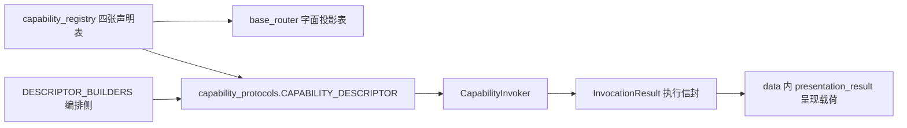

# B02.capability-registry 能力注册表与调度壳

<!-- BOARD-AUTO:BEGIN -->
<!-- 本节由 scripts/board_doc_sync.py 生成，请勿手改；正文写在标记外 -->

## B02.capability-registry 能力注册表与调度壳

> 每能力一行的 keystone 声明源，与中央调度信封的收编进度。

- 归属板块：[B02](../README.md)
- 实现落点：`plugins/bot_unified_runtime/domains/chat_reply/runtime/capability_registry.py`、`plugins/bot_unified_runtime/domains/chat_reply/runtime/service_wiring.py`、`plugins/bot_unified_runtime/capabilities`
- 帮助主题：功能管理, 帮助

### 三级入口

| 三级入口 | 路由席位 | 能力 id | 别名/帮助页 | 优先级 |
|---|---|---|---|---|
| [声明源与投影表一致性](keystone-declarations.md) | — | — | — | — |
| [调度信封与呈现契约分层](invocation-envelope.md) | — | — | — | — |
| [新增能力登记流程（先建模块与函数）](new-capability-checklist.md) | — | — | — | — |
<!-- BOARD-AUTO:END -->

## 这个功能解决什么

一个能力要"被系统看见"，需要同时回答七件事：占哪个路由席位、叫什么能力 id、优先级多少、算不算确定性命令、要不要绑 matcher、有没有内部说明、帮助主题归谁。这些属性早期散在 `base_router.py` 的多张手写清单里，新增一个能力要改四五处，漏登一处就出现"代码在跑但没人知道它存在"的隐身能力。

本功能把它们收成**每能力一行的 keystone 声明源**：`domains/chat_reply/runtime/capability_registry.py::ROUTE_CAPABILITY_DECLARATIONS`，同文件另有接口清单、内部受控能力、帮助主题三张表。它只声明数据、不 import 包内任何模块，因此不会造成循环依赖；`base_router` 在 import 时从它构造 `COMMAND_ROUTE_KINDS`。

第二层问题是"同一个 id 在几处各登记一次、彼此漂移"。现在的口径是：这四张表是**声明式输入源**，而"某个 capability_id 是否在册、它的 handler/健康探针/降级说明/门 id/帮助主题/路由席位是什么"的**唯一答案**是 `plugins/bot_unified_runtime/runtime/capability_protocols.py::CAPABILITY_DESCRIPTOR`（由多路输入取并集派生，编排侧那一路是同模块的 `DESCRIPTOR_BUILDERS`）。消费面（`domains/ops/features/feature_catalog.py` 与 `scripts/command_catalog.py`）都改读这张唯一表。

## 处理流程

执行信封与呈现契约是正交两层、不是同一抽象：`plugins/bot_unified_runtime/runtime/capability_protocols.py::InvocationResult` 回答"这次调用执行得怎样"（status / via / elapsed / attempts），呈现契约 `CapabilityResult` 回答"给用户看什么"。全树各只一份，由唯一性门执法。

## 边界与降级

- 声明行的 `execution` 列不填＝该能力**只在册、未接入中央 invoker**，属诚实在册而非已接入；缺口逐条记在缺口账测试里（见下节指针），本文不写条数。
- 四张表的**字面形态不可改成运行时构造**：机器册、命令目录、文档门禁、触发词提取四处静态解析器按源码文本提取，不 import 插件包。
- 描述符完整性校验在构造期：`health_probe` 填了就必须是壳内已注册的探针，否则当场红。
- 信封不变量：成功态才允许携带呈现载荷且必须是已 dump 的 dict；失败/降级态不得携带载荷且必须给非空 `detail`（诚实降级说明，不静默、不假成功）。

## 测试与验收

`tests/test_capability_registry.py`（声明源与 base_router 投影逐字段一致性 + 帮助主题一致性）、`tests/test_capability_single_registration.py`（同一 id 全树只准一处 authoring）、`tests/test_capability_result_unique.py`（两份同名结果件的分层唯一性）、`tests/test_descriptor_wiredness_ledger.py`（在册/接入缺口账）。真机侧无独立验收条目：本功能不产生对外行为，能力是否真的接上以 `bot.*` 各能力自己的验收为准。

## 现行缺陷

中央调度层的分波收编（Wave 1–4）未全部完成——哪些能力已经经 invoker 执行、哪些仍走直连，以 `tests/test_descriptor_wiredness_ledger.py` 的活体缺口账为唯一准绳，本文不抄一份会漂移的清单。挂账全貌见根目录 `HANDOFF-FIXWAVE-20260921.md` 与 `docs/design/capability-orchestration-adoption-spec.md`。
