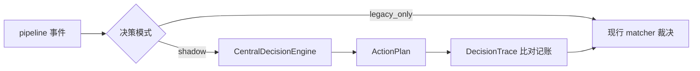

# B02.decision-engine 决策引擎

<!-- BOARD-AUTO:BEGIN -->
<!-- 本节由 scripts/board_doc_sync.py 生成，请勿手改；正文写在标记外 -->

## B02.decision-engine 决策引擎

> 影子对照记录分歧，接管进度由配置模式控制。

- 归属板块：[B02](../README.md)
- 实现落点：`plugins/bot_unified_runtime/domains/core/decision`
- 帮助主题：决策
- 配置键前缀：`bot_decision_`（逐键以目录册为准）

### 三级入口

| 三级入口 | 路由席位 | 能力 id | 别名/帮助页 | 优先级 |
|---|---|---|---|---|
| [影子对照与分歧记账](shadow-mode.md) | — | — | — | — |
<!-- BOARD-AUTO:END -->

## 这个功能解决什么

现在"一条消息交给哪个能力"是分散在 NoneBot matcher 与 `base_router` 判定序里决定的，想改一处判定就得把所有分支读一遍。决策引擎要把它变成一份可解释的东西：先算出决策链与动作计划，再和现行裁决对照。

阶段 0 的立场很保守：**引擎只算不发**。它把每次经过 pipeline 的事件算出一个 plan 写进 trace，与旧 matcher 的实际裁决比对记账，对外行为逐字节不变。这样"引擎会不会接管"成了一个可以拿数据回答的问题，而不是一个信仰问题。

## 处理流程

模式解析链在 `domains/core/decision/shadow.py::resolve_decision_mode`：NoneBot driver config → 进程环境变量 `BOT_DECISION_ENGINE_MODE` → 默认 `legacy_only`。`normalize_decision_mode` 把非法值与未启用值一律回落 `legacy_only`（fail-closed，同一值只告警一次）。引擎骨架与决策链在 `domains/core/decision/engine.py::CentralDecisionEngine`，产物类型 `ActionPlan` / `ActionKind` / `AbilitySpec`。

## 边界与降级

- 现网缺省是 `legacy_only`：引擎完全不参与，本功能处于休眠态，不是"已经在工作但看不见"。
- `engine_only` 是保留值：阶段 0 一律回落 `legacy_only`，不会因为写错配置就意外接管发送。
- 影子覆盖有已知边界：只覆盖经过 `RuntimePipeline.handle/handle_async` 的 message 事件；C 类直连与 notice 类不经 pipeline，因此不会被比对。
- 全链 fail-open：影子观测自身任何异常只降级为"这一轮不观测"，绝不把异常传给对话链路。

## 测试与验收

`tests/test_decision_engine_shadow.py`（三态行为与零接管）、`tests/test_decision_trace_persistence.py`（trace 落盘与比对）。真机无独立验收条目：默认模式下线上无可观察行为差异，切 `shadow` 后以 trace 有分歧记账为准。

## 现行缺陷

接管（迁移阶段 1+）未实施：`engine_only` 未启用、决策结果不改变任何回执。规格与开放问题见 `docs/design/` 的中央决策引擎规格（B2），其未裁决开放问题登记在 AGENTS 台账「已知问题」表。旧路径包 `plugins/bot_unified_runtime/decision/` 是再导出垫片，真身在 `domains/core/decision/`。
