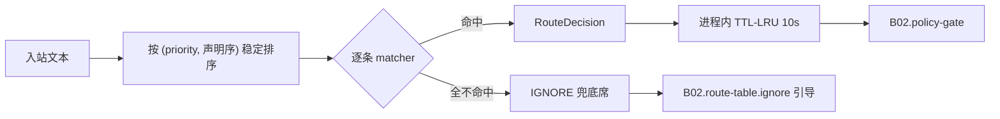

# B02.route-table 路由表与判定序

<!-- BOARD-AUTO:BEGIN -->
<!-- 本节由 scripts/board_doc_sync.py 生成，请勿手改；正文写在标记外 -->

## B02.route-table 路由表与判定序

> base_router 的 RouteKind 枚举、RouteRule 注册表与优先级判定序。

- 归属板块：[B02](../README.md)
- 实现落点：`plugins/bot_unified_runtime/domains/chat_reply/runtime/base_router.py`
- 路由席位：`ALIAS`, `NATURAL_COMMAND`, `IGNORE`
- 能力 id：`bot.alias`, `bot.natural_command`, `bot.ignore`
- 帮助主题：路由, 昵称, 自然语言, 忽略

### 三级入口

| 三级入口 | 路由席位 | 能力 id | 别名/帮助页 | 优先级 |
|---|---|---|---|---|
| [昵称命令](alias.md) | ALIAS | bot.alias | — | 10 |
| [自然语言命令](natural-command.md) | NATURAL_COMMAND | bot.natural_command | — | 45 |
| [IGNORE](ignore.md) | IGNORE | bot.ignore | — | 999 |
| [matcher 族与谓词](matcher-family.md) | — | — | — | — |
| [优先级判定序与拆位](priority-order.md) | — | — | — | — |
| [命令路由成员资格](command-route-membership.md) | — | — | — | — |
<!-- BOARD-AUTO:END -->

## 这个功能解决什么

一条消息进来，得先确定「这是哪件事」。如果这件事的判断散落在各能力里各自 `if 文本里有 XX`，就会出现同一句「天气 黄金」被天气和金价两个能力抢、或者「说话要注意分寸」被语音能力劫持这类事故。本功能簇把判定收在一处：一张按优先级排序的规则表，一次确定性分类，产出一个可审计的 `RouteDecision`（种类、能力 id、优先级、理由、审计标签）。

只判断，不执行、不发消息——这是这个文件的自述，也是它能被影子引擎平行复算的前提。

## 处理流程

## 边界与降级

- 空文本直接判 `IGNORE`，不进规则循环。
- 每条能力自己的开关在 matcher 内部先判（`bot_<能力>_enabled`）：关掉的能力不再抢路由，而不是「命中后被拒」。
- 同优先级按书写序先到先得；书写序就是声明登记序，不做物理重排（审计与文档生成依赖它）。
- 判定结果有 10 秒进程内缓存，按「有无昵称解析器 + 文本」去重，且缓存条目持 config 强引用并校验同一性——不同 config 对象（测试、多实例）互不串结果。管理员改路由相关配置最迟 10 秒生效，需要立即生效调 `clear_route_decision_cache()`（设置保存监听已自动接线）。
- 兜底席不再是无声黑洞：`is_command_form_text` 为真的输入（`/bot …` 打错、`/help` 等）回一句守岸人语气的引导，且同会话 60 秒只回一次；普通闲聊、空消息、被限流/安静时间拦下的静默语义不受影响。
- 自然语言命令（`NATURAL_COMMAND`）把「帮我查天气」归一化成标准命令文本后交给目标能力，判定与执行分两步记账。

## 测试与验收

`tests/test_route_order_semantics.py`（判定序与书写序语义）、`tests/test_route_priority_disambiguation.py`（金融与天气/点歌让路矩阵）、`tests/test_route_ignore_guide.py`（兜底引导与节流）、`tests/test_trigger_bidirectional_gate.py`（触发词双向门）、`tests/test_finance_route_wiring.py`、`tests/test_llm_route_priority_v21r2.py`、`tests/test_capability_registry.py`（三快照一致性）、`tests/test_doc_sync_gates.py`（route-matrix 行对齐）。
真机：`docs/acceptance-manual.md` §6.6.1 触发形态抽样（英文/拼音/繁體/昵称 + 劫持负样本）。席位与优先级现值一律以 `docs/auto-facts.md` 与 `docs/route-matrix.md` 为准，本卡不手写数量。

## 现行缺陷

- 判定链与执行装配分居两处：规则表在本文件，NoneBot matcher 注册在根 `__init__.py`（事实中央）。同一能力可能「表里有、根文件没接线」或反之，靠 `tests/test_capability_registry.py` 与 route-matrix 门兜住，属结构问题非行为缺陷（审计 V1-2）。
- 审计 V2-6：50 条冻结 matcher 坐标表与现场漂移，守它的门只比字符串非空。对策是坐标棘轮改为回读源码，尚未全面落地；本页因此只写函数名。
- 影子引擎与现行表对同一条消息各判一次，分歧只记账不干预（见 `decision-engine`）。接管未开始。
