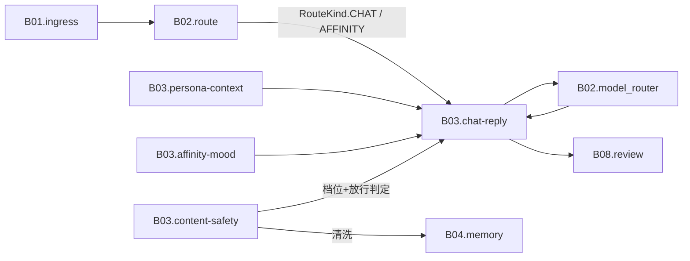

# B03 人格·对话·内容安全

<!-- BOARD-AUTO:BEGIN -->
<!-- 本节由 scripts/board_doc_sync.py 生成，请勿手改；正文写在标记外 -->

## B03 人格·对话·内容安全

> 让她像守岸人，并且任何设定都越不过写死的红线。

职责：

- 人格上下文分区注入与反注入包裹
- 对话回复、称谓与身份、怪癖演化审核
- 好感度与心情（算法说明只定性，不展示固定数值）
- 内容安全六硬线与亲密模式路由（任何设定不可架空）

### 二级功能

| 二级功能 | 一句话 | 三级入口 |
|---|---|---|
| [人格对话与回复](chat-reply/README.md) | CHAT 主能力：上下文拼装、失败话术池、分段换行统一。 | [人格对话](chat-reply/chat.md)、[人格提示词拼装](chat-reply/prompt-assembly.md)、[失败与降级话术池](chat-reply/failure-copy-pools.md)、[戳一戳互动五件套](chat-reply/poke-interaction.md) |
| [人格上下文与称谓身份](persona-context/README.md) | 分区上下文、称谓边界、会话身份、人格源与副本同步。 | [上下文分区渲染](persona-context/context-sections.md)、[称谓与主角边界](persona-context/addressing.md)、[会话身份与自助偏好](persona-context/session-identity.md)、[人格源与运行副本一致性](persona-context/persona-sync.md)、[反注入包裹与指令剥离](persona-context/anti-injection.md) |
| [好感度与心情](affinity-mood/README.md) | 好感度多因素步长与心情双轴，驱动语气与主动行为。 | [好感度查询](affinity-mood/affinity.md)、[分数模型与档位](affinity-mood/affinity-model.md)、[态度文案与红线场景](affinity-mood/affinity-copy.md)、[心情双轴与回归](affinity-mood/mood-axes.md) |
| [怪癖演化](quirks/README.md) | propose→管理员 approve→渲染 的审核制人格演化。 | — |
| [内容安全与亲密模式](content-safety/README.md) | 六硬线确定性闸、亲密档位判定、名单门与记忆净化。 | [六条硬线与不可架空](content-safety/hard-lines.md)、[亲密档位与双开关](content-safety/intimate-mode.md)、[四名单与群级门](content-safety/roster-gates.md)、[记忆侧净化同源](content-safety/memory-sanitize.md) |
<!-- BOARD-AUTO:END -->

## 板块职责

切分的依据是「谁决定她说话的样子，谁决定她能不能说这句话」这两件事同源：
人格上下文与内容安全闸如果拆成两块，红线就会在两块之间各写一份、各自漂移
（历史上繁简折形漏在守界侧、`memory_sanitize` 与 `content_safety` 各抄一份词面，
都是同一件事被切成两处导致的）。所以本板块收三件事：

- **她是谁**：人格源档案、上下文分区拼装、称谓与身份、心情与好感带来的语气偏移；
- **她怎么说**：CHAT 主能力的提示词装配、出站整形（括号动作/分段/说人话）、失败话术池；
- **她不肯说什么**：确定性内容安全闸（六条硬线 + 未成年 fail-closed）、亲密档位判定与
  名单门、记忆侧清洗（与守界闸共用同一份词面）。

与其他板块的边界：消息进来长什么样是 [B01](../B01-ingress-protocol/README.md)；
路由席位与中央调度信封是 [B02](../B02-routing-dispatch/README.md)——本板块只声明自己
占用的席位（`CHAT` / `AFFINITY`）与优先级，不实现调度；模型走哪个渠道、失败转移
预算属 B02/B09 的 `llm_engine`，本板块只提供「这轮该用哪一档候选序」的回调；
长期事实与反思归 [B04](../B04-memory-knowledge-notes/README.md)，本板块只管
写入记忆前的净化那一刀；卡片怎么画、怎么发出去归 [B08](../B08-render-outbound/README.md)，
本板块只交正文与 `CapabilityResult`。

## 上下游

入站只有两种：B02 判定为 `CHAT`/`AFFINITY` 的消息，以及被动事件（戳一戳、表情回应）
经 B01 归一后投给 B03 的登记件。出站一律交回中央管线（review → renderer → send_queue），
本板块内不存在任何直接发消息的代码。

## 退役与并入记录

- 散在 `docs/affinity-design.md` 的 v4/v5/v6 章节 + `docs/design/affinity-v7-design.md`：
  数值规范仍留原处（它是设计权威与回归锁的引用对象），本板块 affinity 三页改为
  「口径 + 指针」，不复制数值表。
- `docs/design/v21r5-C-brief-final.md`、`docs/design/r18-taxonomy-20260920.md` 的裁定结果：
  现役口径并入 [六条硬线](content-safety/hard-lines.md) 与 [亲密档位](content-safety/intimate-mode.md)；
    裁定过程件按 `_conventions` 的既有留档条款留在 `docs/design/` 与 `.superpowers/`，不搬运。
- `AGENTS.md` 第四部分「人格对话 / 好感度 / 角色权限 / 心情 / 怪癖 / 会话身份」六行功能表：
  正文并入本板块对应页，AGENTS 侧只留指针。
- 旧方案「模型自评标签 `<intimacy:high|low>` 注入 + 升级重试」整体退役
  （2026-09-17：gemini 与 grok 都把它当注入攻击整轮拒答），现役检测为纯本地信号；
  只在该页「现行缺陷/历史」处留一句防复活的说明，不写成现役。
