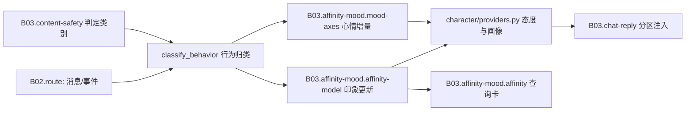

# B03.affinity-mood 好感度与心情

<!-- BOARD-AUTO:BEGIN -->
<!-- 本节由 scripts/board_doc_sync.py 生成，请勿手改；正文写在标记外 -->

## B03.affinity-mood 好感度与心情

> 好感度多因素步长与心情双轴，驱动语气与主动行为。

- 归属板块：[B03](../README.md)
- 实现落点：`plugins/bot_unified_runtime/domains/chat_reply/character/affinity.py`、`plugins/bot_unified_runtime/domains/chat_reply/character/mood.py`
- 路由席位：`AFFINITY`
- 能力 id：`bot.affinity`
- 帮助主题：好感度
- 配置键前缀：`bot_affinity_`, `bot_mood_`（逐键以目录册为准）

### 三级入口

| 三级入口 | 路由席位 | 能力 id | 别名/帮助页 | 优先级 |
|---|---|---|---|---|
| [好感度查询](affinity.md) | AFFINITY | bot.affinity | — | 41 |
| [分数模型与档位](affinity-model.md) | — | — | — | — |
| [态度文案与红线场景](affinity-copy.md) | — | — | — | — |
| [心情双轴与回归](mood-axes.md) | — | — | — | — |
<!-- BOARD-AUTO:END -->

## 这个功能解决什么

她对每个人的态度不该是同一个模板，也不该能被一句话刷到极端。这两层负责把
「相处」折算成两件事：**印象**（对具体某个人，天-周尺度）和**心情**（她自己，分钟-小时尺度）。
印象决定语气基调与称呼许可，心情决定开不开口的意愿与表达的暖意。两层都是连续量、
都随时间自然回落，没有「攒够多少分解锁」这种门槛。

第二件事是把**展示纪律**钉死：她内心的数字是隐私，只有用户主动查（好感度卡、榜单、
算法页）才出现；日常回复里数值一律打码。算法说明**只讲道理不讲算术**——绝不出现
「一句好话加几分」这类固定加减数值（2026-09-12 用户实弹反馈裁定，有测试执法）。
还有一条硬红线：**任何档位都不攻击、不强硬、不冷暴力**，负向档位只是距离感。

## 处理流程

## 边界与降级

- 缺席不扣分：长时间不说话**不会**让好感往下走（政策常量 `_PASSIVE_DECAY_ENABLED=False`），
  只有实际发生的负面言行会计分；难听的记忆则随时间淡出，淡完回到基准。
- 拒答≠辱骂：她温和守界时不算负面事件（行为归类与守界动作同源，避免「被拒绝还要扣分」）。
- 幂等与冷却：同一事件靠 `source_event_id` 幂等、交互级冷却防连点刷分；
  单日变化受滚动预算与熔断护栏约束，正负通道独立记账、互不挤占。
- 管理员权威信号（`delta_override`、戳一戳正向）走专用通道：不乘个人系数、
  不吃新鲜度递减，但仍受冷却、负向单事件上限、日位移上限与值域边界钳制。
- 存储异常：读失败按「无记录=基准印象」处理并回一行日志，绝不因好感层故障让回复失败；
  列缺失走 ALTER-if-missing 自动迁移（家规同 affinity 三列先例），运行数据不清空。
- 学习护栏：昵称与画像只学「怎么称呼对方」，管理档案名与被划为红线的内容不许被学进去
  （名字与昵称污染的清洗有专项锁）。
- 权限：查询卡私聊看双向、群聊看本群榜单（有印象成员网格），内心数值不外泄给第三方。

## 测试与验收

`tests/test_affinity.py`、`tests/test_affinity_numerical.py`、`tests/test_affinity_query.py`
（展示与文案锁）、`tests/test_affinity_tag_fade.py`（印象淡出）、
`tests/test_affinity_v21*.py`（预算/信号/幂等）、`tests/test_affinity_v6_smoothing.py`
（平滑层 + **算法文案定性无数字**回归锁）、`tests/test_affinity_v7.py`（潜变量层行为锁，
含「滚」字假阳性族）、`tests/test_v21_affinity_replay.py`（存量账本重放与补偿）、
`tests/test_mood.py`、`tests/test_forward_and_mood.py`。
真机：`docs/acceptance-manual.md` §6.6 系列（好感度卡与算法页形态）+
`docs/design/v21r5-restart-acceptance-checklist.md` 观察点。

## 现行缺陷

- **v7 目前是灰度关**：`bot_affinity_v7_enabled` 缺省 False，即线上仍是 v4/v5/v6 口径
  （v6 平滑层在位）。代码与行为锁都已在，开启属用户裁决 + 重启，别按「已生效」叙述。
- v7 的这批键**故意没进 `SETTABLE_KEYS`**（热改口径待收尾统一裁决），
  所以别指望运行时改它们。
- v5/v6 的算法说明页与 v7 的算法说明页共用一套文案锁；两版并存期间，文案改动必须
  两条路径都复跑，否则会出现「开关一开、文案锁失效」的假绿（owner 待补一条
  开关两态都断言的锁）。
- 心情速率帽的窗口记账在进程内，重启清零，重启后第一个窗口不受重启前事件约束（P2 折衷）。
- 每日位移上限按自然日（进程本地时区），与安静时间的时区口径不一致时会出现边界日
    帽宽抖动（同 `AGENTS.md` 台账里 cron 时区那条，未统一）。
