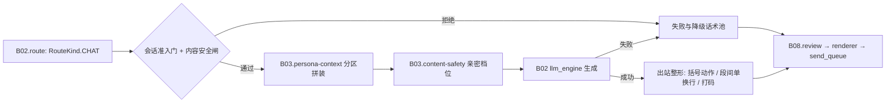

# B03.chat-reply 人格对话与回复

<!-- BOARD-AUTO:BEGIN -->
<!-- 本节由 scripts/board_doc_sync.py 生成，请勿手改；正文写在标记外 -->

## B03.chat-reply 人格对话与回复

> CHAT 主能力：上下文拼装、失败话术池、分段换行统一。

- 归属板块：[B03](../README.md)
- 实现落点：`plugins/bot_unified_runtime/domains/chat_reply/capabilities/chat.py`、`plugins/bot_unified_runtime/domains/chat_reply/capabilities/poke.py`
- 路由席位：`CHAT`
- 能力 id：`bot.chat`
- 帮助主题：对话, 聊天, 回复, 戳一戳
- 配置键前缀：`bot_chat_`, `bot_poke_`（逐键以目录册为准）

### 三级入口

| 三级入口 | 路由席位 | 能力 id | 别名/帮助页 | 优先级 |
|---|---|---|---|---|
| [人格对话](chat.md) | CHAT | bot.chat | — | 50 |
| [人格提示词拼装](prompt-assembly.md) | — | — | — | — |
| [失败与降级话术池](failure-copy-pools.md) | — | — | — | — |
| [戳一戳互动五件套](poke-interaction.md) | — | — | — | — |
<!-- BOARD-AUTO:END -->

## 这个功能解决什么

她是「守岸人」，不是一个会答话的接口。这条链路负责把一条自然语言消息变成**以她的口吻
说出来的话**：先决定这轮该不该由她开口，再把人格档案、称谓边界、好感与心情、记忆与
知识、当前时间与联网所得拼成一份分区的提示词，交给模型，最后把模型的输出整形成
出站文本（括号动作拆段、段间单换行、数值与本地路径打码）。

第二件事是**失败也要像她**：模型链全红、上下文缺件、被反注入拦下、管理员门拒了，
都不该吐「Error: xxx」，而是从话术池里换一句守岸人语气的短句；群里能力失败时补一句
温和反馈，而不是 @ 了她却石沉大海。

第三件是被动互动：戳一戳的「回戳 + 话术 + 群内 @ 戳者 + 好感小额正向」四态组合，
按配置确定性轮换，不打扰为主。

## 处理流程

## 边界与降级

- 模型侧全链失败：走 B02 的失败转移与链级 fail-fast，最终由本功能出**可见降级**——
  私聊用守岸人话术池（`chat.py` 内的人格失败池与通用运维句），群聊由管线补一句
  降级池短句（会话级节流，防刷屏）。限流拦截、安静时间拦截、超载快败的静默是
  故意的降频设计，不走降级池。
- 上下文缺件（人格档案读不到、记忆/知识服务未装配）：分区留空不渲染，绝不编造内容；
  装配期缺件会体现在 `/bot status` 与告警里。
- 提示词超预算：从最旧的非 system 轮次裁起，正文尾部加「内容已按上下文预算裁剪」句，
  而不是整条丢掉。
- 出站整形失败：兜回纯文本，不阻断发送。
- 权限：话术池与路由席位任何人都能触发（自然语言对话本就是对全员开放的能力），
  但**改配置**只能管理员/超管经控制面或 `.env` 重启（铁律：改代码必须重启）。

## 测试与验收

离线：`tests/test_chat_provider_chain.py`、`tests/test_persona_prompt_and_memory.py`、
`tests/test_persona_failure_messages.py`、`tests/test_persona_injection_v21.py`、
`tests/test_roleplay_paragraphs.py`、`tests/test_poke_v2.py`、`tests/test_poke_unified_reaction_b10.py`、
`tests/test_bgroup_chat_pipeline.py`、`tests/test_chat_token_limit.py`（清单以机器册
`docs/auto-facts.md` 派生为准，不在本文手写数量）。
真机：`docs/acceptance-manual.md` §6.6.1（触发形态）、§6.6.7（戳一戳 v2 + 内容感知路由）、
`docs/design/v21r5-restart-acceptance-checklist.md`（内容政策与亲密档位段）。

## 现行缺陷

- 会话准入的**活性**没有端到端用例：静态可达性锁全绿，而「被拦消息是否真的到不了模型」
  只靠人工观察；按 `_conventions` 第六节「存在性锁不算修好」应补一条杀行为的用例（P1）。
- 群聊降级短句的节流表在进程内，重启清零，重启后的第一个窗口不受重启前事件约束（P2，
  与心情速率帽同类折衷）。
- 戳一戳模块 `poke.py` 的头注仍写「回戳（`bot_poke_poke_back`，默认关）」，而配置真身
  缺省为 True（`bot_poke_reply_enabled`/`bot_poke_poke_back` 缺省开）——注释滞后于代码，
  属 P2 文档漂移，改注释即可，别照注释改行为。
