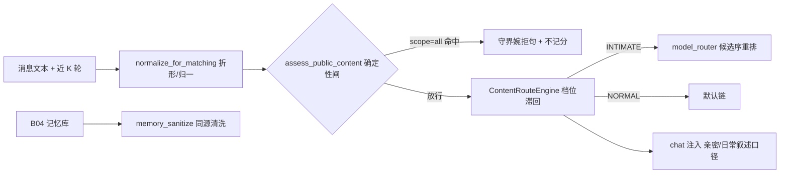

# B03.content-safety 内容安全与亲密模式

<!-- BOARD-AUTO:BEGIN -->
<!-- 本节由 scripts/board_doc_sync.py 生成，请勿手改；正文写在标记外 -->

## B03.content-safety 内容安全与亲密模式

> 六硬线确定性闸、亲密档位判定、名单门与记忆净化。

- 归属板块：[B03](../README.md)
- 实现落点：`plugins/bot_unified_runtime/domains/chat_reply/runtime/content_route.py`、`plugins/bot_unified_runtime/domains/chat_reply/security`
- 帮助主题：亲密模式
- 配置键前缀：`bot_content_route_`, `bot_master_love_`（逐键以目录册为准）

### 三级入口

| 三级入口 | 路由席位 | 能力 id | 别名/帮助页 | 优先级 |
|---|---|---|---|---|
| [六条硬线与不可架空](hard-lines.md) | — | — | — | — |
| [亲密档位与双开关](intimate-mode.md) | — | — | — | — |
| [四名单与群级门](roster-gates.md) | — | — | — | — |
| [记忆侧净化同源](memory-sanitize.md) | — | — | — | — |
<!-- BOARD-AUTO:END -->

## 这个功能解决什么

一句话：**任何设定都越不过写死的那几条**。用户可以把内容政策放得很开（2026-09-17、
2026-09-20 两轮裁定），但残害身体、窒息、侮辱性调教与系统级贬低、未成年、暴力 SM、
非人化牲口式对待这几条不能因为「用户设定」「管理员身份」「亲密模式已开」而被绕过去。
这件事必须**确定性**（本地词面 + 结构，不调模型、不看放行参数），否则就是一次
模型配合度测试，而不是一条红线。

第二件事是**档位**：哪些对话可以按成年自愿的亲密口径来（切到更配合的模型、放宽篇幅与
表现力），哪些必须留在公开面口径。第三件事是**记忆侧同源**：已经进库的历史事实如果
含硬线内容，清洗面必须用同一份词面，不能守界拦一套、清洗另一套。

## 处理流程

## 边界与降级

- 全模块 fail-open 到「安全缺省」：判定或路由内部异常时返回 NORMAL / 原文本，
  绝不影响主链路；但 scope="all" 的硬线判定**不参与降级**——降级只会更保守，不会更宽。
- 繁简必须折形：词面只登记简体，繁体输入先折形再匹配（现用 zhconv，库不可用时
  降级到字级兜底表并显式告警）；曾出现「装了库、调用了、折形为零」的静默陷阱，
  现在 import 期有折形探针自检，探针不过按库不可用处理。
- 未成年是 **fail-closed**：歧义（年龄/身份语境不明、出现儿童化信号）一律按拒绝处理，
  即使声称成年。这条是本项目唯一不服从用户字面指令之处，理由与偏差披露见
  `docs/design/r18-taxonomy-20260920.md`，不得在文档或代码里偷偷放宽。
- 群聊亲密面默认关闭：白名单为空即整群不开（绝不猜群），黑名单永远赢；
  2026-09-19 起群内改为「群级钉 + 个人级钉」两级，详见
  [亲密档位与双开关](intimate-mode.md) 与 [四名单与群级门](roster-gates.md)。
- 拒答≠惩罚：被守界拒掉的消息**不扣好感度**（`classify_behavior` 与守界同源），
  避免「她拒绝我，所以她讨厌我」的错误反馈环。
- 权限：所有名单与档位参数都是管理员/超管侧配置，会话内只有
  「亲密模式 开/关」这一条命令可拨（群内非管理员只影响自己）。

## 测试与验收

`tests/test_content_safety_v2.py` … `test_content_safety_v6.py`（逐轮裁定的行为锁：
六硬线中英样本、儿童化 fail-closed、CJK 邻接望卫、繁简折形与错误 locale 两把锁、
共现窗口、不可绕过结构锁、过拦对照组）、`tests/test_content_route.py` /
`test_content_route_v3.py`（滞回、双开关、四名单、TTL）、
`tests/test_content_route_threading.py`（并发）、`tests/test_memory_sanitize.py`（清洗同源）。
真机：`docs/acceptance-manual.md` §6.6.7/§6.6.8 + `docs/design/v21r5-restart-acceptance-checklist.md`。

## 现行缺陷

- 拦截面是**词面 + 共现窗口**，不是语义理解：改写、拆句、夹带外语仍可能穿透。
  最后一道是人格层软防线（`personas/` 与 Runtime 副本的「亲密边界」节）。
  已知残留：真人色情、兽奸两类刻意不做词面化（词面化必误伤），只靠人格层兜——
  这是 2026-09-21 CRIT-FIX-3 席的明确取舍，不是漏做。
- 词面表与档位阈值都在代码里，热改需要重启；跨「守界 / 清洗 / 路由」三处的口径靠
  共享常量保证，新增类别时**必须**同时过三侧的锁（历史上出现过单侧改动导致漂移）。
- 亲密档位的判定是纯本地启发式，误判方向是「宁宽不窄」（误命中只让当轮换一个模型，
  人格提示照常注入，无害），但这也意味着公开面里出现强词会被切档——用户已裁定接受。
