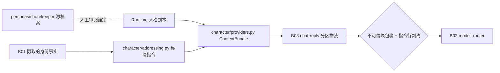

# B03.persona-context 人格上下文与称谓身份

<!-- BOARD-AUTO:BEGIN -->
<!-- 本节由 scripts/board_doc_sync.py 生成，请勿手改；正文写在标记外 -->

## B03.persona-context 人格上下文与称谓身份

> 分区上下文、称谓边界、会话身份、人格源与副本同步。

- 归属板块：[B03](../README.md)
- 实现落点：`plugins/bot_unified_runtime/domains/chat_reply/character`、`personas/shorekeeper`
- 帮助主题：人格, 身份, 上下文

### 三级入口

| 三级入口 | 路由席位 | 能力 id | 别名/帮助页 | 优先级 |
|---|---|---|---|---|
| [上下文分区渲染](context-sections.md) | — | — | — | — |
| [称谓与主角边界](addressing.md) | — | — | — | — |
| [会话身份与自助偏好](session-identity.md) | — | — | — | — |
| [人格源与运行副本一致性](persona-sync.md) | — | — | — | — |
| [反注入包裹与指令剥离](anti-injection.md) | — | — | — | — |
<!-- BOARD-AUTO:END -->

## 这个功能解决什么

模型本身不认识「守岸人」，也不记得现在在跟谁说话。这个功能负责把「她是谁、
在跟谁说话、对方是什么身份」这三件事，变成一份**结构固定、来源可辨、越界不了**的
上下文：人格正文与分区指令由这里产出，别处只准消费不准再抄一份。

它同时挡两类事故：①把第三方正文（检索摘要、被引用的聊天记录、转发的消息）
当指令执行；②把称谓搞错——群里把每个群友都叫「漂泊者」、或者用户自己没说过性别
却被猜成某种性别。这两类都是真实发生过的生产问题，不是假想需求。

## 处理流程

## 边界与降级

- 人格文件读不到（路径为空/文件缺失/编码异常）：该段正文留空并记一行告警，
  **不降级成「没有人设的通用助手」**——缺人设时宁可走失败面（见
  [失败与降级话术池](../chat-reply/failure-copy-pools.md)）。
- 记忆/知识/梗检索内容一律按不可信资料处理：包进 `[UNTRUSTED_USER_TEXT]` 块 +
  句级剥离指令形态，绝不做「来源看起来权威就直灌」。
- 称谓：私聊可用「漂泊者」，群聊默认群友；性别为 unknown 时不猜；超管 master
  是唯一显式例外（配置来源，不是文案推断）。用户自设的称谓偏好优先于自动推断，
  但群聊里的保留字「漂泊者」会被忽略并回退展示名（防自斥指令）。
- 会话身份与标签只能调整称呼与语气亲疏，核心人格事实由人格档案冻结，
  任何标签都不能推翻（渲染文本内建护栏声明）。
- 怪癖（quirks）走审核制，未过审对提示词零影响；per-user 怪癖无 sender 上下文时
  fail-closed 只渲染全局项。

## 测试与验收

`tests/test_persona_injection_v21.py`（版本库注入胶水）、`tests/test_persona_source_sync.py`
（源与副本一致性门，含覆盖面自锁）、`tests/test_addressing_context.py`（称谓四态 +
保留字回退）、`tests/test_creator_dualname.py`（创造者双名单一事实源）、
`tests/test_admin_roster_and_roles`（管理名册注入）、反注入相关探针用例散在
`tests/test_chat_provider_chain.py` 与 `tests/test_v21r2_content_probe.py`。
真机：`docs/acceptance-manual.md` §6.6.1（触发与称谓形态抽样）。

## 现行缺陷

- 「分区清单」没有机器门保证顺序：分区内容各有断言，但**顺序漂移**不会被拦
  （提示词顺序变化会影响模型行为却全绿）——属 P2，建议由 owner 补一条顺序快照锁。
- 人格源与运行副本**不是**可推导的投影（实测逐行重合率≈0），一致性只能靠
  「人工审阅凭证」锚定；这意味着「改了 personas/ 忘了改副本」这类漂移永远存在，
  防线只有 `scripts/sync_persona_source.py` 的 SOURCE_DRIFT 红。详见
  [人格源与运行副本一致性](persona-sync.md)。
- `AGENTS.md` 第四部分与 HANDBOOK 仍用「十三分区」这类手写计数，与代码派生的分区
  清单可能不同步；按规则 10 应改为指真身（属 B10 治理项，本板块不代改）。
