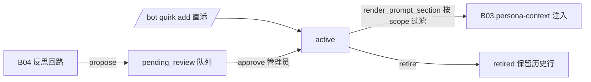

# B03.quirks 怪癖演化

<!-- BOARD-AUTO:BEGIN -->
<!-- 本节由 scripts/board_doc_sync.py 生成，请勿手改；正文写在标记外 -->

## B03.quirks 怪癖演化

> propose→管理员 approve→渲染 的审核制人格演化。

- 归属板块：[B03](../README.md)
- 实现落点：`plugins/bot_unified_runtime/domains/chat_reply/character/quirks.py`
- 帮助主题：怪癖

### 三级入口

| 三级入口 | 路由席位 | 能力 id | 别名/帮助页 | 优先级 |
|---|---|---|---|---|
<!-- BOARD-AUTO:END -->

## 这个功能解决什么

人格核心档案是冻结的：运行时任何角色（反思管线、管理员命令）都不自动改写
`personas/` 里的正文。但她又确实需要「活着的感觉」——慢慢养成一点说话的小习惯。
于是中间放了一个**审核区**：自动来源（反思回路）只能把候选丢进待审队列，
管理员过审之后才允许进上下文渲染，随时可以退役。既避免「她突然自己变了」的失控，
也避免每次改口癖都要动核心档案、走重启。

分层口径：心情（分钟-小时）→ 动态好感（天-周）→ 小习惯（周-月，本功能）→
核心人格（冻结）。四层的存储、时间尺度和权限都不同，不准互相串写。

## 处理流程

## 边界与降级

- 审核制红线：自动来源**只进待审**，未过审对 prompt 零影响；`add_direct` 是唯一的
  免审通道（管理员显式指令），同文本去重规则一致（已 active 原样返回、
  命中 pending 视为当场转正、命中 retired 视为复活）。
- 容量：生效条目有上限（`bot_quirks_max_active`），待审队列也有封顶，满时逐出最旧；
    列表默认限量返回（命令面按条数上限返回，上限以该实现为准；store 侧 `limit` 参数另计）。
- 跨用户泄漏防线（审查 G-07）：每条带 `scope_kind/scope_key`——
  `global` 全员渲染；`user` 只在来源 sender 匹配的会话渲染。渲染入口按 scope 过滤，
  **没有 sender 上下文时 fail-closed 只渲染 global**，宁可不渲染也不外溢。
- 渲染文本是纯自然语言（引导语 + 逐行条目），不外泄 id/状态/时间等簿记字段。
- 停用：`BOT_QUIRKS_ENABLED=false` 时整个演化区停用，命令只回停用提示，
  反思侧也不再投喂。
- 线程模型与 affinity/mood 同构：单 SQLite 连接 + 线程锁串行读写，WAL 先于任何 DML。

## 测试与验收

`tests/test_quirks.py`（propose/approve/retire/add_direct 状态机、封顶与逐出、
去重三分支、渲染只出自然语言）、`tests/test_quirks_scope.py`（scope 过滤与
无 sender 时 fail-closed）、`tests/test_reflection_*` 家族（反思投喂只进待审）。
真机：`/bot quirk list pending` 取 id 前缀 → `approve` → 下一轮回复里能看到该习惯；
`retire` 后消失；在非来源用户的会话里确认 per-user 习惯不出现。
帮助主题「怪癖」为 admin_only，`/bot help 怪癖` 有逐参数四要素。

## 现行缺陷

- `approve <id前缀>` 要求**唯一命中**，零命中或多命中都拒绝——前缀碰撞时用户只能重取 id，
  没有「列出同前缀候选」的便利分支（P2 体验项）。
- 退役只退出渲染、保留历史行，目前没有「复活审计」的展示面，只能靠
  `list retired` 回看（P2）。
- 自动投喂的质量依赖反思侧的置信阈值（`bot_reflection_quirks_min_confidence`，
  缺省 False 的 `bot_reflection_llm_enabled` 关闭时投喂来源有限），
  待审队列长期为空属预期而不是 bug。
- 本功能不占路由席位（走 `/bot quirk` 命令链），所以它不出现在三级入口卡清单里；
  如果有人想给它开一张 `quirks.md`，那是 B10 的分类裁决，不在本文自行加层。
