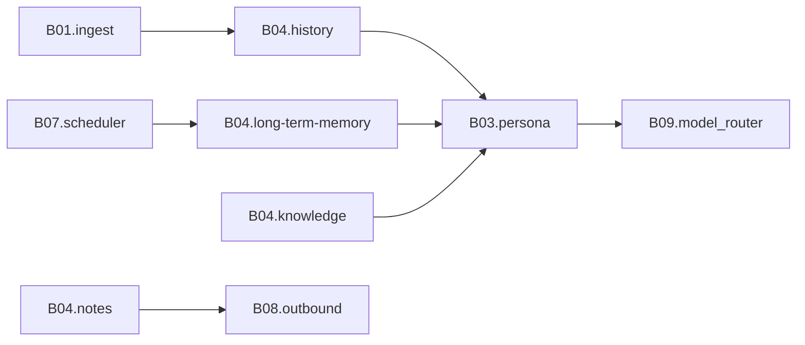

# B04 记忆·知识·笔记

<!-- BOARD-AUTO:BEGIN -->
<!-- 本节由 scripts/board_doc_sync.py 生成，请勿手改；正文写在标记外 -->

## B04 记忆·知识·笔记

> 她记得什么、从哪查到、怎么不记错。

职责：

- 会话历史与上下文窗口
- 长期记忆抽取、反思、召回打分与遗忘
- 知识库检索与来源约束
- 用户笔记与授时（笔记不是记忆，两套存储）

### 二级功能

| 二级功能 | 一句话 | 三级入口 |
|---|---|---|
| [会话历史与上下文](history/README.md) | 线性对话历史的读写窗口与注入裁剪。 | — |
| [长期记忆与反思](long-term-memory/README.md) | 抽取、反思回路、记忆总线 v2 召回打分与生命周期。 | [抽取与提示词硬化](long-term-memory/memory-extract.md)、[夜间反思回路](long-term-memory/reflection-loop.md)、[召回打分与冗余惩罚](long-term-memory/memory-recall.md)、[遗忘、墓碑与恢复](long-term-memory/memory-forget.md) |
| [知识库与检索](knowledge/README.md) | 知识源、分块、索引与配额；来源可信度约束。 | [分块与索引状态](knowledge/kb-indexing.md)、[来源配额与检索预算](knowledge/kb-quota.md) |
| [笔记与授时](notes/README.md) | Markdown 笔记 CRUD、自然语言勾选、NTP 授时时序。 | [记/看/放下/列表](notes/notes-crud.md)、[自然语言完成勾选](notes/mark-done.md)、[NTP 授时与钟差钳制](notes/time-sync.md) |
<!-- BOARD-AUTO:END -->

## 板块职责

上方清单是机器投影；这里补写"为什么切成这四块"。四块对应四种**存东西的理由**，它们的写入者、生命周期和删除语义都不一样：

- **会话历史**是短期窗口，只为"下一句怎么说"服务。键形是 会话 × 发送者 × 实例，滚动裁剪，清掉就没了，不参与长期学习。
- **长期记忆**是 bot 自己从对话里归纳出来的"关于你这个人的事实"。它有来源、有置信度、会随时间衰减，并且必须能被本人删掉且删干净（墓碑），否则就是"我明明说忘了你还记着"。
- **知识库**是外部灌进来的资料（人格语料、Crawl Wiki 导出、审核过的教导条目）。它是**读物**不是**画像**：切块、建索引、按查询召回，不署名为用户的事实，也不参与好感/人格演化。
- **笔记**是你显式说"记下来"的原文。存进去什么形状，取出来就什么形状：Markdown 原样落库，不加工、不归纳、不与记忆互写。

把后两者混成一件（本仓历史上真发生过命名混淆）会导致两类事故：把一句气话永久化成"用户事实"（记忆侧因此必须有来源分级与黑名单闸），以及"删了笔记但记忆还在"（所以两层各自一库一张表，只在上下文构建处汇总，绝不互相当备份）。

## 上下游

只画本段：入站是 B01 归一后的 `IncomingMessage`（本板块只认 `session_id`/`sender_id`/文本，不回读原始事件）。三路上下文（记忆、历史、知识）在 `domains/chat_reply/character/providers.py` 汇总成 `ContextBundle` 交给 B03 拼 prompt；本板块向 B09 要两样东西——配置现读与 model_router（记忆抽取、反思归纳、勾选消歧都是经主路由的轻量调用）；B07 的调度器提供触发时刻（夜间反思的**调度席位**登记在 B07.scheduled-jobs，**回路本身**在这里）。笔记与记忆的操作回执走 B08 的 review→renderer→send_queue 出站四件套，本板块不自建发送通道。

与 B03 的边界：注入**格式**（【长期记忆】分区怎么写、空分区不渲染）属 B03.persona-context；本板块只管**给不给、给哪几条、按什么分数排**。

## 退役与并入记录

本板块不吞旧文档，只挂指针。现役规格仍在原处：`docs/design/memory-reflection-v2-design.md`（记忆总线 v2：配置键位、打分公式、迁移规约）、`docs/design/v21r2-v2-memory-log.md`（V2.1 记忆存储层的表结构与墓碑设计要点）、`docs/design/v21r4-kb-drift-explainer.md`（索引与原文数量对不上的科普说明与两条处置路线）。

路径迁移史（v21r2 域重组留下的再导出垫片，垫片不算实现）：`domains/notes/store/notes_store.py` → `domains/notes/store/notes_store.py`；`character/memory.py`、`domains/chat_reply/character/memory_bus_v2.py`、`character/vector_knowledge.py`、`domains/chat_reply/character/knowledge_service.py` → `domains/chat_reply/character/`；`domains/location/knowledge/kb_wiki.py` → `domains/location/knowledge/kb_wiki.py`；`runtime/time_window.py` → `domains/chat_reply/runtime/time_window.py`。

两处"文档指的路和真身不一致"的现役事实，写死在这里免得下一个人再找：授时件的真身是 `domains/schedule/timesync/timesync.py`（**没有** `runtime/timesync.py` 这个旧路径，也没有垫片）；`docs/db-owners.md` 里笔记/记忆/向量库的 owner 列仍写 `character/` 旧路径名，读的时候按上面这张迁移表换算。
