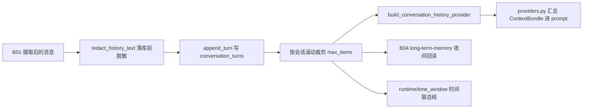

# B04.history 会话历史与上下文

<!-- BOARD-AUTO:BEGIN -->
<!-- 本节由 scripts/board_doc_sync.py 生成，请勿手改；正文写在标记外 -->

## B04.history 会话历史与上下文

> 线性对话历史的读写窗口与注入裁剪。

- 归属板块：[B04](../README.md)
- 实现落点：`plugins/bot_unified_runtime/domains/chat_reply/character/history.py`
- 帮助主题：历史, 最近
- 配置键前缀：`bot_history_`, `bot_context_`（逐键以目录册为准）

### 三级入口

| 三级入口 | 路由席位 | 能力 id | 别名/帮助页 | 优先级 |
|---|---|---|---|---|
<!-- BOARD-AUTO:END -->

## 这个功能解决什么

她得接得住"刚才那句"，但也不能把整段聊天记录无限背进 prompt——前者是"上一句刚说完你就忘了"，后者是 token 放大加上被带偏之后越聊越偏。所以有一层只服务近几轮的读写窗口：每轮把用户消息与回复各写一行，下次构建上下文时按会话只捞最近几条，超字数的从头部裁。

这层还兼作两个下游的原料：夜间反思按天回读同一张表做归纳，「总结一下最近若干分钟内的消息」这类时间窗总结也从这里取窗口内的原始轮次（窗口长度以该能力的实现为准）。也就是说，历史记录本身不带策略，谁读、读多少、给谁看由各自的消费者决定。

## 处理流程

真身 `plugins/bot_unified_runtime/domains/chat_reply/character/history.py`，表 `conversation_turns`（owner 与保留策略登记在 `docs/db-owners.md`）。写入口 `SQLiteConversationHistoryRepository.append_turn`，读出口 `ConversationHistoryStore.retrieve`（实现同时具备 recorder/cleaner 协议）；装配口 `build_conversation_history_provider`。

窗口有两道独立的闸：写侧按 `bot_history_max_items` 做库内滚动保留，读侧按 `bot_history_max_turns` 与 `bot_history_max_chars` 截断（三道缺省值以 `plugins/bot_unified_runtime/config.py` 对应字段为准）——这两个读参数在 `domains/chat_reply/character/providers.py` 消费，不在本模块。

## 边界与降级

- **关态就是零副作用**：`bot_history_enabled` 缺省 False，或 `bot_history_db_path` 为空 ⇒ 装配口返回 `NullConversationHistoryProvider`，不建库、不开连接；写为 no-op，读为空结果。空 `db_path` 走内存实现的口径是全仓统一约定（见 `docs/db-owners.md` 自身条款）。
- **密钥不入库**（写入侧第一道防线）：`redact_history_text` 在落库前遮蔽 `*key=`/`token=`/`secret=`/`cookie=`/`session_id=` 赋值形态、`Bearer` 串与 `sk-` 形态；`env:变量名` 这类间接引用**刻意保持可读**，免得把正常配置记录洗成不可辨认。同一函数在 `domains/chat_reply/capabilities/chat.py` 也有一条调用点，两处共用同一判据，不写第二份正则。
- 遮蔽后为空串的行直接不写（宁缺毋滥），`kind` 只认 `chat`/`command`/`system`，其余回落 `chat`。
- 建表 DDL 不逐条消息重跑：进程内首次写时建一次，且有锁——冷启动时事件循环与 offload 线程会并发首写，无锁就是双跑 ALTER。
- 时间戳一律 UTC ISO 存储，读侧再换本地时区显示，避免跨日窗口漂移。
- `/bot history clear` 只清「当前会话 × 当前发送者 × 当前实例」的轮次，**不动长期记忆**——这是帮助页写死的口径，两层的删除互不牵连。

## 测试与验收

- `tests/test_time_window_summary.py`：时间窗总结对历史窗口的读取与保守触发门槛。
- `tests/test_persona_injection_v21.py`、`tests/test_addressing_context.py`：历史段进 prompt 的形态与称谓边界。
- `tests/test_reflection.py`、`tests/test_memory_bus_v2.py`：反思/总线按同一 schema 回读 `conversation_turns`。
- `tests/test_perf_p1.py`：历史仓储热点路径的模块级卫生（含构造开销回归量级门）。
- `tests/test_shared_group_key_alignment.py`、`tests/test_shared_export_key_shape.py`：会话键形与群共享导出的键对齐（键形错配是本域真咬过的坑，见下）。
- 真机：`/bot status` 的 history 开关与存储形态行；重启验收清单见 `docs/acceptance-manual.md` §6.6 族。测试用例数与件数以 `dev.ps1 -Task test` 实跑与机器册 `docs/auto-facts.md` 为准，本文不手写。

## 现行缺陷

1. **写入侧脱敏没有回归锁**（P1）：全仓 `tests/` 内没有任何用例引用 `redact_history_text`，也就是说 H8 那道"密钥不进历史库"的防线目前只靠代码在位，注毒改成恒等函数不会有任何门变红。按 `_conventions.md` 第六节「存在性锁不算修好」的判据，这条只能记作"在岗、未证"。
2. **会话键形一族的历史事故**（P1，同类缺陷仍在别处）：本域曾因判据用 `group:` 前缀而真实键是 `group_<gid>_<uid>`，把群聊按私聊口径处理。判据现已统一到 `domains/core/session_keys.py`，但同类形态的读侧键形错配在反思链仍有活的实例（见 `../long-term-memory/reflection-loop.md` 列出的现行缺陷）。
3. **默认关**（P2 现状非缺陷）：`bot_history_enabled=False` 是缺省，现网是否真开以 `.env` 与 `/bot status` 为准；未开时时间窗总结与夜间反思都拿不到原料，属预期的静默降级，不额外告警。
4. 无三级入口：本功能没占 `RouteKind` 席位、也没有独立 `capability_id`（`/bot history clear` 走 B09 的 admin/echo 面），所以按 `_conventions.md` 第〇节判定规则不生成入口卡，参数与命令都写在本页。
