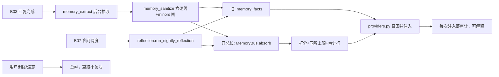

# B04.long-term-memory 长期记忆与反思

<!-- BOARD-AUTO:BEGIN -->
<!-- 本节由 scripts/board_doc_sync.py 生成，请勿手改；正文写在标记外 -->

## B04.long-term-memory 长期记忆与反思

> 抽取、反思回路、记忆总线 v2 召回打分与生命周期。

- 归属板块：[B04](../README.md)
- 实现落点：`plugins/bot_unified_runtime/domains/chat_reply/character/memory_bus_v2.py`、`plugins/bot_unified_runtime/domains/chat_reply/character/memory_store_v21.py`、`plugins/bot_unified_runtime/domains/chat_reply/capabilities/memory.py`
- 帮助主题：记忆
- 配置键前缀：`bot_memory_`, `bot_reflection_`（逐键以目录册为准）

### 三级入口

| 三级入口 | 路由席位 | 能力 id | 别名/帮助页 | 优先级 |
|---|---|---|---|---|
| [抽取与提示词硬化](memory-extract.md) | — | — | — | — |
| [夜间反思回路](reflection-loop.md) | — | — | — | — |
| [召回打分与冗余惩罚](memory-recall.md) | — | — | — | — |
| [遗忘、墓碑与恢复](memory-forget.md) | — | — | — | — |
<!-- BOARD-AUTO:END -->

## 这个功能解决什么

她要在下次见面时还记得"你不吃香菜""你在准备答辩"，但聊天原文既多又短命，直接背进 prompt 既不现实也不该做——大部分句子隔天就没意义了。这一层负责把值得长期记住的东西**挑出来**、**存下来**、**按相关度和新旧排个序再给出去**，并且在你说"忘了"之后**真的忘掉、不复活**。

现役实现是两套并存的形态，这点必须写清，否则读代码会误判：

- **旧路径（线上跑的就是这套）**：`character/memory.py` 的 `memory_facts` 表存显式事实，`character/reflection.py` 的 `reflection_digests` / `reflection_facts` 存夜间归纳，召回时在出口用 fact_id 拼一起。
- **记忆总线 v2（代码已在、开关默认关、线上零变更）**：`character/memory_bus_v2.py` + `character/memory_store_v21.py` 扩列，把显式事实与归纳收进**同一张表** `memory_entries_v21`，可见性从字符串升成列（`scope_kind`/`scope_key`），取信从"只看 confidence + 时间序"升成证据累积（`provenance`/`confirm_count`/`contradict_count`/`supersedes`/`decay_class`）+ 召回打分。`bot_memory_bus_enabled=False` 时读写**逐字节**回到旧路径：不建总线库、不开新连接。

一句话口径：**总线是灰度件**，本轮所有文档与验收都按"未接管"写；打开它属于需要单独裁决与真机验证的动作，不是改一个 `.env` 键的边角事。

## 处理流程

四段生命周期各有一张入口卡：抽取（memory-extract）、夜间反思（reflection-loop）、召回打分（memory-recall）、遗忘与恢复（memory-forget）。

## 边界与降级

- **总开关**：`bot_memory_enabled`（缺省 False）与 `bot_memory_db_path`（缺省空）任一不满足 ⇒ 召回侧给 `NullMemoryProvider`，`/bot memory` 明确回一段"记忆功能还没打开，让管理员设两个键并重启"的人话，不静默。
- **总线九键全缺省保守**：`bot_memory_bus_enabled=False`、`bot_memory_reflected_write_target="legacy"`（另一取值 `bus` 才写新表）等，见 `config.py` 记忆块。本轮**刻意不登记进 SETTABLE_KEYS**——登记而不接热改合并层是本仓已定罪的"假热改"形态，读路径逐调用现读的证明没做完之前不开放热改。
- **抽取只跑后台**：`memory_extract` 在回复完成后的后台线程执行，任何失败都不影响主回复；错误有冷却窗（`bot_memory_extract_error_cooldown_seconds`，缺省值以 `config.py` 该字段为准），超时与 max_tokens 都有上限。
- **敏感级不出口**：`credentialed` 永不进召回面，进 prompt 前还要过 `LLM_SAFE_MEMORY_SENSITIVITIES`（public/group/personal）；`requester != subject` 直接零结果。
- **沉淀面复用单一词表**：六硬线 + minors 的清洗判据来自 `domains/chat_reply/security/memory_sanitize.py` 这一份，总线**不另建第二套词表**；该来源不可用时退回"不清洗"并点名一次，绝不静默换判据。
- **会话键只准走中央件**：总线的作用域形状由 `domains/core/session_keys.py` 的 `parse_session_key` 派生，平台维度留在 `owner_id`；非 global 行在 SQL 层就取不到跨作用域数据（缺作用域=只给 global，fail-closed，旧版"忘了传就是全会话"的 fail-open 已翻转）。
- **运行数据不可删**：总线记忆行永不 `DELETE`（遗忘=status 翻 `forgotten` + 墓碑双记录），`memory_index_v21` 是可再生投影（可整表清），绑定表只增不改——见 `docs/db-owners.md`。

## 测试与验收

- `tests/test_memory_bus_v2.py`：总线红线（credentialed 不召回、跨作用域取不到、显式压过归纳、墓碑不复活、同簇上限、打分与审计）。
- `tests/test_memory_bus_v2_migration.py`：`scripts/migrate_memory_bus_v2.py` 的幂等、守恒断言与"宁可零迁移不可半迁移"回滚。
- `tests/test_memory_service_v21.py`：V2.1 存储层四表契约（该文件是原文件被垫片覆写后据以重建的依据，见 `memory_store_v21.py` 头注）。
- `tests/test_memory_router_reuse.py`、`tests/test_persona_prompt_and_memory.py`：召回复用主路由与注入形态。
- `tests/test_memory_sanitize.py`、`tests/test_reflection.py`：清洗闸与夜间归纳。
- 真机：`/bot memory add|list|delete`、`/bot status` 的记忆开关与存储行；用例数以最近一次 `dev.ps1 -Task test` 实跑为准。

## 现行缺陷

1. **反思归纳的事实今天完全召不回（P0-8，待用户裁决）**：写侧存的会话键带 `platform:` 前缀、读侧绑裸 `session_id`，`session_key = ?` 永不成立 ⇒ `bot_reflection_enabled=True` 时按人沉淀的高层事实全部静默不进 prompt。探针实证见 `docs/audit-20260921.md` 的 D3-14，裁决选项在 `docs/audit-20260921-decisions.md` 的对应条目。方向是 fail-closed（不泄漏别人的事），所以不是隐私事故，而是"白做 + 白烧配额"。
2. **总线未灰度**：v2 的打分、审计、可解释（`render_memory_why`）在生产路径上**没有现役数据**——上面首条描述的正是旧路径。把"总线代码在位"写成"召回已升级"是不实陈述。
3. **「笔记」的归属口径分叉**（P2，待裁）：帮助层把「笔记」的能力 id 记成 `bot.reminder`，而真身是独立域 `domains/notes/` ⇒ 报表里笔记被计进提醒族。登记为 `docs/audit-20260921.md` 的 V1-9/M-9，改 id 影响账单与审计历史连续性，需用户裁（R1-7）。
4. **成员级隔离粒度无人验证**（P1，V3-8）：笔记/提醒族以 `message.session_id`（含 uid）为存储键，而测试每文件只用一组键、从不跑"同群两成员"，所以成员级隔离的实际粒度没有可见证据；这与 `notes_store.py` 自述的会话隔离口径是否一致尚未对齐。
5. **群摘要读零行的同型病**（台账 #33 存量项）：跨会话读历史时键形不一致，属同一族的"键形两套、读侧绑错"问题，修一处不足以根治，改到本域时按 1 的方案统一裁。
