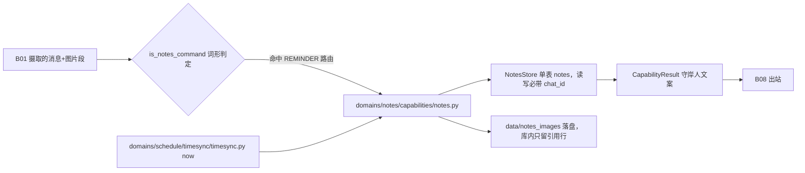

# B04.notes 笔记与授时

<!-- BOARD-AUTO:BEGIN -->
<!-- 本节由 scripts/board_doc_sync.py 生成，请勿手改；正文写在标记外 -->

## B04.notes 笔记与授时

> Markdown 笔记 CRUD、自然语言勾选、NTP 授时时序。

- 归属板块：[B04](../README.md)
- 实现落点：`plugins/bot_unified_runtime/domains/notes/capabilities/notes.py`、`plugins/bot_unified_runtime/domains/notes/store`
- 帮助主题：笔记
- 配置键前缀：`bot_notes_`, `bot_time_sync_`（逐键以目录册为准）

### 三级入口

| 三级入口 | 路由席位 | 能力 id | 别名/帮助页 | 优先级 |
|---|---|---|---|---|
| [记/看/放下/列表](notes-crud.md) | — | — | — | — |
| [自然语言完成勾选](mark-done.md) | — | — | — | — |
| [NTP 授时与钟差钳制](time-sync.md) | — | — | — | — |
<!-- BOARD-AUTO:END -->

## 这个功能解决什么

你说"记一下：周三要交总结"，她要能原样存下来、之后原样还给你，还能在你说"总结写完了"时把对应那一件勾掉。这件事和"记忆"看着像，其实是**两套存储、两种语义**，本板块反复强调这条红线：

- **笔记**（`domains/notes/`，库 `data/notes.sqlite3`）：你说存什么就是什么，Markdown 原文照存，不加工、不归纳、不参与人格与好感。删除是真删除。
- **记忆**（`domains/chat_reply/character/` 的 memory 族，库 `BOT_MEMORY_DB_PATH` 指向的聊天记忆库）：她自己从对话里推断出来的关于你的事实，有来源、置信度、衰减和墓碑。

两边互不镜像：删了笔记不会去动记忆库，写进记忆的内容也不会出现在笔记列表里。唯一的公共部分是"它们最终都可能被拼进同一轮 prompt"，那是 B03 的注入面负责的事。

授时（NTP/HTTPS 校时）放在本功能名下，是因为它存在的唯一理由就是给提醒与笔记的时序判断提供可信的"现在几点"——它不改系统钟，只提供一个校正后的 `now()`。

## 处理流程

## 边界与降级

- **总闸**：`bot_notes_enabled` 缺省 True；`bot_notes_db_path` 经 `scripts/runtime_paths.py` 重映射到 Runtime，不落源码树（启动期不建库）。
- **路由席位**：笔记**不占** `RouteKind`——全部词形收在提醒判定 `is_reminder_command` 里（`RouteKind.REMINDER`），因此它没有自己的路由席位与优先级，帮助层与审计层的能力 id 记账是 `bot.reminder`（现行缺陷第 1 条）。
- **限额**：单会话笔记数达 `bot_notes_max_per_chat`（缺省 200）时 `add` 返回 None，由能力层给人话提示而不是静默丢弃；单条笔记图片上限 `_MAX_NOTE_IMAGES`、单图字节上限 `_MAX_IMAGE_BYTES`（判据在能力层，store 只认文本）。
- **图片来源与落点双查**：随笔记发来的图片走 SSRF 入口护栏，`file://`/本地路径读取有字节上限，落盘目录名消毒防穿越；删笔记时图片文件随笔记一起清（引用已不在，留着只会积灰）。
- **会话隔离**：一切读写都带 `chat_id`（= `message.session_id`），A 群看不到 B 群的笔记；群成员之间是否再按人隔离取决于 session_id 本身含 uid，该粒度目前无测试覆盖（现行缺陷第 2 条）。
- **授时降级链**：NTP 全败 → HTTPS `Date` 头估偏移 → 回退系统钟，每级一行日志；`|offset|` 超 `bot_time_sync_max_drift_ms`（缺省 1500ms）或 RTT 超上限的应答视为不可信，拒收该台换下一台。防火墙拦 UDP 123 时回退系统钟**属预期行为**，不是故障。

## 测试与验收

- `tests/test_notes.py`：笔记 CRUD、触发词形态、图片收纳与限额。
- `tests/test_notes_item_checkoff.py`：单条待办的逐项勾选/取消勾选与歧义语义。
- `tests/test_timesync.py`、`tests/test_v21r2_stall_timesync_http.py`：SNTP 报文与偏移钳制、HTTPS 兜底与停摆面。
- 真机：`docs/acceptance-manual.md` 的提醒/笔记面（含「<事项>做完了」并列候选必须追问、不得硬编码矛盾）；重启后看日志里 timesync 首次校时是否成功（本机 UDP 123 被拦时预期看到"回退系统钟"warning 一行）。
- 用例数以最近一次 `dev.ps1 -Task test` 实跑为准，本文不手写。

## 现行缺陷

1. **归属口径分叉**（P2，待用户裁）：帮助/能力登记表把「笔记」记在 `bot.reminder` 名下，而实现是独立域 `domains/notes/` ⇒ 账单与审计里笔记被算进提醒族。裁决项 = `docs/audit-20260921.md` 的 V1-9 / M-9 / D8（改 id 会影响历史连续性，故不擅改）。
2. **成员级隔离粒度无证据**（P1，V3-8）：存储键是含 uid 的 `session_id`，但测试从不跑"同群两成员"，隔离粒度实际是什么无人可见，且与 `notes_store.py` 头注自述的"会话隔离"口径疑似不完全对齐。
3. **撤销勾选的整链生效有半截**（P2，在册）：撤销词形已并入能力层的 `is_notes_command`，但生产路由判定 `reminder.is_reminder_command` 是按正则清单显式引用本模块的，撤销两组正则待其一行收编后才在**整链**生效——此前只有能力层离线可验证完整行为。真机现象是"能力认得、路由不放行"。
4. **旧路径 owner 名未更新**：`docs/db-owners.md` 的 notes 行 owner 仍写 `character/notes_store.py`（再导出垫片），真身是 `domains/notes/store/notes_store.py`；该行的"待生成：生产未重启"标注同样要看重启实况，别读成已落库。
