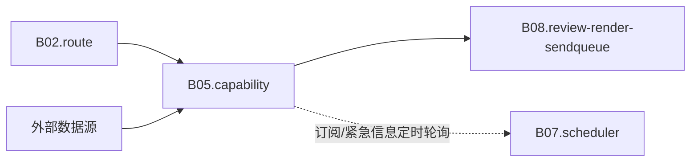

# B05 外部资讯与数据服务

<!-- BOARD-AUTO:BEGIN -->
<!-- 本节由 scripts/board_doc_sync.py 生成，请勿手改；正文写在标记外 -->

## B05 外部资讯与数据服务

> 从外部世界取真数，取不到就诚实说取不到。

职责：

- 天气与预警、金融行情、快讯与历史上的今天
- 订阅源、紧急信息、链接解析、百科参考
- 缺源必须显式标注，绝不编造数值

### 二级功能

| 二级功能 | 一句话 | 三级入口 |
|---|---|---|
| [天气与预警](weather/README.md) | NMC 主通道重试、Open-Meteo 兜底、预警支路与地名定位。 | [天气查询](weather/weather.md)、[NMC 预报与码表](weather/nmc-forecast.md)、[预警支路](weather/alert-branch.md)、[地名解析与变体链](weather/geo-locating.md) |
| [金融行情](finance/README.md) | 股指、个股、商品、债券、北向与汇率，含交叉核验脚注。 | [全球股指行情](finance/market.md)、[个股行情](finance/stocks.md)、[商品行情](finance/commodities.md)、[国债收益率](finance/bond.md)、[北向资金](finance/northbound.md)、[汇率查询](finance/fx.md)、[全球指数与走势图](finance/global-indices.md)、[个股 OHLCV 与分布](finance/single-stocks.md)、[大宗商品](finance/commodities.md)、[国债收益率与期限利差](finance/bonds.md)、[北向资金口径](finance/northbound.md)、[汇率面板与定向换算](finance/fx-panels.md) |
| [快讯与历史上的今天](news/README.md) | 多源 RSS 营销过滤、条目限额与日历型推送。 | [今日快报](news/news.md)、[历史上的今天](news/today-history.md) |
| [订阅与更新推送](subscription/README.md) | B 站/YT/小红书/推特/微博/Epic 订阅与 outbox 落库。 | [订阅命令](subscription/subscribe.md)、[Epic 免费游戏](subscription/epic.md)、[各平台订阅通道](subscription/platform-subscription.md)、[更新出队与投递](subscription/outbox-delivery.md) |
| [紧急信息与预警](emergency-info/README.md) | 权威源采集、定级、审核门与群内订阅投递。 | [紧急信息](emergency-info/emergency-info.md)、[四权威源采集](emergency-info/collection-sources.md)、[预警谱与定级](emergency-info/alert-taxonomy.md)、[权威源审核门](emergency-info/review-gate.md)、[群内订阅与投递门](emergency-info/group-subscriptions.md) |
| [链接解析与内容理解](link-parse/README.md) | 多平台链接解析、正文抽取与 Cookie 归因。 | [链接解析](link-parse/content.md)、[解析器规则族与归因](link-parse/parser-rules.md)、[凭证域名绑定与剥离](link-parse/credential-scoping.md) |
| [百科与参考查询](reference-wiki/README.md) | 维基百科、萌娘百科与地点/作品参考。 | [维基百科](reference-wiki/wiki.md)、[萌娘百科](reference-wiki/moegirl.md)、[二次元问句](reference-wiki/moegirl-question.md) |
<!-- BOARD-AUTO:END -->

## 板块职责

这个板块管一件事：**替用户去外部世界取数，并且只说取到的数**。上游七个二级功能长得不太一样（天气、行情、快讯、订阅、紧急信息、链接解析、百科），但它们共用同一套底线：

- 取数走 `domains/link_parse/parsers/http_util.py` 这一条 HTTP 咽喉（统一 UA/超时/响应上限/429 有界重试），不许每个域各自造第二套客户端；
- 失败一律降级成人话，不把异常抛给流水线；**取不到就说取不到**，绝不用 0、用平均值、用"应该有"的结构造一个数出来（本板块红线）；
- 缓存策略统一：成功结果才进进程内 TTL 缓存，失败不缓存，让用户下一句就能重试。

这样切分的理由：**按"数据从哪来 + 谁说了算"切，不按"界面长什么样"切**。所以金融六路能力（股指/个股/商品/债券/北向/汇率）是一个二级功能下的六个入口，而不是六个功能；紧急信息把"采集/定级/审核/投递"收在同一目录 `domains/emergency_info/` 里，因为它们的红线是同一条（无源不接、未定级不投）。渲染、发送、限流不属于这里——那是 B08 的出口管线；本板块只交出"事实 + 出处 + 时间戳 + 状态"。

## 上下游

- 入站：B02 路由把 `RouteKind` 席位交给本板块的能力闭包；B07 调度层按时触发订阅轮询、紧急信息采集、历史上的今天推送。
- 出站：本板块只产出 `CapabilityResult`（文本/卡片 payload/审计标签），投递一律交回 B08 的 `review → renderer → send_queue → sender`；域内主动推送（紧急信息）走中央闸 `submit_active_push`，禁止直调 `send_queue.submit`。

## 退役与并入记录

- 本板块正文取代的旧叙述：`AGENTS.md` 第四部分功能表中天气/金融/快报/订阅/紧急信息/链接解析/百科各行、`docs/HANDBOOK.md` 里对应的批次章节、`docs/design/emergency-info-*` 与 `docs/design/link-unification-audit-20260920.md` 的结论摘要部分。旧文档不删不改（属 B10 与主会话的账），本页与二级页是**现行口径**，冲突时以代码真身与本板块为准。
- 目录迁移留下的垫片：顶层 `capabilities/market.py`、`sources/parsers/`、`output/card_render/` 一类的旧路径已降为再导出垫片，真身在 `domains/<域>/<层>/`；本板块所有引用一律写真身路径。
