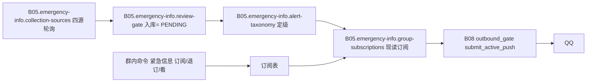

# B05.emergency-info 紧急信息与预警

<!-- BOARD-AUTO:BEGIN -->
<!-- 本节由 scripts/board_doc_sync.py 生成，请勿手改；正文写在标记外 -->

## B05.emergency-info 紧急信息与预警

> 权威源采集、定级、审核门与群内订阅投递。

- 归属板块：[B05](../README.md)
- 实现落点：`plugins/bot_unified_runtime/domains/emergency_info`
- 路由席位：`EMERGENCY_INFO`
- 能力 id：`bot.emergency_info`
- 帮助主题：紧急信息
- 配置键前缀：`bot_emergency_info_`（逐键以目录册为准）

### 三级入口

| 三级入口 | 路由席位 | 能力 id | 别名/帮助页 | 优先级 |
|---|---|---|---|---|
| [紧急信息](emergency-info.md) | EMERGENCY_INFO | bot.emergency_info | 紧急信息 | 44 |
| [四权威源采集](collection-sources.md) | — | — | — | — |
| [预警谱与定级](alert-taxonomy.md) | — | — | — | — |
| [权威源审核门](review-gate.md) | — | — | — | — |
| [群内订阅与投递门](group-subscriptions.md) | — | — | — | — |
<!-- BOARD-AUTO:END -->

## 这个功能解决什么

把"外面出事了"这件事做成一条**可核、可控、可退订**的链路：权威源定时采集 → 单一等级枚举定级 → 人工报料要过审核门 → 投递前按"这个群/这个人订了什么"现读过滤 → 只经中央投递闸出站。目标是让群主在群里说一句就能决定本群收什么，而不是让管理员去改 `.env` 再重启。

产品层面的四条裁定（都是烧过账之后钉死的）：**无源不接**（缺字段/字段非法的条目直接不成立）、**未定级不投递**（`level=None` 的含义是"还没判"，不用最低档冒充"判过了"）、**绝不猜群猜人**（没有订阅行就没有投递）、**主动投递只走一个口子**（域内禁止直调发送队列）。

## 处理流程

## 边界与降级

- **装配门两腿**：`enabled ∧ sources` 任一为空 ⇒ 整链不注册（WIRE-SUB 裁定 3.B 撤掉了旧的第三腿"推送名单非空"）。生产 `.env` 现状是总闸已开 + `SOURCES=nmc`，而**订阅表为空 ⇒ 零投递**。
- **采集失败可见**：单源失败既进快照（保留上一轮条目、显式标注本轮失败）又产一次 `OperationalIssue`，经 300s 折叠抑制后交告警面；"源可达但自报零条"是 `NO_DATA`（合法答案，不告警）。把两者都收敛成空列表正是旧天气支路的病灶，本域结构上不许重演。
- **投递**：`priority` 必须等于等级字面（`P0..P3`），这是中央闸判"够不够格穿 00:00–06:00 静默窗"的唯一 severity 载体；漏传或传 `normal` 会把 P0 顺延到窗尾且**不报错**，因此由门禁与用例双向钉死。幂等键形态唯一出处是 `domains/emergency_info/service/dedupe.py`，中央闸委托到这里判形。
- **权限**：能设/退订阅的是超级管理员 ∨ 管理员 ∨ **本群群主**；报料审核权归 `bot_emergency_info_reviewer_ids` 名单 + 管理员角色额外放行腿；订阅目前只对 QQ 会话开放（多平台需要目标带通道事实，另案）。
- **保留期**：条目按 `bot_emergency_info_keep_days` 裁剪，**prune 结构性不碰订阅表**（订阅永久直到退订）。

## 测试与验收

离线八件合跑参照（WIRE-SUB 波实跑口径见 `AGENTS.md` 台账 #46 与 `.superpowers/sdd/` 该波日志）：`tests/test_emergency_info_core.py`、`tests/test_emergency_info_subscriptions.py`、`tests/test_emergency_info_push.py`、`tests/test_emergency_info_review_gate.py`、`tests/test_emergency_info_collector.py`、`tests/test_emergency_info_sources.py`、`tests/test_emergency_info_reachability.py`、`tests/test_outbound_gate.py`。
真机：`docs/acceptance-manual.md` §6.6.12（E1–E12，含"群里设完当轮生效不重启"与"非 QQ 会话拒设"）；操作单 `docs/design/emergency-info-enablement-20260920.md` §七。

## 现行缺陷

1. **整域代码已入库、线上未生效**（阻塞项）：本域文件已全部提交（复跑 `git status --short plugins/bot_unified_runtime/domains/emergency_info/` 现算为干净），剩下的阻塞点只有一条——生产进程未重启 ⇒ 定级与订阅口径一行都不生效（铁律：改代码必须重启，重启权在用户）。此前的"闸建好但一条都过不去"（条目 id 用 `:` 连接撞上幂等键段字符集禁 `:`）已由 WIRE-SUB 波根修并补端到端用例——静态可达性全绿照样漏，这是本域最贵的一课。
2. **~~`WP3-TAXONOMY` 半成品挂账~~（已于 2026-09-22 落地摘牌，勿再当"未做"派工）**：注册表驱动定级已在——族内合法色档由注册表派生、地震只吃震级/深度/境内外三枚源侧事实分档、`grading_candidates` 提供审计面，且**种类词整体退出缺省关键词表**（判据由 `tests/test_emergency_info_taxonomy.py::test_default_keyword_table_contains_no_category_words` 锁死）。复跑：全树 `grep -rn "WP3-TAXONOMY" tests/` 只剩摘牌注释、无 `xfail` 标记；`pytest tests/test_emergency_info_taxonomy.py tests/test_emergency_info_collector.py tests/test_emergency_grading_family_legality.py -q` 全绿（实例数以该次实跑为准）。⚠ **反向警示**：把「台风/地震/暴雨」这类种类词加回缺省关键词表＝重演"标题含种类词即抬到 P0、矩阵格全判红档"那笔 Critical，任何"回填 observed 类进关键词表"的开工令都不构成授权——类别可达性走注册表别名索引（`resolve_category`），与定级关键词是两条不相干的腿。残项：`grading_candidates()` 生产无消费方，已按 2026-09-22 评审席 T8 裁定 (b) 诚实改口为"未接线的调试/复算出口"（落库只存最终档），升格为审计通路须另行授权且禁造第三条通路。
3. **`bot_emergency_info_quiet_breach_levels` 是枚不存在的键**：能力层用 `getattr` 读它，`config.py` 未声明 ⇒ 只能吃代码缺省（P0,P1），`.env` 写了不生效（`domains/emergency_info/service/grading.py` 头注自证）。要么补声明+登记目录册，要么删读点。
4. **地名→坐标 resolver 未接**：装配层跨域取数没做，所以 `area=湘潭` 目前只走文字命中，半径只能靠用户自己给 `coord=`。
5. 条目 id 含非法段时改为"点名跳过该条"，但 `deps.sources` 为空仍沿用既存的"整轮 return"口径（两处行为不一致，登记未修）。
