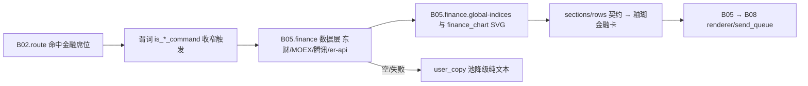

# B05.finance 金融行情

<!-- BOARD-AUTO:BEGIN -->
<!-- 本节由 scripts/board_doc_sync.py 生成，请勿手改；正文写在标记外 -->

## B05.finance 金融行情

> 股指、个股、商品、债券、北向与汇率，含交叉核验脚注。

- 归属板块：[B05](../README.md)
- 实现落点：`plugins/bot_unified_runtime/domains/finance`
- 路由席位：`MARKET`, `STOCKS`, `COMMODITIES`, `BOND`, `NORTHBOUND`, `FX`
- 能力 id：`bot.market`, `bot.stocks`, `bot.commodities`, `bot.bond`, `bot.northbound`, `bot.fx`
- 帮助主题：行情, 个股行情, 商品行情, 国债收益率, 北向资金, 汇率
- 配置键前缀：`bot_market_`, `bot_stocks_`, `bot_fx_`（逐键以目录册为准）

### 三级入口

| 三级入口 | 路由席位 | 能力 id | 别名/帮助页 | 优先级 |
|---|---|---|---|---|
| [全球股指行情](market.md) | MARKET | bot.market | — | 41 |
| [个股行情](stocks.md) | STOCKS | bot.stocks | 个股行情 | 42 |
| [商品行情](commodities.md) | COMMODITIES | bot.commodities | 商品行情 | 37 |
| [国债收益率](bond.md) | BOND | bot.bond | 国债收益率 | 38 |
| [北向资金](northbound.md) | NORTHBOUND | bot.northbound | 北向资金 | 39 |
| [汇率查询](fx.md) | FX | bot.fx | — | 36 |
| [全球指数与走势图](global-indices.md) | — | — | — | — |
| [个股 OHLCV 与分布](single-stocks.md) | — | — | — | — |
| [大宗商品](commodities.md) | — | — | — | — |
| [国债收益率与期限利差](bonds.md) | — | — | — | — |
| [北向资金口径](northbound.md) | — | — | — | — |
| [汇率面板与定向换算](fx-panels.md) | — | — | — | — |
<!-- BOARD-AUTO:END -->

## 这个功能解决什么

用户问「英伟达股价」「黄金」「国债收益率」「美元兑人民币」「北向资金」「行情」，要的是**此刻可核的数**：现价、涨跌幅、区间、口径、时点。这个功能簇替六个金融入口做同一件事——从公开免费接口取数、按统一 provenance 四件套（来源 / 基准口径 / 时点 as_of / 状态 status）交付、并在**结构性没有数**的地方明确写没有。

它同时是给非上市实体留红线的地方：OpenAI、Anthropic、字节跳动一类公司**不给价格、不给 K 线、不给市值**，只给有来源、有口径、标注时点的公开估值/公告说明。这不是保守措辞，是结构约束——那条分支根本不触发任何行情外呼。

## 处理流程

## 边界与降级

- **单一来源不可信 → 交叉核验**：股指卡额外走腾讯行情二次核验（`domains/finance/data/market_crosscheck.py`）。两源一致才声明"已交叉核验"，不一致显式标差异数值，核验通道不可用则**保持沉默**（不声明、不阻塞、不伪造）。刻意不映射的指数（如纳斯达克口径不同的那些）宁可不核。
- **无源显式登记，不静默消失**：`domains/finance/data/market_data.py:INDEX_UNAVAILABLE`（迪拜/阿联酋/澳门一类确实无公开股指口径的市场）、商品的 LME 与布伦特、国债的 1 年期、汇率的 TWD/MOP/AED、北向的"净买入"，全部走覆盖表并出现在卡面「暂无」注记区。候选（如用 ETF 代理某国指数）只登记不上卡，等用户裁决。
- **缓存纪律**：成功结果才进进程内 TTL 缓存（时长键见下），失败不缓存以便用户立即重试；缺数/停牌一律 `status=unavailable` + note，绝不返回 0。
- **量纲与口径写死**：涨跌额带符号、红涨绿跌、单位随币种（未登记币种用 ISO 代码本身，不冒充美元）；北向成交额换算链、日 K 列序（实测「日期,开,收,高,低,量」，不是 OHLC 顺序）都有回归锁。
- **渲染**：三张扩容卡（商品/债/北向）走 `finance_card` 的 sections/rows 契约、零模板改动；后端缺失或失败一律回退纯文本，卡片目录按配额 prune。
- **权限**：无角色门、无额度；纯查询。

## 测试与验收

离线（全 mock 单点网络出口）：`tests/test_market_card.py`、`tests/test_market_backoff.py`、`tests/test_market_exclusion_guard.py`、`tests/test_market_crosscheck_tencent_gbk.py`、`tests/test_finance_market_expansion.py`、`tests/test_fin_*`（见 `tests/` 目录，清单以最近一次实跑为准）、`tests/test_stock_data.py`、`tests/test_stock_technical_indicators.py`、`tests/test_stocks_hijack_guard.py`、`tests/test_fx_data.py`、`tests/test_fx_card_semantics.py`、`tests/test_bond_data.py`、`tests/test_commodities_data.py`、`tests/test_northbound_data.py`、`tests/test_route_priority_disambiguation.py`。
真机：`docs/acceptance-manual.md` §6.6.3（商品/国债/北向三卡 + 个股 logo 缓存）与 §6.6 金融触发形态。

## 现行缺陷

1. **东财侧限流与瞬断是常态**：HTTP 200 但业务体为空（限流）与 `push2his` 的 `RemoteDisconnected` 是两类不同故障。前者由 `bot_market_retry_on_empty` 控制至多再试一次（退避单点 `empty_backoff_sleep`），后者由 `domains/finance/data/stock_data.py:_network_retry` 在三个取数点退避重试。二者都失败时卡面写「暂无历史走势数据」，属诚实降级不是缺陷；用户凌晨遇到连空需按限流理解。
2. **接口变更是最大风险源**：东财 kline 自 2026-09-13 起必须带 `end` 参数（缺它返空），已在数据层修死并有回归锁；同类"上游悄悄改字段/改包络"只会表现为长期「暂无」，不会报错。发现某一块长期空，先核该接口族，不要先怀疑代码。
3. **技术指标窗口不足时给 None 而非数**：KDJ/MACD/RSI/WR/CCI 各自判窗口，样本不够就是"暂缺"；箱形图有 min-5 样本门，**单日 OHLC 四价位不得当分布输入**（口径红线写在 `domains/finance/data/finance_chart.py` 头注，纯计算层识别不了这个语义，只能靠调用方自律 + 用例钉）。
4. **个股 logo 卡面槽位属休眠契约**：缓存与三级兜底已实装，是否显示由模板槽位裁决；卡上没有 logo 不算异常。
5. **A 股/港股注册切片与美股九家同表不同面**：批量面板不含 A/港股注册切片（`list_cn_hk_companies`），点名才取——扩展面板属待裁决项，不是 bug。
6. **三枚"看起来能关"的开关其实关不掉**（P2，经实跑 `grep` 取证）：路由层以 `getattr(config, "bot_commodities_enabled"|"bot_bond_enabled"|"bot_northbound_enabled", True)` 判定，而 `config.py` 未声明这三个字段、目录册亦无登记 ⇒ 缺省恒开、`.env` 写了也不生效。属"读点先于声明"的呆账（与本板块 #47 波发现的 `bot_emergency_info_quiet_breach_levels` 同族）。正解是要么补进 `config.py` 并登记目录册，要么删掉读点——**不要在文档里把它写成可关旋钮**，三张卡片已按实况改口。
