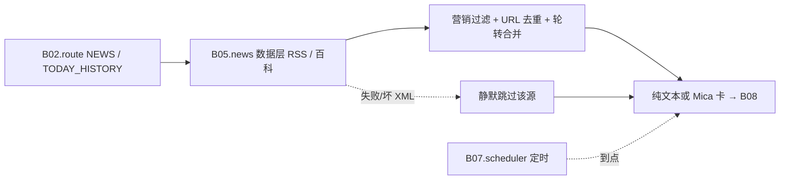

# B05.news 快讯与历史上的今天

<!-- BOARD-AUTO:BEGIN -->
<!-- 本节由 scripts/board_doc_sync.py 生成，请勿手改；正文写在标记外 -->

## B05.news 快讯与历史上的今天

> 多源 RSS 营销过滤、条目限额与日历型推送。

- 归属板块：[B05](../README.md)
- 实现落点：`plugins/bot_unified_runtime/domains/subscribe/feeds`
- 路由席位：`NEWS`, `TODAY_HISTORY`
- 能力 id：`bot.news`, `bot.today_history`
- 帮助主题：快报, 历史上的今天
- 配置键前缀：`bot_news_`, `bot_today_history_`（逐键以目录册为准）

### 三级入口

| 三级入口 | 路由席位 | 能力 id | 别名/帮助页 | 优先级 |
|---|---|---|---|---|
| [今日快报](news.md) | NEWS | bot.news | — | 41 |
| [历史上的今天](today-history.md) | TODAY_HISTORY | bot.today_history | 历史上的今天 | 41 |
| [新闻摘要卡](news-digest-card.md) | — | — | — | — |
<!-- BOARD-AUTO:END -->

## 这个功能解决什么

两件事都叫"资讯"，但节奏完全不同，所以放在一个二级功能里、拆成两个入口：

- **今日快报**是"现在有什么"：聚合若干国内可达的新闻 RSS，过滤营销位，出一屏可读的标题 + 摘要行。
- **历史上的今天**是"日历型"：按日期给当年条目，并且允许会话自己订阅一个每日推送时间。

它们共同的红线是：**源不可用就不出内容，绝不拿模型记忆补一条"看起来像新闻"的东西**。

## 处理流程

## 边界与降级

- **多源并发、单源失败静默跳过**：类目内全部源用线程池并发抓，整类目共享一份超时预算（最坏耗时约等于单源超时，不是源数×超时）；成功结果进按类目分桶的进程内 TTL 缓存，失败不缓存。
- **源清单是实测结论**：只留在本机直连验证过返回合法 XML 的源；曾经收录但实测返回 HTML 页面（feed 已下线）的源已剔除——留着只会制造常态解析失败的静默噪音。当前源清单与条数以 `domains/subscribe/feeds/news_feeds.py` 头注为准。
- **解析支持 RSS 2.0 / Atom / RDF**（命名空间通配），标题剥 HTML 标签、反转义实体、压空白；摘要取首段纯文本（治"标题党"）。
- **触发面刻意收窄**：裸「新闻」两字不触发本入口（那是联网搜索链路的地盘），"搜索/查一下/找新闻/联网"等明确搜索意图时让路；短文本、不带链接。
- **历史上的今天**：数据源是公开接口，按日缓存到 Runtime 数据根；推送时间表在文件损坏/不可读时**拒绝改写**（不静默覆盖用户设置），保存失败必须回错。
- **额度与权限**：两者都无角色门；历史上的今天的定时推送按会话键登记（谁在哪个群说就在哪个群收）。

## 测试与验收

离线：`tests/test_news.py`、`tests/test_today_history_robustness.py`、`tests/test_traditional_news_randpic.py`（繁体族触发）。定时面见 `tests/test_campus_digest.py` 同族的调度测试与 `docs/route-matrix.md` 触发登记。
真机：`快报` / `科技新闻` / `AI快报` / `今日热点` / 繁体「快報」；`历史上的今天`、`历史上的今天 设置 8:00`、`历史上的今天 状态`、`历史上的今天 取消`。

## 现行缺陷

1. **单源失败对用户的可见度为零**（P2）：所有源都挂时才出人话，部分源挂掉时条目只是变少，用户无从知道"今天科技类只来了寥寥几条是因为某源挂了"。缺一个"本次由 N/M 个源提供"的诚实角标。
2. **BBC 中文源实际返回繁体条目**，被收在「国际」类目里（已在其源表注明）；跨类目做繁简归一属 B03 的换库改造（本波已把折形改走库），不要在快报侧另写一套转换。
3. **历史上的今天的条目质量取决于上游**（标题里偶带 HTML 残留与营销串），已做清洗但不保证零噪音；条目数不承诺固定值，缺就说缺。
4. 推送时间表是 JSON 文件而非 SQLite 库（历史遗留），与 B07 的统一调度面尚未合流（台账 #3 同族："装配期快照 + 文件态"），改配置需重启。
