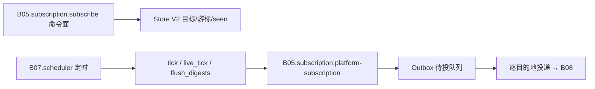

# B05.subscription 订阅与更新推送

<!-- BOARD-AUTO:BEGIN -->
<!-- 本节由 scripts/board_doc_sync.py 生成，请勿手改；正文写在标记外 -->

## B05.subscription 订阅与更新推送

> B 站/YT/小红书/推特/微博/Epic 订阅与 outbox 落库。

- 归属板块：[B05](../README.md)
- 实现落点：`plugins/bot_unified_runtime/domains/subscribe`、`plugins/bot_unified_runtime/domains/subscribe/adapters`
- 路由席位：`SUBSCRIBE`, `EPIC`
- 能力 id：`bot.subscribe`, `bot.epic`
- 帮助主题：订阅, Epic
- 配置键前缀：`bot_subscribe_`（逐键以目录册为准）

### 三级入口

| 三级入口 | 路由席位 | 能力 id | 别名/帮助页 | 优先级 |
|---|---|---|---|---|
| [订阅命令](subscribe.md) | SUBSCRIBE | bot.subscribe | — | 12 |
| [Epic 免费游戏](epic.md) | EPIC | bot.epic | Epic | 41 |
| [各平台订阅通道](platform-subscription.md) | — | — | — | — |
| [更新出队与投递](outbox-delivery.md) | — | — | — | — |
<!-- BOARD-AUTO:END -->

## 这个功能解决什么

用户把一条公开主页/频道/UP 主的链接交给 bot，说"订这个"，之后该作者更新时 bot 主动提醒。难点不在命令，在三件事：**别吵到别人**（多目标并发与频控）、**别丢也别重**（出队投递要能断点续投、按目的地记账）、**订了收不到要能说清**（平台没有可用取数通道时，当场拒绝并说明，而不是让用户以为订上了）。

平台差异全部收在 adapter 层：B 站（创作者/直播/番剧/收藏夹/合集）、YouTube、小红书（创作者与专栏）、推特/X、Telegram 频道、Pixiv、微博、网易云音乐（歌单/专辑/歌手/用户）。**订阅系统只认"目标 + 游标 + 新条目"，不认平台细节。**

## 处理流程

## 边界与降级

- **权限**：群内 `add` 与操作本群订阅要求管理员；私聊用户只能管理自己创建的私聊订阅；`list` 不再向所有人泄露全部订阅（审计项）。
- **开关分层**：`bot_subscribe_enabled` 是总开关（关掉后路由层直接拦截整个订阅系统）；每平台还有独立开关（`bot_subscribe_platform_*`），判定唯一实现是 `domains/subscribe/store/subscription_store_v2.py:subscription_platform_enabled`——轮询侧与命令侧同源，关掉的平台在 add 时给人话拒绝，既有订阅行不动。
- **诚实的注册面**：只有真正有取数实现的平台才留在支持清单里。历史上 qqmusic/kuwo/kugou/apple_music/spotify 曾"能订不能推"（订了永远收不到也不提示），已按审查项摘除；现在这些链接仍被识别，但解析时抛 `SubscriptionTargetNotice` 明确说"暂不支持 + 还能订什么"。恢复条件写在该 adapter 头注。
- **凭证门**：X/Twitter 需要 `auth_token`+`ct0` Cookie，注册面与 fetch 用同一判据（缺凭证就不假装可用）；小红书直播无稳定匿名探测通道，长期标 degraded，不做伪探测。
- **频控与抖动**：全局并发与单平台并发分开限、每目标最小间隔、轮询抖动比例、租约时长、退避基数与上限（键名见下）；单轮每目标一次调用，失败进退避而不是当轮重试打爆上游。
- **outbox 有界化**：已发送行与 seen 行都按保留期裁剪（防线性膨胀），投递中的行超过"发送中超时限"可被重新领取；投递失败按最大尝试次数退避，超限进入死信面并告警。
- **推送内容渲染**：能出卡就出卡（复用 B05.link-parse 的解析卡管线），任何失败回退纯文本；digest 型订阅不当轮即推，攒成日报由 flush 面出。

## 测试与验收

离线（全 mock 适配器与网络出口）：`tests/test_subscribe_capability_v2.py`、`tests/test_subscribe_capability_bridge.py`、`tests/test_subscribe_platform_switch_j02.py`、`tests/test_subscription_v2_core.py`、`tests/test_subscription_v2_bootstrap.py`、`tests/test_subscription_scheduler_v2.py`、`tests/test_subscription_cursor_v2.py`、`tests/test_subscription_delivery_v2.py`、`tests/test_subscription_runtime_delivery_v2.py`、`tests/test_subscription_outbox_reliability.py`、`tests/test_subscription_async_sqlite.py`、`tests/test_subscription_card_push.py`、`tests/test_subscription_vision.py`、`tests/test_social_subscription_adapters_v2.py`、`tests/test_social_subscription_fetch_v2.py`、`tests/test_music_subscription_*`、`tests/test_twitter_subscription_*`、`tests/test_auditfix_subscriptions_capabilities.py`。
真机：`docs/acceptance-manual.md` §6.6 相关条目（订阅增删查、关闭平台后的拒绝话术、更新到达）。

## 现行缺陷

1. **老订阅库与新 store 并存**（P2）：`domains/subscribe/store/subscription_store.py`（旧 SQLite 存储）与 `subscription_store_v2.py` 同时在册，命令面已走 V2、旧库靠 `subscription_migration.py` 承接；收敛到单真身属退役波（B10 的垫片退役账）没做的部分。
2. **live 状态判定不稳**（P2，已知边界）：YouTube 直播次信号受 consent 页影响可能漏判；小红书直播常驻 degraded。表现为"开播了没提醒"，属探测通道限制，不是丢单。
3. **推送时延由轮询周期决定**（设计取舍）：`bot_subscribe_poll_interval_seconds` 是装配期快照，热改当夜不生效（与台账 #3 同族），改完要重启。
4. **cookie 到期与订阅可用性耦合**：需要登录态的平台一旦 Cookie 失效，取数就静默退化；提醒面归 B09 的 cookie 到期告警，本板块只保证"不假装成功"。
