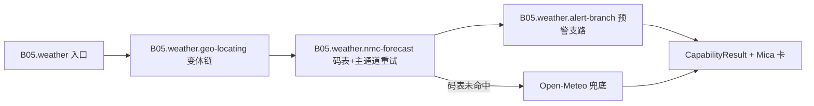

# B05.weather 天气与预警

<!-- BOARD-AUTO:BEGIN -->
<!-- 本节由 scripts/board_doc_sync.py 生成，请勿手改；正文写在标记外 -->

## B05.weather 天气与预警

> NMC 主通道重试、Open-Meteo 兜底、预警支路与地名定位。

- 归属板块：[B05](../README.md)
- 实现落点：`plugins/bot_unified_runtime/domains/weather`
- 路由席位：`WEATHER`
- 能力 id：`bot.weather`
- 帮助主题：天气
- 配置键前缀：`bot_weather_`（逐键以目录册为准）

### 三级入口

| 三级入口 | 路由席位 | 能力 id | 别名/帮助页 | 优先级 |
|---|---|---|---|---|
| [天气查询](weather.md) | WEATHER | bot.weather | — | 41 |
| [NMC 预报与码表](nmc-forecast.md) | — | — | — | — |
| [预警支路](alert-branch.md) | — | — | — | — |
| [地名解析与变体链](geo-locating.md) | — | — | — | — |
<!-- BOARD-AUTO:END -->

## 这个功能解决什么

用户在 QQ 里说一句「天气 湘潭」，拿到的应当是**中国气象局发布的实况与预报**，而不是模型凭印象编的一段话。这个功能替用户做三件事：把口语地名变成 NMC 认得的站点码、把站点码变成一份结构化天气报告、顺带把这座城市当前在报的气象预警挂在家常话后面。

海外城市、乡镇街道这一类 NMC 码表里没有的目标，改由 Open-Meteo 全球源兜底，并在卡上标清来源——两条通道口径不同（NMC 有预警、Open-Meteo 没有），所以来源标注不是装饰，是防止用户把两套口径当同一件事。

## 处理流程

## 边界与降级

- **NMC 主通道**：城市在码表内但单次拉取失败（实测约 1/8 概率瞬时超时或 `data:""`）时重试一次，退避常量在 `domains/weather/capabilities/weather.py`（`_NMC_RETRY_ATTEMPTS`/`_NMC_RETRY_BACKOFF_SECONDS`）。码表**未命中**不重试、不空耗，直接走 Open-Meteo 快速兜底。
- **预警支路**：接口不可达、响应结构不对、确实没有在报预警，三者都返回空列表并由调用方静默跳过——这是**已知病灶而非设计**，见下方现行缺陷；本域新的紧急信息域用三态 `OK/NO_DATA/FAILED` 明确不再复制这个写法。
- **无 key 无登录**：NMC 与 Open-Meteo 都是公开接口，失败不与 Cookie 混谈；两条通道全失败时回一句「没有查到『<查询词>』的天气（城市名没找到或接口失败）」，不猜、不补历史值。
- **渲染**：卡片合成失败一律回退纯文本报告，契约零破坏。
- **权限**：无权限门、无额度，全员可用；纯查询不发消息。

## 测试与验收

离线：`tests/test_weather_card.py`、`tests/test_weather_nmc_retry_nmcflix.py`（主通道重试与"码表未命中不重试"）、`tests/test_weather_alerts_b10.py`（预警标题解析与条序）、`tests/test_weather_statement_guard.py`（「天气真好」不触发）。全部走 monkeypatch 单点网络出口，零真实外呼。
真机：`docs/acceptance-manual.md` §6.6 触发形态（`天气 北京`/`天气 河北-大城`/`天气 湘潭 雨湖`/繁体「天氣預報」族）；`天气 东京`、`天气 华沙` 验证海外别名与全球兜底。

## 现行缺陷

1. **预警支路把"取数失败"说成"无预警"**（P1，已定性未根修于本域）：`domains/weather/capabilities/weather.py:fetch_city_alerts` 内联在用户热路径且失败静默返回 `[]`，而 NMC `findAlarm` 冷页实测可达十几到二十几秒、现码超时更短——生产上会间歇性给出"这座城市没有预警"的假象。裁定是**不做超时化妆修复**，正解＝定时轮询写快照 + 查询只读快照，该机制落在 `domains/emergency_info/service/snapshot_store.py`（四态 `NEVER_FETCHED/FRESH/STALE/FETCH_FAILED`，失败保留上一轮条目并显式标失败），但**天气支路本身尚未改读快照**，接线属后续波次。
2. **qx.json 是随包内置资产**，历史上被源码树清理波误删过，NMC 路径会整体塌向 Open-Meteo（预警支路随之静默消失）。任何清理动作前先确认该文件在位，禁删禁移。
3. **NMC 预警只有发布时间、没有失效时间**（P2 已知边界），卡面只能写"发布 X 时刻"，不能宣称"仍在生效"。
4. 地名→坐标的解析器在紧急信息域是注入缝、天气域不需要，因此「天气 湘潭」与「紧急信息 订阅 area=湘潭」共用同一份 `qx.json` 码表但**不共用**解析代码，改码表口径要同时看两处。
