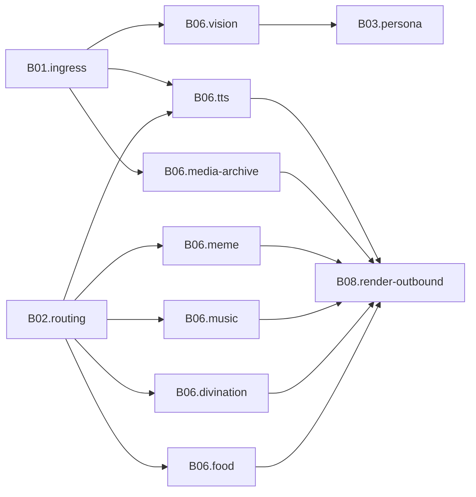

# B06 多媒体与娱乐

<!-- BOARD-AUTO:BEGIN -->
<!-- 本节由 scripts/board_doc_sync.py 生成，请勿手改；正文写在标记外 -->

## B06 多媒体与娱乐

> 声音、图像、表情、点歌、占卜与吃什么。

职责：

- TTS 语音合成与媒体归档
- 识图/搜图/视频抽帧
- 表情与随机图、点歌、占卜、创作与菜谱

### 二级功能

| 二级功能 | 一句话 | 三级入口 |
|---|---|---|
| [语音合成](tts/README.md) | GPT-SoVITS 契约层、退避与提交点、缓存身份与音色守望。 | [语音合成](tts/tts.md)、[引擎契约与参数域](tts/engine-contract.md)、[退避窗口与成功提交点](tts/backoff-and-commit.md)、[参考音频与音色基线](tts/voice-identity.md)、[缓存键与落盘命名](tts/synthesis-cache.md) |
| [媒体归档](media-archive/README.md) | VLM 判类别×IP 双层归档、去重与限额。 | [媒体归档](media-archive/media-archive.md) |
| [图像与视频理解](vision/README.md) | 识图、搜图、视频抽帧与字幕；失败三分类诚实上报。 | [识图与场景归属](vision/image-describe.md)、[以图搜图与来源](vision/image-search.md)、[抽帧与字幕链路](vision/video-frames.md) |
| [表情包与图库](meme/README.md) | 表情生成、收库、NSFW 降权与随机图。 | [表情包生成](meme/meme.md)、[偷表情](meme/meme-library.md)、[随机图片](meme/randpic.md) |
| [点歌](music/README.md) | 多供应商点歌、候选卡与真实榜单。 | [点歌](music/music.md)、[点歌模式](music/music-mode.md) |
| [占卜](divination/README.md) | 八字、塔罗、金钱卦；牌算与抽卡存储单一真身。 | [占卜](divination/divination.md)、[牌算与节气算法真身](divination/deck-math.md)、[抽卡记录单一存储](divination/draw-store.md) |
| [创作与图片生成](creation/README.md) | 图像/语音创作扩展位与共用件。 | — |
| [吃什么与菜谱](food/README.md) | 菜谱检索与饭点推荐，含图片质检与防污染。 | [吃什么推荐](food/eat.md) |
<!-- BOARD-AUTO:END -->

## 板块职责

这一板块按「产出或消费的是富媒体，而不是信息」切：语音、图片、视频、表情、歌曲、
卦象、菜谱。它们的共同点有三条——都要吃外部依赖（本机引擎、VLM/ASR 供应商、
图片站点、音乐平台接口）、都可能失败且必须诚实降级、最终产物是「一段媒体部件」
而不是「一段文字」。把这类能力放在一起，是为了让「外部服务没在跑怎么办」这一套
口径只写一遍。

与其他板块的边界：

- 消息进来后的段归一、语音预转码、Telegram `file_id` 取字节属于
  [B01 接入与协议](../B01-ingress-protocol/README.md)；本板块只接「已经拿到本地
  路径或 URL 的媒体」这一份事实。
- 路由席位、门禁与限流属于 [B02 路由与调度](../B02-routing-dispatch/README.md)；
  本板块每张三级入口卡只登记自己占的席位号，不复制路由表。
- 识图与转写的文字结果如何进人格上下文，消费方是
  [B03 人格与对话](../B03-persona-chat-safety/README.md)；模型注册表与调用护栏在
  本板块，注入格式不在。
- 卡片渲染、语音段出站与投递记账归 [B08 渲染与出站](../B08-render-outbound/README.md)。
  本板块产出 `CapabilityResult`（含 audio/image 部件）即交棒，不自己发消息。
- 中央媒体摘要层（`domains/media/digest.py`）虽是媒体件，其键语义与出站契约归
  B08 正文；本板块只在 TTS 卡里说明合成侧挂了哪些字段。

## 上下游

外部依赖一侧：TTS 打本机 GPT-SoVITS api_v2；识图/转写打 `BOT_VISION_MODEL_REGISTRY`
与 `BOT_ASR_MODEL_REGISTRY` 里的 OpenAI 兼容供应商；表情生成打本机
meme-generator-rs；搜图打 SauceNAO；点歌打各音乐平台公开接口；占卜与菜谱纯本地
计算，零网络。

## 退役与并入记录

- 本板块正文吸收的旧文档（原件按 `_meta/doc-classification-20260921.md` 的处置
  结论保留原位或归档，此处不复制过程内容）：
  `HANDOVER-TTS-GH-20260920.md`（波 G+H 全量交接，含缺陷编号与提交哈希）→ 结论
  蒸馏进 `tts/` 五页；`docs/design/tts-contract-layer.md`（契约层规格，与前者
  去重后作为契约真身）→ `tts/engine-contract.md`；`docs/design/tts-audit-20260919.md`
  与 `docs/design/tts-handover-20260919.md`（同期交接长文）→ 现役坑另归 B10，
  余为历史证据；`docs/design/media-digest-layer.md`（摘要层蓝图）→ 主体归 B08，
  本板块只留合成侧接线一段；`docs/design/divination-consolidation-20260921.md`
  （用户裁定 11.C 的合并判据）→ `divination/deck-math.md` 与 `draw-store.md`；
  `docs/design/unify-audit-20260919/F15-voice-chain.md`（语音链路取证）→ 退避与
  观测两段。
- 台账归属：`docs/HANDBOOK.md` §35（Wave G 契约波总账）与 AGENTS.md 台账 #44、#47
  WP4/WP9 条目仍是逐席证据源；本板块写「现行口径」，逐笔哈希与席位报告留在
  `.superpowers/sdd/`，不在板块树内重复。
- 能力合并记录：占卜原「聊天侧 `data/draw_store.py`」与「REST 侧
  `service/tarot_draw.py` + `service/fortune.py`」两套算法、两颗 `DrawError`
  已收编为单一真身，旧路径降为再导出垫片（详见 `divination/` 三页）；触发词字符
  集六副本收编进 `domains/core/text_boundary.py`。
