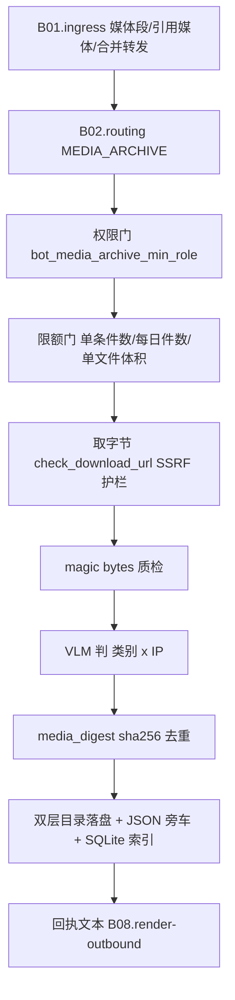

# B06.media-archive 媒体归档

<!-- BOARD-AUTO:BEGIN -->
<!-- 本节由 scripts/board_doc_sync.py 生成，请勿手改；正文写在标记外 -->

## B06.media-archive 媒体归档

> VLM 判类别×IP 双层归档、去重与限额。

- 归属板块：[B06](../README.md)
- 实现落点：`plugins/bot_unified_runtime/domains/media/archive`、`plugins/bot_unified_runtime/domains/media/capabilities/media_archive.py`
- 路由席位：`MEDIA_ARCHIVE`
- 能力 id：`bot.media_archive`
- 帮助主题：媒体归档
- 配置键前缀：`bot_media_archive_`（逐键以目录册为准）

### 三级入口

| 三级入口 | 路由席位 | 能力 id | 别名/帮助页 | 优先级 |
|---|---|---|---|---|
| [媒体归档](media-archive.md) | MEDIA_ARCHIVE | bot.media_archive | 媒体归档 | 43 |
<!-- BOARD-AUTO:END -->

## 这个功能解决什么

群里刷到的好图、别人发的 cosplay、一段值得留的动画截图，发的时候不留神就翻不到了。
这个功能把「顺手存下来」变成一句话：发媒体 + 说「收藏」，或者回复那条媒体说
「收藏」。落盘按 类别 × 作品来源（IP）双层目录归位，判不出来源就进「未识别」，
不硬猜。回复一份合并转发并说「存聊天记录」，会展开成 Markdown 归档。

它替谁解决什么：替用户解决「媒体散在聊天流里无法沉淀」；替运维解决「一个会往磁盘
写东西的能力必须有闸」——所以这个功能的安全面和功能面是一起落地的。

## 处理流程

## 边界与降级

- 权限：`bot_media_archive_min_role` 缺省 super_admin——归档写的是本机磁盘，默认
  不给全员；改 `user` 即放开，限额与冷却照常生效，不会因此绕过任何其它闸。
- 限额：单文件 `bot_media_archive_max_file_mb`（100）、单条消息
  `bot_media_archive_per_message_limit`（4）、每日 `bot_media_archive_daily_limit`
  （50）。超限件诚实跳过并在回执点名「有一件没能落盘」，不静默吞。
- 安全：下载只走 `domains/files/sources/downloader.py:check_download_url` 这一处咽喉
  （本域不自建第二份校验逻辑）；类别与 IP 目录名一律消毒，防路径穿越；重复内容按
  sha256 幂等，同一张图第二次说「收藏」不会复制两份。
- VLM 关闭或识别失败：按媒体类型降级归类，回执明确写「未分析」，绝不把猜测写成
  判定结果。
- 归档是**永久保存**（用户自己的档案库），不做 TTL 清理，这一点与表情库的
  FIFO+TTL 正好相反；落盘根目录必须经 `scripts/runtime_paths.py` 重映射，漏登会
  把档案写进源码树。
- 视频：ffmpeg 轻抽若干帧（`bot_media_archive_video_frames`）交给 VLM 一次判类，
  不做 ASR 转写——归档要的是「这是什么」，不是「说了什么」。

## 测试与验收

`tests/test_media_archive.py`（指令解析、双层归位、去重幂等、限额、权限门、目录名
消毒、VLM 失败降级、聊天记录展开）。真机验收＝`docs/acceptance-manual.md` §6.6.2：
发图收藏、回复收藏、显式 `分类=`/`IP=`、超限、非白名单角色五种形态。

## 现行缺陷

- P2：摘要身份已收编中央件 `domains/media/digest.py`，但归档目录本身仍无统一配额
  与容量告警（永久保存是设计选择，代价是盘只会涨）；需要的是运维侧的容量观测，
  归 B09。
- P2：VLM 判定质量依赖识图模型注册表配置（见 `../vision/README.md`），未配模型时
  全部走「未分析」降级，归档会集中在「未识别」桶里。
- P2：聊天记录的合并转发展开依赖协议端 `get_forward_msg`，节点未就绪时该子功能
  不可用，其它归档形态不受影响。
