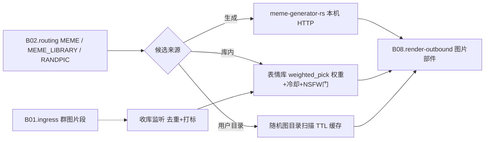

# B06.meme 表情包与图库

<!-- BOARD-AUTO:BEGIN -->
<!-- 本节由 scripts/board_doc_sync.py 生成，请勿手改；正文写在标记外 -->

## B06.meme 表情包与图库

> 表情生成、收库、NSFW 降权与随机图。

- 归属板块：[B06](../README.md)
- 实现落点：`plugins/bot_unified_runtime/domains/meme`
- 路由席位：`MEME`, `MEME_LIBRARY`, `RANDPIC`
- 能力 id：`bot.meme`, `bot.meme_library`, `bot.randpic`
- 帮助主题：表情, 偷表情, 表情收库, 随机图
- 配置键前缀：`bot_meme_`, `bot_randpic_`（逐键以目录册为准）

### 三级入口

| 三级入口 | 路由席位 | 能力 id | 别名/帮助页 | 优先级 |
|---|---|---|---|---|
| [表情包生成](meme.md) | MEME | bot.meme | — | 20 |
| [偷表情](meme-library.md) | MEME_LIBRARY | bot.meme_library | 偷表情 | 22 |
| [随机图片](randpic.md) | RANDPIC | bot.randpic | — | 41 |
<!-- BOARD-AUTO:END -->

## 这个功能解决什么

「会玩图」这件事的三个面：做一张梗图（表情生成）、攒一库群里的图并挑着发（偷表情）、
以及从用户自己的文件夹里随机甩一张图（随机图）。共同点是产物都是图片部件，
出口都走统一渲染与发送；不同点是数据来源与风险面完全不一样，所以拆成三个入口、
三套开关。

第二层目的在「不尴尬」：库里图混了不合适的东西不能照发，心情低落时不该甩吵闹梗，
主动甩图必须有防骚扰门。这些倾向性判定都收在权重与门链里，不散在文案里。

## 处理流程

## 边界与降级

- 三把独立开关：`bot_meme_api_enabled`（生成，缺省 False）、
  `bot_meme_command_enabled`（命令面，缺省 True）、`bot_meme_library_enabled`
  （库与收库，缺省 False）、`bot_randpic_enabled` + `bot_randpic_dirs`（随机图，
  没配目录即等于关闭）。生产实况：生成器与表情库均已开。
- 外部服务不在就诚实告知：meme-generator-rs 未安装/未监听时给「配置提示」而不是
  抛异常；随机图目录为空或全不可读给一句友好降级，绝不报错、绝不在源码树建新目录。
- 表情库的收库是**旁路监听**：下载走中央 SSRF 咽喉，按 md5 去重，体积上限
  `bot_meme_library_max_file_bytes`，库容 `bot_meme_library_max_files` +
  `bot_meme_library_max_age_days` 做 FIFO/TTL 剪枝（与媒体归档的「永久保存」相反）。
- NSFW 分级：`nsfw_score ≥ 0.8` 永不发送且可配自动删除
  （`bot_meme_library_nsfw_delete`），`≥ 0.2` 降权；取图默认上限
  `bot_meme_library_nsfw_max`。
- 倾向而非硬开关：心情低落（valence 达低落档，与 `character/mood.py` 同阈值）时对
  吵闹标签有限次重抽，全吵闹也照发——只调倾向，不做「心情不好就不发图」的断言。
- 随机图只读用户配置的目录，不自建存储、不建数据库、不接收上传；文件超过
  `bot_randpic_max_file_mb` 直接跳过。
- 相邻但**不属于本板块入口**的两件：贴纸回应的识别与进程内缓冲
  （贴纸回应入口模块）及其持久化统计（`domains/meme/sources/reaction_store.py`，
  归 B01 摄取 + B04 记忆面）、表情挑选引擎 `domains/meme/reactions/engine.py`
  （为回应与二次元语料提供脸名/素材）。

## 测试与验收

`tests/test_meme_domain_fixes.py`（生成链、模板参数、图片输入）、
`test_meme_image_input.py`、`test_meme_conflict_fix.py`（触发词让路）、
`test_randpic_identity.py`、`test_randpic_scan_cache_l10.py`（目录变更的缓存失效）、
`test_traditional_news_randpic.py`（繁體触发形态）、`test_reactions.py` 与
`test_reaction_store.py`（相邻面回归）。真机：`docs/acceptance-manual.md` §6.6.6
（贴纸回应）、§6.6.7（表情挑选第二层）与 §6.6.1 的随机图/偷表情触发形态。

## 现行缺陷

- P1：「心情驱动主动发图」仍有意不上线半吊子版本——完整的防骚扰门（概率×心情×
  冷却×NSFW×白名单）未设计评审（台账 #17）。
- P2：表情库自动打标依赖 VLM，未配视觉模型时所有新入库图为「未标」，权重退化为
  默认档；NSFW 判定同样退化，靠收库侧保守默认兜着。
- P2：按需梗搜索（`domains/meme/sources/meme_search.py`，`bot_meme_search_enabled`
  缺省 False）是「模型自己查热词」的旁路能力，与表情库共享域目录但语义不同，
  尚未与知识检索面（B04）合并口径。
