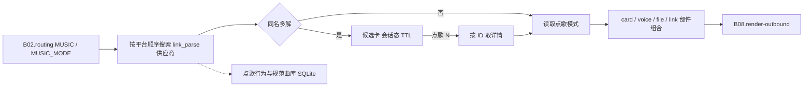

# B06.music 点歌

<!-- BOARD-AUTO:BEGIN -->
<!-- 本节由 scripts/board_doc_sync.py 生成，请勿手改；正文写在标记外 -->

## B06.music 点歌

> 多供应商点歌、候选卡与真实榜单。

- 归属板块：[B06](../README.md)
- 实现落点：`plugins/bot_unified_runtime/domains/music`
- 路由席位：`MUSIC`, `MUSIC_MODE`
- 能力 id：`bot.music`, `bot.music_mode`
- 帮助主题：点歌
- 配置键前缀：`bot_music_`（逐键以目录册为准）

### 三级入口

| 三级入口 | 路由席位 | 能力 id | 别名/帮助页 | 优先级 |
|---|---|---|---|---|
| [点歌](music.md) | MUSIC | bot.music | 点歌 | 41 |
| [点歌模式](music-mode.md) | MUSIC_MODE | bot.music_mode | — | 40 |
<!-- BOARD-AUTO:END -->

## 这个功能解决什么

一句话点到能听的歌。用户说「点歌 晴天」，bot 按平台顺序去搜，拿到候选后按当前
输出模式发出来：平台音乐卡片、封面图、语音报幕、音频文件或纯链接。同名歌曲不再
自作主张挑一首，而是回候选卡让用户用编号选（历史事故：同名人硬选一首，用户听到
的是别人的歌）。

另一半是榜单——网易云热歌/飙升、QQ 音乐热歌、酷狗飙升/电音这类真榜，能取到就取，
取不到就明确标不可用，绝不伪造排行。

## 处理流程

## 边界与降级

- 搜索是纯接口调用，不调 LLM：结果只来自平台接口，模型不参与选歌。
- 平台顺序与可用性来自
  `domains/link_parse/parsers/__init__.py:_MUSIC_SEARCH_PROVIDERS`（顺序即尝试顺序），
  `bot_music_platforms` 为空表示按内置全序走；Cookie 经 `build_cookie_provider`
  按平台绑定（`bot_cookies_file`，Netscape 格式），没 Cookie 的平台自然搜不到，
  不会因此编造结果。
- 候选态是会话级、有 TTL 的临时状态：过期后「点歌 2」不再指向旧候选，会重新搜索
  或给引导；同名歧义永远问，不硬选。
- 渲染失败自动回退纯文本（含歌名与链接），不会因为出图失败而吞掉点歌结果。
- 榜单侧：匿名不可达的来源注册为 `unavailable` 占位并如实标注原因，取数抛
  `ChartSourceUnavailableError`，没有「看起来像榜单」的兜底假数据。
- 点歌模式是管理员键：普通用户能点歌，不能改全服输出形态。

## 测试与验收

离线族：`tests/test_music_capability_analytics_v2.py`、`test_music_candidates_card.py`、
`test_music_candidates_v2.py`、`test_music_charts_v2.py`、
`test_music_charts_real_sources_v2.py`、`test_music_analytics_v2.py`、
`test_music_backend_v2.py`、`test_music_parser_metadata_v2.py`、
`test_music_projection_v2.py`、`test_music_provider_projection_v2.py`、
`tests/test_music_backend_v2.py`、`tests/test_music_analytics_v2.py`、`tests/test_music_candidates_v2.py`（订阅面归 B05，与本域共享供应商）。真机：
`docs/acceptance-manual.md` §6.4 的点歌条目（正常点歌、同名出候选、编号选择、
模式切换、无结果五条）。

## 现行缺陷

- P2：部分平台的音频直链受登录态与地域限制，`file` 模式在那些平台上会退化成
  卡片或链接，属外部约束不是解析缺陷。
- P2：点歌统计（`bot_music_analytics_*`）与规范曲库同库不同表，留存期靠
  `bot_music_analytics_retention_days` 裁剪，尚未接入中央容量观测（B09）。
- P2：榜单来源可用性依赖第三方接口，接口变更时以「不可用」呈现，不做静默替换。
