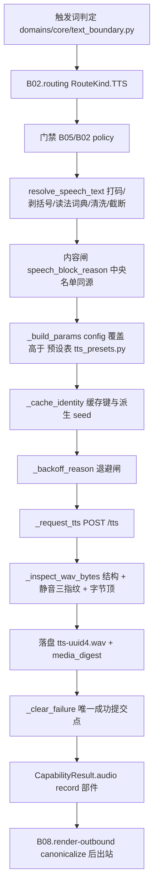

# B06.tts 语音合成

<!-- BOARD-AUTO:BEGIN -->
<!-- 本节由 scripts/board_doc_sync.py 生成，请勿手改；正文写在标记外 -->

## B06.tts 语音合成

> GPT-SoVITS 契约层、退避与提交点、缓存身份与音色守望。

- 归属板块：[B06](../README.md)
- 实现落点：`plugins/bot_unified_runtime/domains/media/capabilities/tts.py`、`plugins/bot_unified_runtime/domains/creation/tts`
- 路由席位：`TTS`
- 能力 id：`bot.tts`
- 帮助主题：语音
- 配置键前缀：`bot_tts_`（逐键以目录册为准）

### 三级入口

| 三级入口 | 路由席位 | 能力 id | 别名/帮助页 | 优先级 |
|---|---|---|---|---|
| [语音合成](tts.md) | TTS | bot.tts | — | 41 |
| [引擎契约与参数域](engine-contract.md) | — | — | — | — |
| [退避窗口与成功提交点](backoff-and-commit.md) | — | — | — | — |
| [参考音频与音色基线](voice-identity.md) | — | — | — | — |
| [缓存键与落盘命名](synthesis-cache.md) | — | — | — | — |
<!-- BOARD-AUTO:END -->

## 这个功能解决什么

让守岸人能用声音回话。用户侧的形态很简单——「说 今天的风很软」，或者让日常回复
自动带上语音；引擎侧是本机 GPT-SoVITS v2ProPlus 的 `api_v2` 接口文件（外部仓，不在本仓；默认
`127.0.0.1:9880`）。

难点不在「能不能出声」，在「出声这件事会不会骗人」。审计（Wave G）在本域立住的事
实包括：引擎推理异常时会返回 **HTTP 200 + 恰好一秒的静音 wav**，看起来完全成功；
它自己的 `TTS_Request` 对数值参数零范围校验，越界值照样收；它只认 3 到 10 秒的
参考音频；它的权重文件缺失时会静默回退底模并把回退写回 yaml，音色就此永久改变。
所以这一簇代码的主要工作是把「成功」重新定义成一件可验证的事：产物要过结构体检
与静音指纹、要在落盘交付之后才算成功、要把失败分成「该冷却」与「不该冷却」两类。

第二件工作是把这些判定收成一个口径，不留副本：触发词边界、预设参数域、缓存键身份、
出站部件形状、健康探针，各自只有一个真身，被 TTS 与相邻域共同消费。

## 处理流程

## 边界与降级

- 总闸 `bot_tts_enabled` 缺省 False；生产 `.env` 置 true 才开。自动配音
  `bot_tts_auto_reply_enabled` 与配音 hook `bot_tts_voice_hook_enabled` 缺省均
  False——关掉时链路逐字节保持旧行为，不会半开。
- 引擎地址受 SSRF 闸约束：`bot_tts_api_url` 在装载期做 loopback 白名单校验，
  fail-closed，非本机地址直接拒绝启动该项；不给远程引擎发文本。
- 失败分类学：不可达/超时/5xx/空音频/httpx 缺失进 30 秒退避窗（窗内快速失败，
  不再白打服务）；4xx 确定性拒绝与结构类坏字节**不进窗**（否则坏配置会让全员
  周期性吃「服务没在跑」的失真文案）；静音陷阱产物按部署类故障进窗。
- 无参考音频、参考音频越 3 到 10 秒、清洗后为空、超字数硬顶：都走可读文案与
  管理员向提示，不构造 OperationalIssue（政策拒绝与用法问题不是故障）。
- 产物绝不落毒：体检不过不落盘、不入缓存、不出站——现役协议端下坏 record 段是
  fatal（整条消息一字不发），毒件入缓存更会在进程存活期复放。
- 诚实边界：引擎生命周期由人工脚本负责，bot 侧只读探测，绝不代启动、绝不重启
  引擎；引擎的 `/control` 端点无鉴权且能改运行时状态（含终止），因此本板块
  **不记录任何调用方法**，只登记该风险与服务由用户自启这一事实。
- 字数与体积：`bot_tts_max_chars=0` 表示不按字数截断，但仍必过中央硬顶
  `bot_tts_hard_max_chars`（缺省 2000）与产物字节顶 `bot_tts_max_audio_bytes`
  （缺省 8 MiB，wav/PCM 下即时长顶）；超限=拒绝并留痕，绝不静默出货、不自动拆条。

## 测试与验收

离线族（全部 mock，零网络）：`tests/test_tts.py`、`test_tts_presets.py`、
`test_tts_contract_layer.py`、`test_tts_config_gates.py`、`test_tts_cache_identity.py`、
`test_tts_audio_gate.py`、`test_tts_health_backoff.py`、`test_tts_backoff_commit_point.py`、
`test_tts_hijack_guard.py`、`test_tts_speech_gate.py`、`test_tts_failure_visibility.py`、
`test_tts_filename_privacy.py`、`test_tts_media_digest.py`、`test_tts_outbound_chain.py`、
`test_voice_boundary_central_gate.py`、`test_voice_central_entry_gate.py`、
`test_voice_health_probe.py`、`test_voice_hook_assembly.py`、`test_voice_outbound_contract.py`、
`test_voice_media_routing.py`、`test_voice_queue_sim.py`、`test_media_digest.py`、
`test_tts_corpus_gate.py`。用例数与套件通过数以最近一次
`powershell -NoProfile -ExecutionPolicy Bypass -Command "& '.\scripts\dev.ps1' -Task test"`
实跑输出为准，本文不手写。

一键自检：`python scripts/tts_offline_selfcheck.py`（重启前体检十项 → 配置面真验证
→ 语料对齐门）；真机语音发出后用 `python scripts/tts_retcode_collect.py --json`
采集退码闭合面。真机验收清单＝`docs/acceptance-manual.md` §6.6.11（离线/引擎/真机
三组）；重启前置体检＝`scripts/pre_restart_check.py` 的音色一致性项。

## 现行缺陷

按 `_conventions.md` 第六节分级，逐条现状：

- P1：Wave H 传输层与观测面的部分改造、以及退避「唯一成功提交点」的根修
  （WP4）目前只在工作树，**未 commit、未重启**——现网进程仍是旧行为：HTTP 200
  即清零退避，引擎以静音伪装成功时冷却保护不启动。判定方法见
  `backoff-and-commit.md`。
- P1：引擎侧六项改造（参考音频长度校验、权重缺失不再静默回退等）需用户授权，
  引擎目录 `C:\Software\GPT-SoVITS-V2Pro` 未授权禁改；bot 侧只用只读探针。
- P2：时长硬拦（M-37）未做，等真机语音条上限数据（U-02）；当前由字节顶间接把守。
- P2：读法词典只有最小集，`%` 与 `～` 刻意关断（语序与双语义会念错）；全量词典
  另波。
- P2：语料三源（`.env` 权威、引擎 tsv 校对前旧文本、参考音频转写件）分叉未收敛，
  相关门以 `xfail(strict)` 钉住现状，等引擎侧订正授权。
- P2：`data/tts_output` 的中央配额缺省关闭（`bot_tts_cache_max_bytes`/
  `bot_tts_cache_max_age_days` 均为 0），uuid 化落盘后的孤儿文件目前无人回收。
- 待裁：中央媒体摘要层三项开放问题（U-107-A/B/C）与配音音色语义匹配（M-74）。
