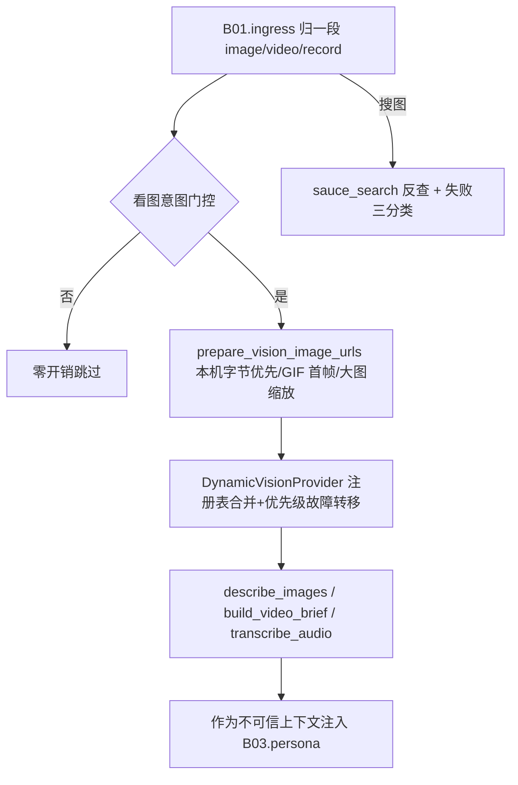

# B06.vision 图像与视频理解

<!-- BOARD-AUTO:BEGIN -->
<!-- 本节由 scripts/board_doc_sync.py 生成，请勿手改；正文写在标记外 -->

## B06.vision 图像与视频理解

> 识图、搜图、视频抽帧与字幕；失败三分类诚实上报。

- 归属板块：[B06](../README.md)
- 实现落点：`plugins/bot_unified_runtime/domains/media`
- 帮助主题：搜图, 视频理解
- 配置键前缀：`bot_vision_`, `bot_image_search_`（逐键以目录册为准）

### 三级入口

| 三级入口 | 路由席位 | 能力 id | 别名/帮助页 | 优先级 |
|---|---|---|---|---|
| [识图与场景归属](image-describe.md) | — | — | — | — |
| [以图搜图与来源](image-search.md) | — | — | — | — |
| [抽帧与字幕链路](video-frames.md) | — | — | — | — |
<!-- BOARD-AUTO:END -->

## 这个功能解决什么

让守岸人「看得见」也「听得懂」发来的媒体：一张图、一段视频、一条语音。她不是把
媒体原样塞给语言模型，而是先把媒体转成一份紧凑的文字材料（画面简述、角色识别、
屏上文字、视频简报、语音转写），再把材料作为**不可信上下文**注入当前消息，由人格
模型决定怎么用。所以「看到什么」和「说什么」是两件事：本簇只负责前者，绝不代她
下结论。

第二件事是搜图与来源——别人发一张图问「这是谁」，靠视觉模型猜不靠谱，需要真的去
反查图源。

## 处理流程

## 边界与降级

- 全部子能力默认关闭或默认保守：`bot_vision_enabled`（False）、
  `bot_asr_enabled`（False）、`bot_video_understanding_enabled`（False）；生产
  `.env` 已把三者置 true，未配模型注册表时依旧零调用。开关读取失败一律回退
  `.env` 值，不抛。
- 任何单信号失败都降级继续：识图失败不阻断聊天，视频里抽帧失败仍可只按字幕/元数据
  出简报，全部失败返回空简报。识别与转写调用按优先级最多转移三个候选模型。
- 成本纪律：一次分析只发一次 VLM 请求，CC 字幕与元数据作为文本上下文随同一次调用
  送入；已有平台字幕时默认跳过 ASR（`bot_video_skip_asr_with_subtitle`）；简报是
  材料不是答案。
- 图片来源优先级固定：协议端落盘的本机路径直读字节转 data URL → http URL 原样透传。
  签名 URL 对部分境外模型不可达且会过期，本机字节最可靠。GIF 取首帧重编 JPEG，
  超大图缩到长边 2048。
- 搜图失败分三类诚实上报：没配 key（`no_key`）、请求失败（`http_error`）、真的没有
  结果——三者文案不同，绝不把「我没查」说成「查无此图」。
- 语音转写统一经 ffmpeg 转 16kHz 单声道 mp3（QQ 语音多为 silk/amr，模型侧不认），
  ffmpeg 不可用且原文件非 mp3/wav 时放弃转写，消息照常处理。

## 测试与验收

离线族：`tests/test_vision_and_failover.py`、`test_vision_local_media.py`、
`test_vision_remote_data_url.py`、`test_video_understanding.py`、`test_video_seam.py`、
`test_video_progress_ack.py`、`test_video_reply_flow.py`、`test_asr_transcribe.py`、
`test_media_registry.py`、`test_media_quality.py`、`test_group_recent_image.py`、
`test_subscription_vision.py`、`test_reviewer_media_visibility.py`。真机：
`docs/acceptance-manual.md` §6.6.5（视觉收口条目）与 §6.6.1 的「看图意图」形态；
管理员侧用 `/bot model vision add ...` 现场挂模型后复验故障转移。

## 现行缺陷

- P2：识图与视频理解的模型可用性完全依赖用户侧供应商；无网或超时时的截断行为
  记在已知边界里（`docs/issue-ledger-p2-p3.md` 与本板块页不重复抄）。
- P2：Telegram 侧没有 reaction 事件键，识别能力只留接口（归 B01 摄取面）。
- P2：简报缓存由 `domains/media/registry/media_registry.py` 承担，其会话/消息身份
  口径与聊天历史对齐是跨域事项（B01/B04），追问命中率的改进未排期。
- P2：搜图仅 SauceNAO 一家，图源站不可用时没有第二来源；多供应商反搜未立项。
