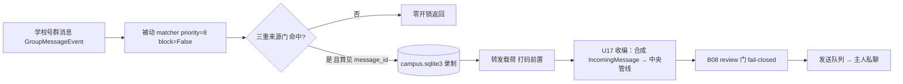

# B07.campus-forward 校园自动转发

<!-- BOARD-AUTO:BEGIN -->
<!-- 本节由 scripts/board_doc_sync.py 生成，请勿手改；正文写在标记外 -->

## B07.campus-forward 校园自动转发

> 三重来源门 + 幂等去重的纯监听旁路，绝不向源群发言。

- 归属板块：[B07](../README.md)
- 实现落点：`plugins/bot_unified_runtime/domains/assistant/campus`
- 配置键前缀：`bot_campus_`（逐键以目录册为准）

### 三级入口

| 三级入口 | 路由席位 | 能力 id | 别名/帮助页 | 优先级 |
|---|---|---|---|---|
<!-- BOARD-AUTO:END -->

## 这个功能解决什么

学校有一个独立的 QQ 号（第二实例）在很多学校群里，主人号看不到那些群。校园自动转发让「守岸人」纯监听这个学校号所在群的消息，一有新内容就实时私聊转发给主人，等于替主人盯着校园通知，而她自己绝不参与、绝不在学校群说一个字。

它是 B07 的"纯监听旁路"：由一个 `on_message(priority=8, block=False)` 被动 matcher 承接，不占路由席位、不产三级入口，来源门任一为空时整链路干脆不装配。

## 处理流程

## 边界与降级

- **三重来源门**：总开关 `bot_campus_enabled` ∧ 学校账号 `bot_campus_self_ids` ∧ 群白名单 `bot_campus_group_whitelist`（装配再加 `bot_campus_notify_qq` 非空），任一为空整链不装配、不注册 matcher——绝不猜账号、猜群、猜目标；白名单含 `*` 显式放行学校号全部群。
- **纯监听红线**：对学校群只读不写；出站目标恒为主人私聊（合成消息的 `group_id` 强制为 `None`），结构性保证不向学校群发任何消息。
- **幂等 + 截断**：`message_id` 去重（SnowLuma 断线重连重发不双推），库 `campus.sqlite3` 按保留窗时机性裁剪（窗宽以该件常量为准）；转发正文按字数上限截断补省略号（上限以该件常量为准）。
- **U17 收编中央出站管线**：删除裸 `send_queue.submit` 旁路，改走门禁/review/幂等统一入队；出站正文进 review 前先过 `redact_local_secrets`（打码前置，主人收打码版），review BLOCK（泄拦/停用）时发一条只带能力名/拦截类别/目标会话、绝不含原文的可观测告警（store 已记账、同 id 不再重放，静默即永久丢失故必须点名）。
- v1 只处理文本消息，纯图片/表情（空文本）不落库不转发。

## 测试与验收

`tests/test_campus_digest.py`（三重门/幂等/截断/端到端转发/纯监听红线结构锁）。设计权威在 `MyWorkspace\CampusInfoButler\docs\specs` 校园信息管家方案。真机验收见 `docs/acceptance-manual.md` 校园条目。

## 现行缺陷

- **启用需用户操作且须提权重启**：管理员跑采集侧启动器扫码（NapCat-school 第二实例，WS 3002，资产在归档 zip `ChatBot_Archive\2026-09-20\napcat-retire-backup-2026-09-20.zip` 内 `NapCat-school\`）→ `.env` 填 `BOT_CAMPUS_GROUP_WHITELIST`（缺省空=关闭）→ `.env.prod` 解注释 3002 → **重启**，未重启则线上未生效。
- 群摘要读取历史缺陷（session_id 口径）属另一域（B05/shared_group），与本旁路转发链路无耦合；此处如实标注以免混淆。
- LLM 行动项提取/每日摘要为后续迭代，v1 未做。
