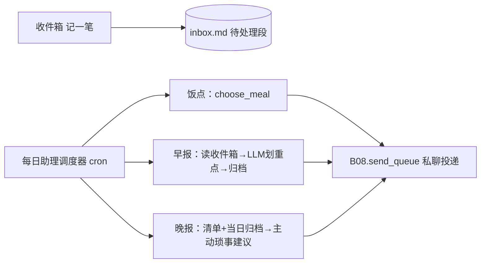

# B07.daily-assist 日常助理与收件箱

<!-- BOARD-AUTO:BEGIN -->
<!-- 本节由 scripts/board_doc_sync.py 生成，请勿手改；正文写在标记外 -->

## B07.daily-assist 日常助理与收件箱

> 收件箱速记、饭点建议、早晚对账推送。

- 归属板块：[B07](../README.md)
- 实现落点：`plugins/bot_unified_runtime/domains/assistant/daily`
- 路由席位：`DAILY_ASSIST`
- 能力 id：`bot.daily_assist`
- 帮助主题：收件箱
- 配置键前缀：`bot_daily_assist_`（逐键以目录册为准）

### 三级入口

| 三级入口 | 路由席位 | 能力 id | 别名/帮助页 | 优先级 |
|---|---|---|---|---|
| [收件箱速记](daily-assist.md) | DAILY_ASSIST | bot.daily_assist | — | 42 |
<!-- BOARD-AUTO:END -->

## 这个功能解决什么

一个贴身日常助理：随手一句话把待办丢进"收件箱"，到饭点替你想吃什么，早上把攒着的事理成简报、晚上做一次当日对账并主动提一句可能忘了的事。所有共享文件（收件箱、菜单、任务清单）都是纯文本，ZCode、手机端和她都能直接读写同一份，不锁死在 bot 里。

它与"提醒督促"的区别：提醒是"到某个时间点催一件事"，日常助理是"到固定作息节点（饭点/早/晚）主动整理并推一把"。二者复用同一套调度器族与发送队列纪律。

## 处理流程

## 边界与降级

- 投递目标只取显式名单 `bot_daily_assist_push_user_ids`；**名单为空整链不注册**（只记不推，绝不猜人）。
- 饭点/早报/晚报是同一调度器注册的多枚 cron；饭点菜色 `food.md` 自定义优先、内置库兜底，同菜 7 天内不重复；早/晚简报若 LLM 划重点失败回退原文。
- 收件箱写入走 `threading.Lock` 包住"检查→建目录→追加"，与调度线程池并发安全；不做跨进程保障（无此先例）。推送时刻为装配期快照。

## 测试与验收

离线用例：`tests/test_daily_assist.py`（记/看/归档/饭点历史/名单门/早晚报），`tests/test_v21r2_hotzone_meal_variants.py`（饭点文案轮换）。真机验收见 `docs/acceptance-manual.md`。

## 现行缺陷

- 投递走 SQLite 队列纯 submit，靠发送队列 worker 送达；`bot_send_queue_worker_enabled` 关时（缺省）需确认默认内存队列 + 内联投递口径（同提醒）。
- 推送时刻热改当轮不生效（台账 #3）。
- 整批为**已落码待重启生效**，线上未生效。
