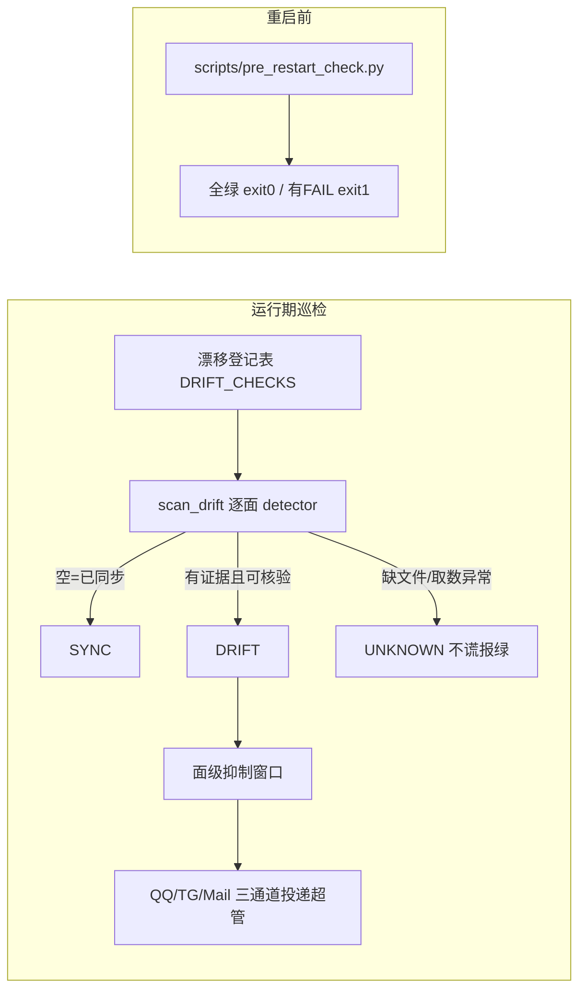

# B07.ops-inspection 巡检与同步漂移

<!-- BOARD-AUTO:BEGIN -->
<!-- 本节由 scripts/board_doc_sync.py 生成，请勿手改；正文写在标记外 -->

## B07.ops-inspection 巡检与同步漂移

> 源-副本漂移检测、告警投递与重启前体检。

- 归属板块：[B07](../README.md)
- 实现落点：`plugins/bot_unified_runtime/domains/ops/sync_drift`、`scripts/pre_restart_check.py`
- 配置键前缀：`bot_sync_drift_`（逐键以目录册为准）

### 三级入口

| 三级入口 | 路由席位 | 能力 id | 别名/帮助页 | 优先级 |
|---|---|---|---|---|
<!-- BOARD-AUTO:END -->

## 这个功能解决什么

她有很多"同一件事写在两处"的真相源——人格源文件与运行时副本、`.env.example` 与 `config.py`、`COMMANDS.md` 与帮助表、`db-owners.md` 与配置里的库清单、触发词与路由矩阵等。人改了一处忘了另一处，就会"文档/配置与代码真身对不上"。这个功能做两件事：① **同步漂移巡检**（sync_drift）：运行期周期复算这些"源 ↔ 副本"是否仍相等，漂了就多渠道报超管并附上修法教程；② **重启前体检**（pre_restart_check）：动手重启生产 bot 前把散落各处的就绪项收敛成一键预检。

## 处理流程

## 边界与降级

- **诚实三态**：detector 返回空=已同步；有证据行=漂移；行首为「无法核验：」=本机缺文件/取数异常，按日志处理，**不算漂移也不谎报绿**。逐面 fail-open，一个面崩不带走整轮。
- **None 与空表不是一回事**：`checks=None`=没筛选扫全部；筛后空表（例如 `bot_sync_drift_surfaces` 里的面名全拼错）=扫零面。早期写成 `checks or checks_for()` 会把后者悄悄放宽成前者（运维打错一个名字反而收到更多告警），属已根修的缺陷。
- **只读、零副作用**：巡检不写盘、不改文件、不发网络，一轮成本是若干本地文件读 + 一次注册表 AST 提取；修法教程现场生成、不存副本。
- **重启前体检**（`scripts/pre_restart_check.py`）逐项跑：关键路径存在性（含内置资产 qx.json 铁律）、人格副本锚定、交付物哈希台账、机器事实册、知识库三漂移、ruff、SnowLuma WS 可达、WebUI 单文件壳、控制面三键、GPT-SoVITS 音色守望等；缺项按 SKIP 不假红。

## 测试与验收

`tests/test_sync_drift_activation.py`（哨兵块**活性判据**：把根接线块真身文本抽出来注入假 scheduler 执行，而非 grep 存在性）。漂移检测各面 detector 由 sync_drift 域测试覆盖。重启体检脚本 exit code 0=可动手、1=有 FAIL。

## 现行缺陷

- **7 枚 `bot_sync_drift_*` 键此前在 Config 上不存在的缺陷已根修**（键落到 `config.py`），根因是消费方读不存在的键使 `bot_sync_drift_alert_enabled` 恒 False、巡检器永不注册；现已能真注册——但**缺省 `bot_sync_drift_alert_enabled=False`，须显式开且配超管才注册，且整体为已落码待重启生效，线上未生效**。
- `domains/ops/sync_drift/` 历史上是**未入库的在飞件**（共享工作树多会话），曾带本域 ruff/mypy 残余与"空 surfaces 被放宽成全扫还谎报"等缺陷；全面修复波把本域 ruff/mypy 归零并根修了这些点，如实记此沿革。
- 收件人只认 QQ 超管 `bot_super_admin_user_ids`；TG/Mail 复用既有运维告警配置，不新增第二份收件人配置。
