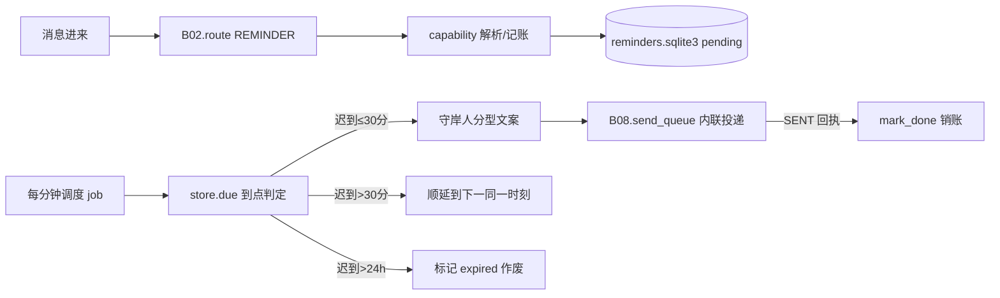

# B07.reminders 提醒督促

<!-- BOARD-AUTO:BEGIN -->
<!-- 本节由 scripts/board_doc_sync.py 生成，请勿手改；正文写在标记外 -->

## B07.reminders 提醒督促

> 自然语言时间点→会话待办→到点投递，含迟到与过期治理。

- 归属板块：[B07](../README.md)
- 实现落点：`plugins/bot_unified_runtime/domains/schedule`
- 路由席位：`REMINDER`
- 能力 id：`bot.reminder`
- 帮助主题：提醒
- 配置键前缀：`bot_reminder_`（逐键以目录册为准）

### 三级入口

| 三级入口 | 路由席位 | 能力 id | 别名/帮助页 | 优先级 |
|---|---|---|---|---|
| [提醒](reminder.md) | REMINDER | bot.reminder | 提醒 | 41 |
| [时间点解析词表](natural-time-parsing.md) | — | — | — | — |
| [投递、顺延与作废](delivery-and-lateness.md) | — | — | — | — |
<!-- BOARD-AUTO:END -->

## 这个功能解决什么

用户在聊天里顺口说一句「12点提醒我写作业」「明天早上8点叫我起床」「半小时后提醒我看看汤」，她就把这件事记成一条待办，到点主动用守岸人的语气来督促，而不是等人自己想起来。反过来，事情做完了一句「作业做完了」也能把对应的待办勾掉。

它替的是"记不住时间点、又怕被生硬闹钟打扰"的人：解析走确定性正则（低误报），到点投递走统一的发送队列，投递失败不销账、下一轮重投。同时把"绝不打扰失控"当硬约束——单会话待办有上限，错过的提醒有顺延与作废治理，长段转发粘贴的文字会被挡在门外。

提醒（`REMINDER` / `bot.reminder`）与笔记共用同一个路由席位，笔记指令面（记/看/列表/做完）由 `domains/notes/capabilities/notes.py` 承接，不另立 RouteKind。

## 处理流程

## 边界与降级

- 到点判定与墙钟推算统一走**配置时区** `config.bot_timezone`（缺省 `Asia/Hong_Kong`），naive 输入按配置时区解释、aware 一律换算过去再比较，跨时区部署不再错位；"现在"这个时刻统一经授时件（`domains/schedule/timesync/timesync.py`）校正，链＝NTP → HTTPS `Date` 头 → 多源互证 → 回退系统钟（逐级降级属预期，全账见 `docs/boards/B04-memory-knowledge-notes/notes/time-sync.md`）；未启用或整链失败时回退系统钟——那一刻用的就是系统钟本身，投递误差不再受任何上限钳制。
- 单会话待办超限（条数上限以该件常量为准）时**拒绝新增**并提示先取消，不再静默挤掉最旧一条（否则用户以为都记着其实丢了）。
- 转发粘贴守卫：正文带广告痕迹词、原始多句、超长一律拒绝入库，并对同一事项按去重窗去重（窗宽以该件常量为准），防"粘贴一条缴费广告 → 到点齐炸"。
- 投递失败只记日志、不销账，下一轮重投前查回执仓防双发；重投受阻时由顺延/作废策略兜底，绝不阻塞主链路。

## 测试与验收

离线用例：`tests/test_reminder.py`（解析与存储）、`tests/test_reminder_delivery.py`（内联投递与回执）、`tests/test_reminder_governance_receipt.py`（顺延/作废治理回执）、`tests/test_reminder_tone.py`（分型文案）、`tests/test_v21r2_reminder_guards.py`（粘贴/超限守卫）；真机验收见 `docs/acceptance-manual.md`。

## 现行缺陷

- 提醒、笔记等能力若绕开 `dev.ps1` 直跑测试会以默认路径把运行数据写进源码树（台账 #1 Wave-6 测试卫生残余，写入根治已随 runtime_paths 收编）。
- 「明早/明晚8点」词表族（`_DAY_OFFSETS` 收「明早」、`REM-EVE` 把无时段词的"今晚/明晚 N 点"按晚间语义 +12h）为**已落码待重启生效**，线上未生效。
- 调度器 cron 时刻是装配期快照，热改 `BOT_GROUP_DIGEST_PUSH_TIME` 一类当夜不生效（台账 #3）；提醒本身是每分钟 tick，不受此影响。
