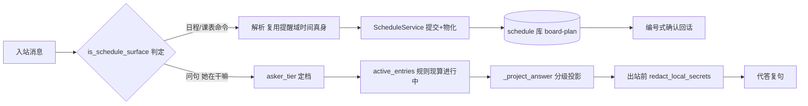

# B07.schedule-board 日程板与智能代答

<!-- BOARD-AUTO:BEGIN -->
<!-- 本节由 scripts/board_doc_sync.py 生成，请勿手改；正文写在标记外 -->

## B07.schedule-board 日程板与智能代答

> 自然语言/命令/课表导入建日程板（复用 V2.1 引擎），别人问「她在干嘛」按可见性分级代答（隐私判定在出站前）。

- 归属板块：[B07](../README.md)
- 实现落点：`plugins/bot_unified_runtime/domains/schedule/capabilities/schedule_board.py`、`plugins/bot_unified_runtime/domains/schedule/service/board_store.py`
- 帮助主题：日程
- 配置键前缀：`bot_schedule_`（逐键以目录册为准）

### 三级入口

| 三级入口 | 路由席位 | 能力 id | 别名/帮助页 | 优先级 |
|---|---|---|---|---|
| [可见性分级投影（代答腿）](visibility-projection.md) | — | — | — | — |
| [课表文本/图片导入](timetable-import.md) | — | — | — | — |
<!-- BOARD-AUTO:END -->

## 这个功能解决什么

她的课表、会议、安排散在聊天流里：自己问「我现在忙什么」要翻记录，别人问「她在干嘛/去哪了」要么得到编造的答案、要么得到生硬的「不知道」。本功能把这些安排收进同一块板子——顺口一句「明天8点有课」、显式命令「日程 …」、粘贴或发来的课表文本/图片，都进板；「日程表」一眼看排到哪儿了。

另一半是按分级表替她答：隐私条目对任何非本人恒零呈现（连「没安排」都不说，条目缺席不是证据），公开条目对普通提问者只给类别词+时刻、trusted/管理员档给活动名+时刻；地点、健康、饮食、作息细节永不出口。隐私判定发生在**出站前**（字段白名单投影 + 统一打码 `redact_local_secrets`），代答路径**零 LLM 调用**——不靠模型自觉。

信息源有硬边界：条目产生面只有三类——入站消息文本、她发来的课表（识图 provider 只由她这条消息触发，不主动扫设备）、日程库既有行。模块不 import 任何本机监控面，由测试 AST 锁执法；她「睡了/吃了什么」只可能来自她亲口说过的话。

装配口径：本功能不新增 RouteKind，挂提醒的 `REMINDER` 车道——路由腿 `is_reminder_command` 与能力分发腿 `build_reminder_capability` 引用唯一判据 `is_schedule_surface`（`domains/schedule/capabilities/schedule_board.py`，判据一处、两腿同源）。板子复用 S11 V2.1 日程引擎：一条日程 = `plan=board-<owner>` 下的 task+rule→物化 occurrence，存储、时区、幂等、限额全走引擎真身（`domains/schedule/service/board_store.py` 是引擎 store 的子类，只补按 owner 反查、可见性重打与终态清理，不加表、不开第二条写口）。时间点解析复用提醒域唯一解析器 `parse_time_target`（`domains/schedule/store/reminders.py`），不写第二个解析器。记录、代答、自然捕捉三面各有独立闸且**缺省全关**——闸关时对应面不存在，既有行为逐字节不变。

## 处理流程

## 边界与降级

- 存储没就绪（引擎表打不开）：如实回「这会儿日程表没接上」，不假装记上，也不阻塞提醒/笔记原流程。
- 引擎校验（限额/冲突/坏形）拒绝：如实回「这条我没能记下」并点名换个写法；导入批里单行坏不拖垮整批，回话点名没读实的行数。
- 解析不出未来时刻：恒回问「要记到什么时候呢」，绝不猜点位；单双周缺学期锚同样回问（禁猜日期，宁可多问不编）。
- 代答腿：谁都不可答（空板、全隐私板、无公开进行中条目）回模糊句，且空板与全隐私板**逐字相同**；多位超管同时可答绝不猜人，也回模糊句。地点（`loc:` 标签）与溯源（`src:` 标签）在代答面结构上不可达——投影用的 `BoardItem` 根本不带这两个字段。
- 自看清单（群聊/私聊一视同仁）只落「序号 + 时刻 + [公]/[密] 标记」，逐字不取条目标题：隐私条目的存在与否只以 [密] 呈现。
- 到点督促不走本板：仍走「X点提醒我」的提醒链，两边不抢（清单回话里明写）。
- 终态实例限期清理随写操作顺带跑，失败只记日志不阻塞业务；保留天数、物化窗口、列表上限等可漂移的值以 `board_store` 与能力件常量为准，本页不抄数。

## 测试与验收

离线用例 `tests/test_schedule_board.py`：记录腿（解析、建表只复用引擎表、列表/删/改可见性、文本与图片导入去重、终态清理与重打标签只碰该碰的行）、代答腿（三档逐级锁、敏感类别折叠、空板与全隐私逐字同句、多超管不猜人、出站打码、零时长在进窗口）、结构锁（路由与能力同一判据函数、模块零本机监控 import、代答零 LLM、总闸关=既有行为不变、提醒/笔记邻面不抢话）。补口三格 `tests/test_schedule_board_privacy_sched20.py`：第一人称问句只答本人板子、自看不泄标题（含反证注毒锁）、同一句不双记。逐命令口径见 `docs/command-catalog.md`【日程】节；出图与真机步骤暂无本功能专属验收组（见下方现行缺陷）。

## 现行缺陷

- `bot_schedule_` 族中 llm_draft / timetable / delivery 三枚键仍是在册未接线（`config.py` 注释 2026-09-26 原话「诚实挂账」）：图片课表识别实际消费 media 域识图装配（`BOT_VISION_ENABLED` 与识图 registry 决定可用性），**不读** `bot_schedule_timetable_enabled`；板内 occurrence 到点投递腿未接。
- 真机验收未在 `docs/acceptance-manual.md` 立专属组（本文时点现算）：重启后按「她发一条日程→别人问→按档回」走查的动作尚无编号可引。
