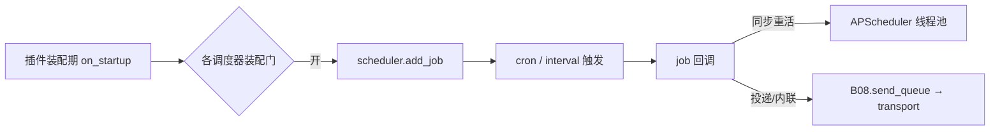

# B07.scheduled-jobs 调度器族与定时推送

<!-- BOARD-AUTO:BEGIN -->
<!-- 本节由 scripts/board_doc_sync.py 生成，请勿手改；正文写在标记外 -->

## B07.scheduled-jobs 调度器族与定时推送

> 根装配期注册的全部定时任务清单、时区口径与去重。

- 归属板块：[B07](../README.md)
- 实现落点：`plugins/bot_unified_runtime/__init__.py`
- 帮助主题：群摘要
- 配置键前缀：`bot_digest_`, `bot_daily_assist_`（逐键以目录册为准）

### 三级入口

| 三级入口 | 路由席位 | 能力 id | 别名/帮助页 | 优先级 |
|---|---|---|---|---|
| [发送队列驱动](send-queue-scheduler.md) | — | — | — | — |
| [夜间反思窗口](reflection-scheduler.md) | — | — | — | — |
| [每日通讯摘要推送](digest-push.md) | — | — | — | — |
| [历史上的今天推送](today-history-scheduler.md) | — | — | — | — |
| [凭据到期巡检](credential-check-scheduler.md) | — | — | — | — |
| [知识库同步](kb-wiki-sync-scheduler.md) | — | — | — | — |
| [落盘点 TTL 清扫调度](file-sweep-scheduler.md) | — | — | — | — |
<!-- BOARD-AUTO:END -->

## 这个功能解决什么

没有人发消息时，她也得按时间或按条件自己动：把排队中的消息送出去、到点提醒、每晚总结群聊、早晚推简报、夜里做反思、定时刷新知识库与凭据、按周期采集紧急信息。这些"自己动"的任务就是调度器族，全部在插件装配期通过 `scheduler.add_job` 注册，运行期由 APScheduler 唤起。

这个二级功能是整个 B07 的"时钟"：它维护一份**现役调度器清单**、统一时区口径、约定去重（dedupe）与失败隔离，让每条定时链路既各自独立、又共享同一套纪律。

## 处理流程

现役调度器（按注册函数列名，清单以根 `__init__.py` 的 `_register_*_scheduler` 一族与 `sync_drift.install` 为准，本文不逐一枚举全部）：发送队列 `_register_send_queue_scheduler`、提醒 `_register_reminder_scheduler`、群摘要 `_register_digest_push_scheduler`、每日助理含收件箱早晚报与饭点 `_register_daily_assist_scheduler`、夜间反思 `_register_reflection_scheduler`、历史上的今天 `_register_today_history_scheduler`、凭据到期 `_register_credential_check_scheduler`、知识库 wiki 同步 `_register_kb_wiki_sync_scheduler`、紧急信息采集 `_register_emergency_info_scheduler`（细节归 B05）。此外还有模型时段调度与用量监视等运营调度器，各自归本板块之外的域。

## 边界与降级

- **时区口径（台账 #6 已知残余）**：`cron`/`interval` 由 `nonebot_plugin_apscheduler` 驱动，用的是**进程系统本地时区**；这与安静时间（policy/quiet）等按配置时区计算的口径在异时区机器上会有偏移。需要严格墙钟语义的链路（提醒）自行把时刻换算到 `config.bot_timezone`，不依赖调度器时区。
- 调度器时刻/名单多为**装配期快照**（G-DIGEST、每日助理等），热改配置当轮不生效、要重启（台账 #3）。
- 名单为空即整链不注册：每日助理推送名单、紧急信息源、同步漂移收件超管、凭据检查开关，任一空 ⇒ 零 job、零副作用，绝不猜人猜群。
- 每个 job 回调自带 `try/except` fail-open：夜间任务失败只记一行日志，绝不带崩主链路或整机装载；重活（凭据探测、kb 同步、反思）下放 APScheduler 线程池，不冻结事件循环。

## 测试与验收

各调度器有独立测试件（见对应三级页「测试与验收」），例如 `tests/test_group_digest_push.py`、`tests/test_daily_assist.py`、`tests/test_reflection.py`、`tests/test_reminder_delivery.py`、`tests/test_sync_drift_activation.py`（哨兵块活性判据）。全量门禁 `dev.ps1 -Task test`。

## 现行缺陷

- cron 用系统本地时区导致的跨时区偏移（台账 #6），待与安静时间统一改造。
- 调度器装配期快照、不支持热改（台账 #3，架构取舍）。
- `sync_drift`、紧急信息调度器等为**已落码待重启生效**，线上未生效（重启前不注册）。
