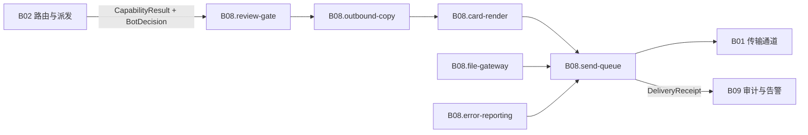

# B08 渲染与出站统一

<!-- BOARD-AUTO:BEGIN -->
<!-- 本节由 scripts/board_doc_sync.py 生成，请勿手改；正文写在标记外 -->

## B08 渲染与出站统一

> 所有内容只有一种长法和一条出口。

职责：

- 卡片渲染管线与 token 单一事实源
- 纯文本兜底与出站文案口径
- 审核门→发送队列→传输器的唯一出站路径
- 文件网关与受控下载

### 二级功能

| 二级功能 | 一句话 | 三级入口 |
|---|---|---|
| [卡片渲染](card-render/README.md) | 釉瑚云母卡片、主题 token 契约与 playwright 出图。 | [token 单一事实源与阴影族](card-render/theme-tokens.md)、[Jinja 模板与 f-string 直拼卡](card-render/templates.md)、[常驻浏览器与失败兜底](card-render/render-backend.md)、[动画钉帧与截图确定性](card-render/animation-pinning.md) |
| [出站文案与纯文本兜底](outbound-copy/README.md) | 说人话、分段换行统一、密钥与路径打码。 | [渲染失败降级纯文本](outbound-copy/plain-text-fallback.md)、[段间换行统一](outbound-copy/paragraph-breaks.md)、[本地密钥与路径打码](outbound-copy/secret-redaction.md) |
| [出站审核](review-gate/README.md) | 发送前的统一审核面与 BLOCK 观测。 | — |
| [发送队列与回执](send-queue/README.md) | part 级幂等、UNKNOWN 确认、PARTIAL 断点续发与投递回执。 | [SQLite 队列与恢复](send-queue/queue-persistence.md)、[回执与对账](send-queue/delivery-receipt.md) |
| [文件网关与受控下载](file-gateway/README.md) | FileSource→Ticket→通道交付，SSRF 护栏与路径白名单。 | — |
| [统一错误报告](error-reporting/README.md) | 内部异常→诊断卡两段式异步，冷却与纯文本兜底。 | — |
<!-- BOARD-AUTO:END -->

## 板块职责

一句话：**凡是用户最终看到的东西，都在这一块收口**——那句话怎么说、那张卡长什么样、从哪条路发出去、发不出去时怎么交代。

切六块的理由是这四件事各自的失败面完全不同：

- 卡片渲染（`card-render`）失败的最坏结果是「外观回退成文字」，所以它的约束是视觉契约与 token 登记，出错不该吵到用户。
- 出站文案（`outbound-copy`）是纯文本加工，确定性、零模型调用，失败的最坏结果是「话说得不像人」或「本机信息出门」，所以它的约束是红线词表与幂等变换。
- 审核（`review-gate`）是发送前最后一道判定，它只裁不放行改写，判错的方向是「拦下」，所以它必须可观测（拦了什么、为什么）。
- 发送队列（`send-queue`）承担「不确定就别重发」的责任，是这一块唯一有持久化和状态机的地方。
- 文件网关（`file-gateway`）把平台上传 API 收在一处，是 SSRF 与体积限额的落点。
- 错误报告（`error-reporting`）是旁路：它自己坏了也绝不能影响主回执。

与其它板块的边界：本板块**不决定说什么**（能力业务在 B03–B07）、**不决定给谁发**（门禁/策略在 B02）、**不实现平台协议**（OneBot/Telegram/Mail 的段语义与 API 形状在 B01）。本板块只接收 `CapabilityResult` + `BotDecision`，产出 `SendRequest` 并把回执交回审计。

## 上下游

入站只有一条：`domains/chat_reply/runtime/pipeline.py` 在能力返回后依次调 `domains/render/reviewer.py:review_capability_result` → `domains/render/renderer.py:render_reviewed_output` → `send_queue.submit`。文件出站走 `domains/transport/sender/file_gateway.py`，错误旁路走 `domains/ops/monitor/error_report.py:maybe_submit_error_card`，两者都汇进同一个发送队列。

⚠ 现役事实与目标态的差距：上画的「一条链」对**入站触发的能力回复**成立，对**主动推送**已更进一步但仍非全部经闸——中央闸 `domains/transport/sender/outbound_gate.py::submit_active_push` 的生产引用现覆盖 transport 本体、紧急信息域与根装配 `__init__.py`：2026-09-22 统一波（WAVE42 裁定件 `.superpowers/sdd/2026-09-21-unify-wave/decisions/WAVE42-active-push-central-exit.md`）起，每日群摘要 `_push_daily_group_digests` 与日常助理私聊推 `_push_daily_assist_private` 两族主动投递已改道本闸（关态＝与裸 `submit` 逐字节同形的 passthrough，线上零变更）。仍直调 `send_queue.submit` 的族（到点提醒与 cookie 到期两族，其内联投递与 `store.mark_done` 回执链耦合未改道）清单以结构锁 `tests/test_outbound_gate.py::test_existing_families_still_submit_directly` 与 `tests/test_outbound_bypass_prohibition_gate.py` 的豁免表为准，本处不手写族数。旧口径为 B4-spec §1.5「只登记不迁移」（当时值，`docs/design/emergency-info-unify-summary-20260919.md` §十，由 `tests/test_outbound_gate.py` 的 T6 结构锁钉死）。详见 [send-queue](send-queue/README.md) 的现行缺陷。

## 退役与并入记录

- `plugins/bot_unified_runtime/output/` 下的 `plain_text.py` `renderer.py` `reviewer.py` `roleplay.py` `templates.py` `render_backends.py` `bot_avatar.py` 与 `output/card_render/` 全部是 v21r2 render 迁移（W13）留下的再导出垫片（头注 `Compat shim: moved to domains/render/...`），真身在 `domains/render/`。板块文档一律写真身坐标；`output/` 路径只作为「历史导出名仍在用」的兼容面看待，不算实现。旧路径消费边的收编进度见 `docs/design/v21r3-render-shim-retirement.md`。
- 统一错误卡的代码真身自始就在 `domains/ops/monitor/error_report.py`，**不在** `runtime/`（多处旧文档写成 `domains/ops/monitor/error_report.py`，以本板块坐标为准）。
- 本板块吸收的过程件：`docs/design/v21r3-render-closing-spec.md`（C1–C13 裁决）、`v21r3-render-unification-plan.md`、`fstring-card-dom-spec.md`、`render-pipeline-optimization-spec.md`、`visual-effects-catalog.md`、`docs/design/unify-audit-20260919/`（渲染波席位取证）、`docs/design/audit-20260920-unify-U3-outbound.md` 与 `docs/design/audit-20260920-unify-U15-output.md`（出站与文本链审计）。这些文件保留原位继续作为规格与审计事实源，本板块正文不复写其数值表。
- **仍然独立生效、不由本板块接管的一份**：`docs/rendering-contract.md`。它是改任何卡片模板前的必读契约与豁免登记册（铁律、注册表、§八 豁免与待补门），本板块各页引用它、不替代它；两者冲突以契约与测试断言为准。
