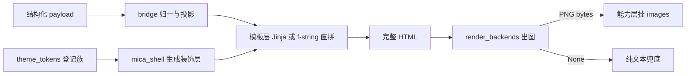

# B08.card-render 卡片渲染

<!-- BOARD-AUTO:BEGIN -->
<!-- 本节由 scripts/board_doc_sync.py 生成，请勿手改；正文写在标记外 -->

## B08.card-render 卡片渲染

> 釉瑚云母卡片、主题 token 契约与 playwright 出图。

- 归属板块：[B08](../README.md)
- 实现落点：`plugins/bot_unified_runtime/domains/render`、`docs/rendering-contract.md`
- 配置键前缀：`bot_render_`（逐键以目录册为准）

### 三级入口

| 三级入口 | 路由席位 | 能力 id | 别名/帮助页 | 优先级 |
|---|---|---|---|---|
| [token 单一事实源与阴影族](theme-tokens.md) | — | — | — | — |
| [Jinja 模板与 f-string 直拼卡](templates.md) | — | — | — | — |
| [常驻浏览器与失败兜底](render-backend.md) | — | — | — | — |
| [动画钉帧与截图确定性](animation-pinning.md) | — | — | — | — |
<!-- BOARD-AUTO:END -->

## 这个功能解决什么

有些结果用一行文字说不清：行情要看走势、好感度要看双向刻度、解析卡要有头像和指标、流程图要真画出来。卡片渲染就是把结构化数据排成一张 PNG 发到会话里。

难点不在「画得出来」，而在「所有面画得像同一家族」。早期每张卡各写各的 CSS，圆角、阴影、字号、色斑各自取巧，改一处要追改十处，还会互相看不见地漂移。现在的做法是：视觉数值只允许在 `domains/render/card_render/theme_tokens.py` 登记一次，装饰层（壳底渐变、漂移色斑、玻璃档位——成员与档位以该件登记册为准）只允许由 `domains/render/card_render/mica_shell.py` 的生成器产出，模板与直拼卡一律 `var()` 消费；「渲染面有多少个」这件事由 `scripts/doc_sync.py` 派生进机器册 `docs/auto-facts.md`，不在文档里手写。

## 处理流程

bridge 负责「脏数据归一 + 只吐已登记 token」，后端负责「浏览器出图」，两件事不混：`domains/render/card_render/bridge.py` 的各 `render_*_html` 是纯函数（输入 `None`/`{}` 也不抛异常），`domains/render/render_backends.py` 才碰 playwright。出图目标固定是 `.card` 元素，所以根元素带 `card` 类是截图契约而不只是习惯。

## 边界与降级

- **出图失败一律回纯文本，契约零破坏**：`render_card` 失败返回 `None`；各能力收到 `None` 或空字节必须走既有文字分支（点歌回候选列表、mermaid 回代码块原文）。这条是渲染契约铁律 7，桥层的 `None`/`{}` 断言与各能力回退断言共同执法。
- **缺省串行**：并发上限 `bot_render_max_concurrency`（等价旧全程大锁）与等待预算 `bot_render_wait_budget_ms`（=不启用，维持固定地板等待）的缺省值以 `config.py` 两键声明为真身。两键不配置时行为逐字节等于现状。
- **浏览器是线程绑定的常驻资源**：sync playwright 不能跑在事件循环线程上，所以调用方必须 offload；`mermaid` 走专用单线程池正是这个原因。空闲回收、崩溃标记、连续页面失败强制重建见 [render-backend](render-backend.md)。
- **离线素材不入库**：mermaid 真身 JS 落在 Runtime 资产目录，带 sha256 旁车与体积门；缺失或损坏时不注册拦截、放行网络，绝不拿半截文件出图。
- **UI 硬约束**：无 `<meta viewport>`、`body` 透明、字重上限与字号下限以 `theme_tokens.py` 与渲染契约登记为真身、动画必须在 `.card` 子树内、阴影只准 `SHADOW_CSS_VARS` 登记族（族外含 `inset` 一票否决）。这些不是审美倡议，是契约测试断言。

## 测试与验收

离线门（全树 `dev.ps1 -Task test` 内常驻）：

| 门 | 执法面 |
|---|---|
| `tests/test_rendering_contract.py` | Jinja 模板族逐条断言铁律与 token 等值 |
| `tests/test_mica_builders_contract.py` | f-string 直拼卡的同口径断言（含阴影两级登记特例） |
| `tests/test_template_visual_audit.py` | 数值与色值等值门（zebra 区分度、对比度、玻璃档位） |
| `tests/test_v21r3_visual_gates.py` | v21r3 九门 ×11 面（字号/色斑数与时长/行高/宽度/玻璃/语义色等） |
| `tests/test_mica_shell.py` | 生成器产物与桥层 `None`/`{}` 兜底 |
| `tests/test_render_backends.py`、`test_render_wait_budget.py`、`test_render_launch_backoff.py`、`test_render_image_cache.py`、`test_render_pool_hygiene.py`、`test_render_phase2_env_keys.py` | 后端生命周期与预算/并发开关 |
| `scripts/doc_sync.py` + `tests/test_perf_regression.py` 等交叉验证门 | 清单与哈希台账漂移（模板清单、渲染面数进机器册） |

真机验收＝重启后按 `docs/acceptance-manual.md` **§6.6.10**（11 面逐卡通用观察点①–⑥ + 逐卡触发清单）与 **§6.6.4⑥**（错误卡形态）。样张比对手段（`scripts/render_card_samples.py`）**本板块未执行**——渲染真机验证归重启后，此处不出图。

## 现行缺陷

以 `docs/rendering-contract.md` §八「豁免登记与待补门」为唯一权威清单，本处只列与本板块直接相关、且经复核仍在位的项：

- **卡骨架不统一**（契约 §五-2 + D-7）：存量并存多种根容器形态，结构锁只有「根类名」一条；统一目标态（`render_shell()` 单一装配）未裁决未迁移。
- **宽度登记不生效**（D-6）：直拼卡宽度已进 `CARD_SHELL_WIDTHS`，调用点仍传字面量 `width_px=`，改表不跟随；另有未登记的缺省档 `_DEFAULT_SHELL_WIDTH_PX`。
- **次级文字与阴影「单一来源」是半真**（D-4 / E-12）：`TEXT_SECONDARY` 仍以等值手抄存在于模板侧，公共段另有同语义双 token 双值并存；直拼卡阴影只有两级面。
- **若干纸面条款无机器拦截**：`OVERLAY_SCRIMS` 无面扫门（D-2）、`TYPE_SCALE_PX` 纯声明零消费者、直拼卡 `@keyframes` 名门缺失（D-1）、语义色「禁止卡私字面量」的全称执法未完成。
- **字节确定性判据易灭**（D-8）：样张基线住在系统临时目录（位置以 `scripts/render_card_samples.py` 的默认输出为准），未入库、无钉帧成功率告警——清临时目录后「PNG 字节等值」这条主判据当场消失。
- **旧路径垫片未退役**：`output/card_render/` 等仍作兼容导出面存在（`docs/design/v21r3-render-shim-retirement.md`），新代码不得再引用旧路径。
