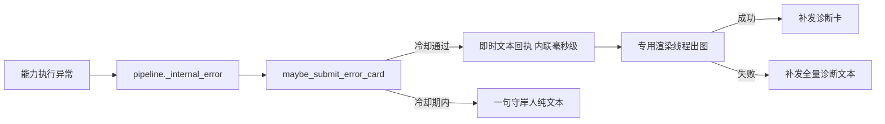

# B08.error-reporting 统一错误报告

<!-- BOARD-AUTO:BEGIN -->
<!-- 本节由 scripts/board_doc_sync.py 生成，请勿手改；正文写在标记外 -->

## B08.error-reporting 统一错误报告

> 内部异常→诊断卡两段式异步，冷却与纯文本兜底。

- 归属板块：[B08](../README.md)
- 实现落点：`plugins/bot_unified_runtime/domains/ops/monitor/error_report.py`
- 配置键前缀：`bot_error_card_`（逐键以目录册为准）

### 三级入口

| 三级入口 | 路由席位 | 能力 id | 别名/帮助页 | 优先级 |
|---|---|---|---|---|
<!-- BOARD-AUTO:END -->

## 这个功能解决什么

当某个能力在执行中抛异常时，用户不该只看到「什么都没发生」或一句冷冰冰的失败。这个入口把内部异常转成一张守岸人语气的诊断卡：既给用户一句人话回执，又给管理员留下脱敏后的堆栈、版本、平台协议、配置快照等排查线索。它替代了过去「能力崩了就静默」的黑箱状态。

## 处理流程

真身 `domains/ops/monitor/error_report.py::maybe_submit_error_card`，由 `pipeline.py::_internal_error` 在能力异常 catch 点调用（LLM 链路语义不走这里）。两段式：第一段在调用线程内联提交毫秒级文本回执（不碰 Playwright，事件循环线程不进渲染）；第二段把云母诊断卡渲染交给专用单线程池，成功后经发送队列补发图片卡、失败则补发全量诊断文本。冷却闸（`ErrorCardGate`，进程内滑动窗、会话表有界）命中时降级为一句 `cooldown_line` 纯文本，防刷屏。

## 边界与降级

三键在 `config.py`：`bot_error_card_enabled`（缺省 True）、`bot_error_card_cooldown_seconds`（缺省 60）、`bot_error_card_stack_frames`（缺省 8，内部按 `_STACK_FRAMES_MIN/MAX` 夹取）。解析链为 nonebot driver config → 环境变量 → 缺省，仅异常路径调用、无热路径成本。冷却秒数变化会重建进程级共享闸，但热改 config 仍需重启方全量生效。全链 fail-open：`maybe_submit_error_card` 自身不抛异常，`pipeline` 还有第二层兜底。渲染或提交失败只落 `logger.warning`，用户至少拿到第一段文本回执。回执文案来自报告里的 `human_text`（轮换的守岸人话术），卡片正文对触发回显、栈帧、配置快照逐项脱敏，出站再经统一打码。

## 测试与验收

诊断卡渲染依赖 `domains/render/card_render/templates/error_card.html` 与 `theme_tokens`（ERROR_ACCENT/ERROR_THEME），主题令牌受渲染契约门约束；离线用例与真机验收条目见 `docs/acceptance-manual.md`（错误卡节，§6.6.4），测试文件清单以生成物 `docs/auto-facts.md` 为准。

## 现行缺陷

历史上错误卡补发有「倒挂」风险（回执与卡图乱序），现用 `deliver_after` 下限与两段式契约约束（此机制细节以 `error_report.py` 内实现为准，未逐行二次核实者视为未确认）。诊断卡每类异常的样本目录是否受配额约束，按旧台账登记项对待，以 `docs/boards/_meta/code-quality-findings-20260921.md` 为准。
