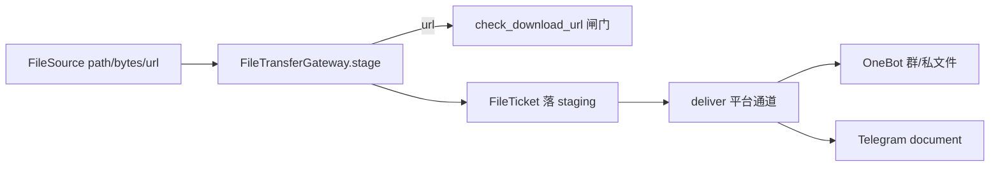

# B08.file-gateway 文件网关与受控下载

<!-- BOARD-AUTO:BEGIN -->
<!-- 本节由 scripts/board_doc_sync.py 生成，请勿手改；正文写在标记外 -->

## B08.file-gateway 文件网关与受控下载

> FileSource→Ticket→通道交付，SSRF 护栏与路径白名单。

- 归属板块：[B08](../README.md)
- 实现落点：`plugins/bot_unified_runtime/domains/files`
- 帮助主题：下载, 文件, 群文件
- 配置键前缀：`bot_file_gateway_`, `bot_download_`（逐键以目录册为准）

### 三级入口

| 三级入口 | 路由席位 | 能力 id | 别名/帮助页 | 优先级 |
|---|---|---|---|---|
<!-- BOARD-AUTO:END -->

## 这个功能解决什么

把「一个要发给用户的文件」从任意来源（本地路径、内存字节、远程 URL）统一成一张可交付票据，再按平台通道投递出去；同时把「用户丢来一个下载链接」这条链路收进同一个受控入口。它避免各处能力各自 open 文件、各自 requests.get 裸下——后者正是路径穿越和 SSRF 的温床。

## 处理流程

出站网关真身是 `domains/transport/sender/file_gateway.py::FileTransferGateway`，两段式：`stage(FileSource)->FileTicket`（路径/字节/URL 三种来源，URL 分支先过 `domains/files/sources/downloader.py::check_download_url` 这道 SSRF 固定闸门，与受控下载共用同一护栏；缺文件抛 `missing_file`），`deliver(ticket,...)` 再派发到 `_deliver_onebot` / `_deliver_telegram_document`。进程级默认网关经 `get_default_file_gateway`/`set_default_file_gateway` 存取。`/bot download` 的下载能力真身在 `domains/files/capabilities/download.py::build_download_capability`（配套 `extract_download_url` 从文本里取链接），落点目录 `domains/files`。

## 边界与降级

下载侧配置以 `config.py` 的 `bot_download_*` 键为准（下载目录、单文件与缓存字节上限、超时、并发、是否委托 aria2 等，逐键以目录册为准；路径类键进 `path_fields` 重映射到运行数据根）。超过大小上限时回退到小于上限的最高画质组合，无合适组合即诚实失败。URL 命中被拦协议或内网地址时由 `check_download_url` 抛拒因（`_url_rejection_reason`），下载不越闸。生成的票据名经 `sanitize_file_name` 消毒，落盘名带 sha256 与 dedupe key 去重。板块声明的配置前缀还含 `bot_file_gateway_`，但本会话未在 `config.py` 检索到该前缀的实际字段——若确无消费方则为声明性前缀，未确认。

## 测试与验收

网关与受控下载的用例以仓库 `tests/` 内相应件为准（测试文件清单见生成物 `docs/auto-facts.md`）。真机验收按 `docs/acceptance-manual.md` 的文件/下载条目走；SSRF 护栏属安全面，回归时以「注毒放宽闸门必红」的行为锁判据对待，存在性断言不算过关。

## 现行缺陷

网关处于 Phase-1 形态：staging 目录暂用系统临时目录、`bot_download_dir` 接线归后续阶段（见 `FileTransferGateway.__init__` 内注记），此为已登记的阶段性取舍而非缺陷。逐条以 `docs/boards/_meta/code-quality-findings-20260921.md` 为准。
