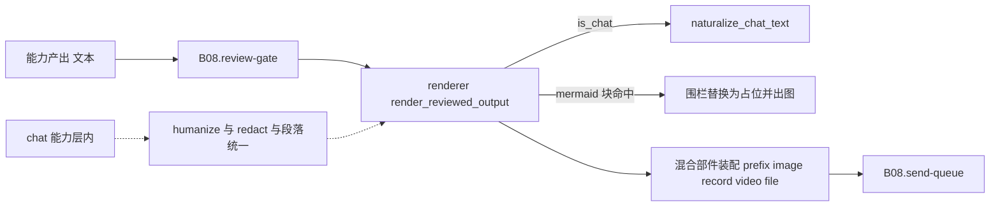

# B08.outbound-copy 出站文案与纯文本兜底

<!-- BOARD-AUTO:BEGIN -->
<!-- 本节由 scripts/board_doc_sync.py 生成，请勿手改；正文写在标记外 -->

## B08.outbound-copy 出站文案与纯文本兜底

> 说人话、分段换行统一、密钥与路径打码。

- 归属板块：[B08](../README.md)
- 实现落点：`plugins/bot_unified_runtime/output`、`plugins/bot_unified_runtime/domains/render/plain_text.py`

### 三级入口

| 三级入口 | 路由席位 | 能力 id | 别名/帮助页 | 优先级 |
|---|---|---|---|---|
| [渲染失败降级纯文本](plain-text-fallback.md) | — | — | — | — |
| [段间换行统一](paragraph-breaks.md) | — | — | — | — |
| [本地密钥与路径打码](secret-redaction.md) | — | — | — | — |
<!-- BOARD-AUTO:END -->

## 这个功能解决什么

模型和能力的原始输出不能直接发给人看：模型会写 Markdown 表格、会留 TeX 公式、会来一句「作为 AI 助手我希望以上内容能帮到你」，偶尔还会把 `.env` 里的键值和本机路径当成聊天内容复述出来。出站文案这一层负责把这些确定性地去掉，全程零模型调用。

四件套（真身都在 `domains/render/`，`output/` 下同名文件是再导出垫片）：

| 件 | 位置 | 干什么 |
|---|---|---|
| `naturalize_chat_text` | `domains/render/plain_text.py` | 展示语法整形：去围栏去标记、表格改读法、TeX 口播化、URL 与链接标签保真 |
| `humanize_reply` | `domains/render/plain_text.py` | 剥 AI 客套开场与总结腔；内心数值（好感度/心情）打码成「…保密」 |
| `redact_local_secrets` | `domains/render/plain_text.py` | 本机信息外泄红线：密钥、盘符路径、Bearer、JWT、URL userinfo、裸键值对 |
| `normalize_paragraph_breaks` | `domains/render/roleplay.py` | 段间换行统一成单换行，折叠空行与行尾空白 |

配套件（同一模块，按能力需要取用）：`format_roleplay_paragraphs`（括号动作独立成段）、`strip_action_brackets`（朗读/纯文本场景剥动作）、`strip_outer_speech_quotes`。

## 处理流程

要点：整形发生在**审核之后、入队之前**（审核读的是整形前的文本，见 [review-gate](../review-gate/README.md)）；`naturalize_chat_text` 只在 `bot.chat` 分支执行，其他能力正文原样透传。

## 边界与降级

- **幂等**：`naturalize_chat_text` 声明为幂等变换，重复加工不改变结果；快路径有哨兵，`redact_local_secrets` 无命中时原样返回（热路径零成本）。
- **宁可不改也不改错**：TeX 只**读法化**不求值，未知命令保留命令名（「公式命令 xxx」）而不是被吞掉；嵌套过深直接给一句人话说明。「总之记得明天八点叫我」这类收尾句里的可执行信息不许被客套剥离规则吃掉（规则带前瞻守卫）。
- **货币不是公式**：行内 `$...$` 的守卫必须是 ASCII 字符类而不是 `\w`——汉字符 `\w`，用 `\w` 会让「$E=mc^2$是…」这类中文行文漏出 LaTeX 原文（评审 M2 回归锁）。
- **覆盖面诚实**：四件套里的三件（humanize / 段落统一 / 动作拆段）**生产消费者只有 `domains/chat_reply/capabilities/chat.py` 一处**；`naturalize_chat_text` 只有 chat 与 renderer 两个消费者。`redact_local_secrets` 是真正的全局面（告警、事件账、错误卡、TTS、媒体归档、控制面、校园转发等都在用）。审计实证见 `docs/design/audit-20260920-unify-U15-output.md` D1.1 矩阵。
- **媒体不加工**：内容来自平台官方接口的图片/语音/文件直链在审核通过后原样透传；音频部件在渲染入口做形态收口（`canonicalize_audio_parts`：`voice`→`record` 归一、散键剥离、拒绝留痕），审查通道键绝不进出站段。

## 测试与验收

`tests/test_roleplay_paragraphs.py`（分段统一三路同构）、`tests/test_secret_redaction_hardening.py`（F-01 各形态正反例，含幂等与防误伤）、`tests/test_f03_notice_redaction.py`、`tests/test_reviewer_media_visibility.py`（媒体文本可被审到但不进正文）、`tests/test_forward_and_mood.py` 与 `tests/test_onebot_chunk_budget_floor.py`（分片/合并转发边界）、`tests/test_mermaid_reply_render.py`（围栏块替换与失败保留原文）。

真机：重启后按 `docs/acceptance-manual.md` §6.6.8 与台账 #36 的「分段换行统一」条目抽查私聊长回复（段间恒定单换行）、以及发一条含公式与表格的提问看读法化效果。

## 现行缺陷

- **口径未全局化（P1，本板块最大面）**：「说人话」链实际覆盖面 = chat 一条链，不是出站口全局。非 chat 能力（28+ 个）正文不经 naturalize/humanize/分行统一，各能力自己拼文本、自己截断、自己写兜底文案的形态仍在。判据与逐通路矩阵见 `docs/design/audit-20260920-unify-U15-output.md`。
- **主动推送旁路不经本层**：主动推送族直调 `send_queue.submit` 的，其文案由各自 store/service 生成，四件套一件不过（只有 `redact_local_secrets` 在个别告警出口被单独调用）。这与 [send-queue](../send-queue/README.md) 的收编缺口是同一根因。**现役名单以结构锁为准、本文不手写族数**：2026-09-22 起群摘要与日常助理两族已改走中央出口 `submit_active_push`（闸关态=与裸 submit 同形的 passthrough，仍不过本层四件套），仍直调族清单见 `tests/test_outbound_gate.py::test_existing_families_still_submit_directly` 与 `tests/test_outbound_bypass_prohibition_gate.py` 的豁免表；裁定件 `.superpowers/sdd/2026-09-21-unify-wave/decisions/WAVE42-active-push-central-exit.md`。
- **打码是词面匹配不是语义识别**：`redact_local_secrets` 靠形态正则与快路径哨兵，改写形态（拆字、插入空白、编码）可以穿透；它的定位是「模型被诱导复述时的最后一道确定性拦网」，不是内容审核。红线仍在 B03 内容安全侧。
- **中央调度未收编**：本层是函数集合而非可编排的能力，因此「加工步骤由管线统一声明」目前不成立，只有 chat 分支硬编码在 `render_reviewed_output` 里。调度层进度（口径以规格件与缺口棘轮为准，本文不手写条数）：Wave 0 分层归并、Wave 1–2 唯一在册表与结构门、Wave 4.1 命令形接缝 + 中央执行审计 sink 已于 2026-09-21/22 落地；Wave 3 与 prepared 形（需运行期注入的那批能力）未做，规格见 `docs/design/capability-orchestration-adoption-spec.md`。
