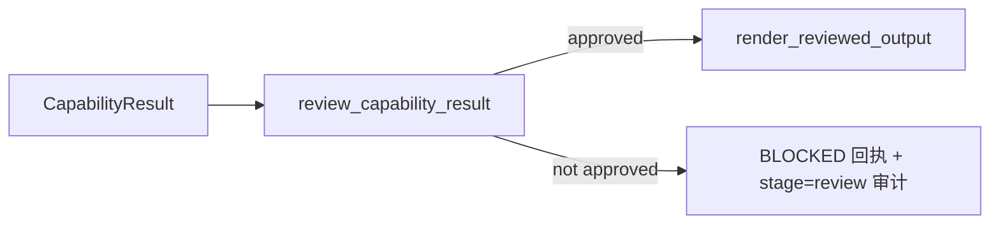

# B08.review-gate 出站审核

<!-- BOARD-AUTO:BEGIN -->
<!-- 本节由 scripts/board_doc_sync.py 生成，请勿手改；正文写在标记外 -->

## B08.review-gate 出站审核

> 发送前的统一审核面与 BLOCK 观测。

- 归属板块：[B08](../README.md)
- 实现落点：`plugins/bot_unified_runtime/domains/render/reviewer.py`

### 三级入口

| 三级入口 | 路由席位 | 能力 id | 别名/帮助页 | 优先级 |
|---|---|---|---|---|
<!-- BOARD-AUTO:END -->

## 这个功能解决什么

任何能力产出的内容在真正出门（渲染、入队、发送）之前，都要先过一道审核面。它替管理员守住三类底线的最后一环：把可能泄漏到聊天里的密钥与内部标记剥在拦截面、把不适合进群的内容拦在群门外、把「守岸人突然自称通用 AI」这类人格走样的回复拦下来。没有这道门，坏内容会直接经渲染管线发到 QQ/TG。

## 处理流程

真身是 `domains/render/reviewer.py::review_capability_result`，由 `output/reviewer.py` 再导出垫片对外暴露同名。管线在能力返回、且「空正文 A-19 分支」之后无条件调用它（见 `domains/chat_reply/runtime/pipeline.py` 的 `review = review_capability_result(...)`），因此审核没有独立开关、始终生效。它把会出门的文本汇成两条不同取范围的待审串分别用规则：泄漏面（密钥、`[UNTRUSTED_USER_TEXT]` 等内部标记）扫较宽的键集，内容面（露骨/暴力/辱骂、且仅在群会话）只扫消息载荷键集——因为卡片里的 `label`/`description` 常是上游原文（新闻标题、公告摘录），用内容面去裁它们会误杀正常卡片。人格走样判定只作用于 `bot.chat`，避免把语音命令里回显的用户原文当成「守岸人自述」。

## 边界与降级

- 命中风险时 `approved=False`，动作为 `ReviewAction.BLOCK`；个人隐私/凭据级内容发往群时改判 `MOVE_PRIVATE`。
- 拦截的用户可见文案由 `pipeline.py::_review_block_public_message` 决定：泄漏类与默认给「输出未通过安全或隐私检查。」，人格走样给一句回到守岸人立场的安抚话术。
- `_collect_scan_text` 的产物只喂规则、刻意不并入 `safe_text`：renderer 拿 `safe_text` 当外发正文，把媒体文本混进去会让一条音频额外发成一条文字消息。
- 本面不接外部依赖，也无权限门与限额；判定纯粹是本地规则，fail-closed（命中即拦）。

## 测试与验收

审核规则的行为锁以 `tests/` 下 review 相关用例为准（真身在仓库测试树内检索 `review_capability_result`），生成物 `docs/auto-facts.md` 汇总测试文件清单；拦截面属主链路 review 段，重启后按 `docs/acceptance-manual.md` 走真机验收。

## 现行缺陷

审核的「存在性」与「活性」历史上分过分叉：早期媒体能力把 `body/summary/title` 留空，导致只看这三样的旧实现恒无输入而免检（reviewer.py 内注记 M-02 的中央半，现改为按 `_META_TEXT_KEYS`/`_PAYLOAD_TEXT_KEYS` 双集扫描已收口）。逐条缺陷以 `docs/boards/_meta/code-quality-findings-20260921.md` 与旧问题台账为准。
