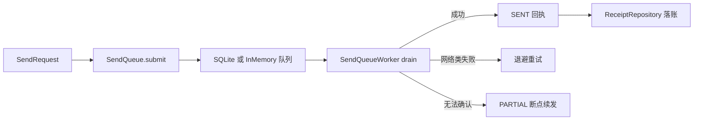

# B08.send-queue 发送队列与回执

<!-- BOARD-AUTO:BEGIN -->
<!-- 本节由 scripts/board_doc_sync.py 生成，请勿手改；正文写在标记外 -->

## B08.send-queue 发送队列与回执

> part 级幂等、UNKNOWN 确认、PARTIAL 断点续发与投递回执。

- 归属板块：[B08](../README.md)
- 实现落点：`plugins/bot_unified_runtime/domains/transport/sender`
- 帮助主题：回执
- 配置键前缀：`bot_send_queue_`（逐键以目录册为准）

### 三级入口

| 三级入口 | 路由席位 | 能力 id | 别名/帮助页 | 优先级 |
|---|---|---|---|---|
| [SQLite 队列与恢复](queue-persistence.md) | — | — | — | — |
| [回执与对账](delivery-receipt.md) | — | — | — | — |
<!-- BOARD-AUTO:END -->

## 这个功能解决什么

消息渲染好之后不直接怼到协议端，而是先进一个可持久、可重试、可断点续发的发送队列。它替运维解决三件事：Bot/协议端临时不在线时消息不丢（排队等恢复）、一条长回复被切成多个 part 时逐 part 记账（不整条重发防重复投递）、发送结果留下可对账的回执。

## 处理流程

队列契约 `SendQueue`（Protocol，`submit`/`find_request`/`safe_summary`）由 `domains/transport/sender/queue.py::build_send_queue(config, audit_logger)` 选择实现：`bot_send_queue_enabled` 且 `bot_send_queue_db_path` 非空时给 `SQLiteSendRequestQueue`，否则退回 `InMemorySendQueue`。取件与重试在 `SendQueueWorker`（`worker.py`），回执账本在 `receipts.py::build_receipt_repository`。主动投递一律经 `submit_active_push` 走 outbound_gate，不直调队列 `submit`（那是另一道闸，见本板块出站统一口径）。

## 边界与降级

两个持久实现都「按配置缺省关闭」：`bot_send_queue_enabled` 与 `bot_receipts_enabled` 缺省均为 False、db_path 缺省为空，因此默认运行形态是内存队列 + 内存回执，重启即清空——这是现状而非缺陷，要落 SQLite 需管理员显式开启并给路径。队列侧键还包括条目上限、最大尝试次数、重试退避底/顶秒数、Bot 不可用回执的年龄上限（超龄自动清理），逐键以 `config.py`/目录册为准。§9.3 UNKNOWN 确认协议：生产确认器缺省为 None，无法确认的 part 绝不盲发重投（宁可停在 PARTIAL 等人工/平台确认，也不冒重复投递之险）。

## 测试与验收

队列、重试、断点续发与回执的用例以仓库 `tests/` 相应件为准（清单见生成物 `docs/auto-facts.md`）；投递回执属主链路 receipt 段，重启后真机验收按 `docs/acceptance-manual.md` 走。

## 现行缺陷

`bot_send_queue_enabled`/`bot_receipts_enabled` 缺省关意味着「持久发送」在默认部署下未启用，运维若以为已持久化会误判；此点应显式在部署文档置顶。逐条以 `docs/boards/_meta/code-quality-findings-20260921.md` 为准。
