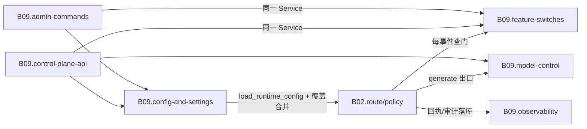

# B09 控制面·配置·可观测

<!-- BOARD-AUTO:BEGIN -->
<!-- 本节由 scripts/board_doc_sync.py 生成，请勿手改；正文写在标记外 -->

## B09 控制面·配置·可观测

> 一切状态可查、一切开关可控、一切动作可审计。

职责：

- /api/v1 统一 envelope、鉴权与 OpenAPI
- 配置单一入口、热更与重启口径诚实
- 日志、指标、Trace、审计四类可观测面
- 模型供应商/渠道/模型三级控制与账本

### 二级功能

| 二级功能 | 一句话 | 三级入口 |
|---|---|---|
| [控制面 API 与工作区](control-plane-api/README.md) | loopback + Bearer 的 /api/v1 端点群、工作区沙箱与动作执行。 | [统一响应与错误码](control-plane-api/api-envelope.md)、[鉴权与角色边界](control-plane-api/auth-and-rbac.md)、[工作区沙箱与真实会话](control-plane-api/workspaces.md)、[白名单远程动作](control-plane-api/remote-actions.md) |
| [配置与运行时设置](config-and-settings/README.md) | Config 单一入口、SETTABLE_KEYS/RESTART_REQUIRED_KEYS 与读取端点，以及危险参数改动的书面同意命令面（咽喉的四档裁决住 safety_exec）。 | [书面同意](config-and-settings/consent.md)、[字段声明与校验器](config-and-settings/config-declaration.md)、[热更、drain 与回滚](config-and-settings/hot-reload-model.md)、[示例与目录三处同源](config-and-settings/env-example-catalog.md) |
| [功能开关树](feature-switches/README.md) | 组/插件/子功能/指令四级开关与依赖阻断显示。 | [父子继承与 blocked_by](feature-switches/feature-gate.md) |
| [日志·指标·Trace·审计](observability/README.md) | 统一事件总线、来源枚举、指标结构化与轨迹阶段表。 | [宿主机状态](observability/host-state.md)、[统一事件与 SSE](observability/event-bus.md)、[指标结构化来源](observability/metrics-sources.md)、[轨迹阶段与脱敏](observability/trace-stages.md)、[运维告警与抑制](observability/ops-alerts.md)、[宿主快照分区注记口](observability/host-snapshot-section.md) |
| [模型路由与账本](model-control/README.md) | provider/channel/model 三级、failover、上下文钳制与计费账本。 | [优先级组与失败转移](model-control/model-router.md)、[链级快速中止与冷却](model-control/fail-fast.md)、[上下文与输出钳制](model-control/context-caps.md)、[调用记录与计价](model-control/billing-ledger.md) |
| [管理命令面](admin-commands/README.md) | 管理员与超管专属命令、诊断与恢复动作。 | [诊断与快照](admin-commands/diagnostics.md)、[自愈与回滚](admin-commands/recovery.md) |
<!-- BOARD-AUTO:END -->

## 板块职责

上方清单说的是"有什么"，这里说的是"为什么这样切"。

本板块管的是**运行时的可见性与可控性**，不管业务本身。判断一件事属不属于 B09，
用一条线：它是不是"关于 bot 自身状态"的信息或动作。某条消息怎么被路由（B02）、
某张卡怎么渲染（B08）不归这里；但"这条消息走过了哪些阶段、能不能把它查出来"
"这个能力此刻是不是被关着""管理员在群里说一句话就能改参数"归这里。

二级功能按**信任边界**切，不按代码目录切：

- `control-plane-api` 是唯一对外 HTTP 面，独立端口、独立鉴权、独立进程内挂载生命周期；
- `config-and-settings` 管"值的真相从哪来"（装载入口 + 覆盖存储 + 热更性判定）；
- `feature-switches` 管"能不能执行"（每事件读快照的执行门）；
- `observability` 管"事后看得见"（事件、指标、轨迹、审计、告警）；
- `model-control` 管"最贵的那条外部依赖"（路由、failover、钳制、账本）；
- `admin-commands` 管"没有 WebUI 时怎么活着"（/bot 命令面与 API 面共用同一 Service）。

之所以把"模型控制"和"管理命令"放进本板块而不是各自单开一块，是因为它们的
共同属性是**运维面**而非用户功能面：`/bot runtime set` 与 `POST /api/v1/config/{key}/set`
调的是同一个 `ConfigControlService`，`/bot feature enable` 与
`POST /api/v1/features/{id}/enable` 调的是同一个 `FeatureControlService`。
拆开放两处就会长出第二套真身，那正是本项目最反对的事。

## 上下游

本板块被所有板块读写，但**绝不在业务链路里当第二套判定**。它只出现在三处：

入站：B02 主链路的每个阶段都往这里交证据（审计 `AuditRecord`、回执 `DeliveryReceipt`、
运行时事件）。出站：不产出用户可见内容，只产出状态、指标、日志与告警；唯一例外是
主动预警——它借 B08 的出站管线投递给管理员，绝不另开通道。

## 退役与并入记录

- 旧权威件 `docs/design/control-plane-api.md`、`control-plane-registry.md`、
  `control-plane-events.md`、`control-plane-core-status.md` 保留在原地：它们是**规格**
  与**切片事实页**（含设计取舍与开放问题），本板块是**现役说明书**。冲突时以代码为准，
  再回改本板块。
- 协议端更名：日志源枚举键 `napcat`、动作名 `napcat.status` 是稳定契约标识符，
  未随 2026-09-18 起的实体更换（NapCat → SnowLuma）改名；正文凡指"当前 QQ 协议端"
  一律写 SnowLuma，看到 `napcat` 字面量按历史标识符理解即可。
- 控制面早期文档里的"M1 骨架 / M2+ 不做"是当时口径。现役面已超出该口径（配置读写、
  工作区、动作、平台资源、WebUI 端点群都已落地），但**默认开关关、真实执行端口多数
  未装配**——各二级页的「现行缺陷」按代码实况逐条写，不以设计文档口径宣成完成。
