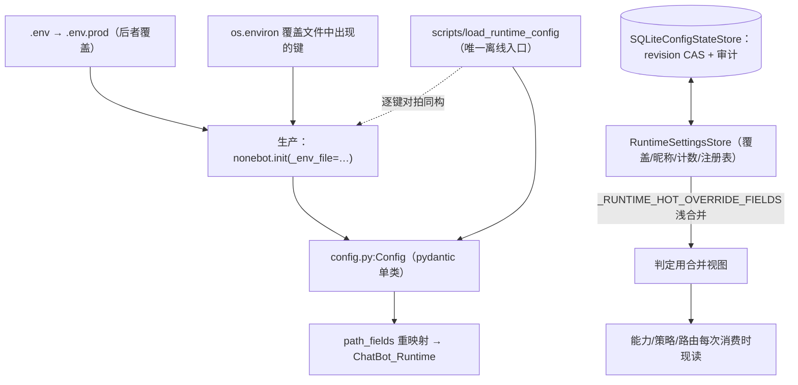

# B09.config-and-settings 配置与运行时设置

<!-- BOARD-AUTO:BEGIN -->
<!-- 本节由 scripts/board_doc_sync.py 生成，请勿手改；正文写在标记外 -->

## B09.config-and-settings 配置与运行时设置

> Config 单一入口、SETTABLE_KEYS/RESTART_REQUIRED_KEYS 与读取端点，以及危险参数改动的书面同意命令面（咽喉的四档裁决住 safety_exec）。

- 归属板块：[B09](../README.md)
- 实现落点：`plugins/bot_unified_runtime/config.py`、`plugins/bot_unified_runtime/domains/core/config`、`plugins/bot_unified_runtime/domains/chat_reply/runtime/settings.py`、`docs/config-catalog-full.md`
- 路由席位：`CONSENT`
- 帮助主题：配置, 设置, 就绪, 书面同意

### 三级入口

| 三级入口 | 路由席位 | 能力 id | 别名/帮助页 | 优先级 |
|---|---|---|---|---|
| [书面同意](consent.md) | CONSENT | bot.consent | 书面同意 | 41 |
| [字段声明与校验器](config-declaration.md) | — | — | — | — |
| [热更、drain 与回滚](hot-reload-model.md) | — | — | — | — |
| [示例与目录三处同源](env-example-catalog.md) | — | — | — | — |
<!-- BOARD-AUTO:END -->

## 这个功能解决什么

一个 bot 跑起来之后，"现在实际生效的配置是什么"这个问题本该有一个确切答案。
现实里它经常没有：`.env` 写着一个值、代码默认值另一个值、运行时覆盖第三个值、
重启没重启又是另一回事。历史上真出过事故——`.env` 写 `gpt-5.6-terra`、实际跑的是
另一个模型；群名单在两处不一致。这一层存在的意义就是把"值的真相"收成一处，
并且**诚实标注哪些能热改、哪些必须重启**。

第二个动机是离线可复现：体检脚本、重启前检查、冒烟控制台都需要一份和生产
**逐键同构**的配置，否则就会拿假红当故障（旧态下 `.env` 里 `0.05  # 注释` 这种
合法写法被体检器判成错，`.env.prod` 的覆盖被看成没生效）。

## 处理流程

只画配置这一段。装载优先级（=生产链语义）：逐文件 dotenv 读、后者覆盖前者、
`os.environ` 只覆盖文件里出现过的键、extras 走 JSON 解码（非空值试 `json.loads`，
失败回退原串）、`translate_env_keys` → `Config.model_validate`。

## 边界与降级

- 密钥不落在配置里：配置字段写 `env:变量名` 引用，真身只在 `.env`。
  读 API 出口一律过 `config_store.public_value`：凭证类字段值替成 `[redacted]`，
  只留 `configured` 与 SHA-256 fingerprint。
- 冻结键不假装热改：`RESTART_REQUIRED_KEYS` 里的键**可读不可写**，写它 409 并
  在文案里点名是哪个消费点在装配期把值烘死了。判据只有一条——每次消费时现读
  store/合并层 = 可热改；装配期快照进调度器/工厂/线程池闭包/PolicySettings = 重启键。
- 装载入口的严格模式：`load_runtime_config(required=True)` 时一个 env 文件都不存在
  直接抛 `RuntimeEnvNotFoundError`，拒绝静默回退全默认（静默回退会让体检器把
  "根本没读到配置"报成"配置没问题"）。
- 覆盖存储损坏不静默清空：JSON 侧遇到坏文件保留现场改名 `*.corrupt` 再走空态；
  SQLite 侧以 `revision` CAS + 事务回滚保证"要么全成要么不改"。
- 未登记的键一律不可读写：`config_store.normalize_key` 只认两张登记表之并集。

## 测试与验收

`tests/test_runtime_config_loader.py`（与 nonebot `DotEnvSettingsSource` 逐键 +
`Config.model_dump` 对拍同构、行内注释、`.env.prod` 覆盖、JSON 解码）、
`test_config_control_service.py`（CAS/preview/审计/reset_all 单次提交）、
`test_runtime_settings_restart_required.py`（冻结键拒绝写入 + 文案点名消费点）、
`test_settings_hot_audit.py`、`test_config_id_list_scalar.py`（QQ 号 int→str 宽容装载）、
`test_config_json_validators.py`、`test_smoke_config.py`；
文档一致性门：`test_doc_sync_gates.py::test_config_catalog_covers_config_fields`
（catalog 必须覆盖 Config 全字段）。字段数、路径字段数一律以
`docs/auto-facts.md`（`scripts/doc_sync.py` 派生）为准，不在叙述文档手写。
真机：`python scripts/verify_chatbot_env.py` 与重启门 `scripts/pre_restart_check.py`
（两者都走同一装载入口，不再自带解析器）。

## 现行缺陷

- 装配期快照的存量面仍在：SQLite 限流路径不支持热改、若干调度器族在装配时抓 config
  快照（旧台账 #3 口径），这些键被诚实登记在 `RESTART_REQUIRED_KEYS`，
  但**根治**（消费点接进合并层）尚未做，属待统一改造项。
- `SETTABLE_KEYS` 与 `RESTART_REQUIRED_KEYS` 是人工复核出来的两张表（最近一次全量
  回标是 2026-09-15 热改面审计），新增键若没人复核消费点，就可能又变成
  "写成功但行为不变"——目前只有测试面守写法，没有门能自动判定热更性。
- 配置读取的"四消费方"约定靠纪律 + 对拍测试，不是 import 级强制；绕开
  `load_runtime_config` 自造装载器仍是可能的（历史上正是这么漂移的）。
