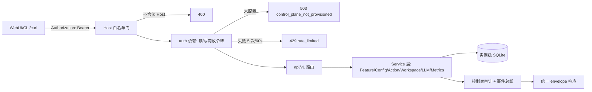

# B09.control-plane-api 控制面 API 与工作区

<!-- BOARD-AUTO:BEGIN -->
<!-- 本节由 scripts/board_doc_sync.py 生成，请勿手改；正文写在标记外 -->

## B09.control-plane-api 控制面 API 与工作区

> loopback + Bearer 的 /api/v1 端点群、工作区沙箱与动作执行。

- 归属板块：[B09](../README.md)
- 实现落点：`plugins/bot_unified_runtime/control_plane`
- 配置键前缀：`bot_control_plane_`（逐键以目录册为准）

### 三级入口

| 三级入口 | 路由席位 | 能力 id | 别名/帮助页 | 优先级 |
|---|---|---|---|---|
| [统一响应与错误码](api-envelope.md) | — | — | — | — |
| [鉴权与角色边界](auth-and-rbac.md) | — | — | — | — |
| [工作区沙箱与真实会话](workspaces.md) | — | — | — | — |
| [白名单远程动作](remote-actions.md) | — | — | — | — |
<!-- BOARD-AUTO:END -->

## 这个功能解决什么

给"未来要做的 WebUI"和一个人类排障者提供同一个后端：一个只能从本机访问的 HTTP 面，
把 bot 内部所有可查状态、可改参数、可执行动作统一成带版本的 REST 资源，并且
把每一次写都留下能追责的审计。现在没有前端页面，所以这一层的价值是**协议先站稳**——
前端将来换模板（AxonHub 或别的），后端不用改。

它解决的第二个问题更实际：管理员不在电脑前时，能不能靠一次 API 调用看清
"这个能力现在到底开没开、这个参数现在实际是多少、刚才那条消息死在哪一段"。
答案以前散在日志里、要人肉 grep；现在它们有结构化的读口。

第三个问题是安全：任何能改状态的入口都可能是攻击面，所以这一层的设计前提是
"假设有人拿到我的浏览器 / 假设端口被人扫到"——Bearer 只存摘要、Host 头硬校验、
未配置令牌时整个 API 面直接 503、写操作要第二枚独立的超管令牌。

## 处理流程

本卡只画控制面自己那一段。业务主链路（route → capability → review → renderer →
send_queue）在 B02/B08，控制面**不插入**其中任何一步，只从旁读取状态或经
Service 层改配置。

## 边界与降级

- 总开关 `bot_control_plane_enabled` 缺省 **false**：关闭时不启动服务，包顶层不导入
  fastapi/uvicorn（惰性 `__getattr__`），零导入副作用。
- 端口与地址：独立监听（缺省 `127.0.0.1:8742`），**不复用** NoneBot webhook 8080；
  绑非环回地址需要 Runtime 数据目录下的确认文件，`serve()` 与
  `register_control_plane_lifecycle()` 两处都会拒绝（返回码 2 / 状态 `failed`、
  失败码 `host_not_allowed`），且端口撞 8080 或撞 driver 端口同样拒。
- 存储不可用一律 503 且**不假报成功**：配置、动作、工作区、事件四套 SQLite 各自
  把 `sqlite3.Error/OSError` 映射成稳定码（`config_store_unavailable`、
  `action_store_unavailable`、`workspace_store_unavailable`、`events_unavailable`）。
- 不暴露内部对象：HTTP 层永不返回 `str(exc)`、环境变量原文、SQL、文件路径；
  未捕获异常统一 500 `internal_error`，日志里只留 `request_id` 与异常**类型名**。
- 采集失败不阻塞主链路：日志/事件面是 best-effort 有界队列，队满即丢弃并计数。

## 测试与验收

`tests/test_control_plane_m1.py`（健康面/鉴权/未配置 503）、
`test_control_plane_host_guard.py`（Host 白名单与多值 Host 头拒绝）、
`test_control_plane_lifecycle.py`（启停状态机、bind_failed 截住 SystemExit）、
`test_control_plane_v1.py`（envelope/OpenAPI/features/config 端点）、
`test_control_plane_services.py`、`test_config_control_service.py`、
`test_control_plane_actions.py` + `test_control_plane_actions_api.py`、
`test_control_plane_workspaces.py` + `test_control_plane_workspaces_api.py`、
`test_control_plane_sandbox.py`、`test_control_plane_metrics.py`、
`test_control_plane_resources.py`、`test_control_plane_events.py`、
`test_control_plane_log_collectors.py`、`test_v21_s9_llm_api.py`、
`test_webui_http*`。用例数以最近一次 `dev.ps1 -Task test` 实跑为准。
真机：控制面启动后 `GET /healthz`（免鉴权）与 `GET /api/v1/protocol`（带 Bearer），
逐端点验收见 `docs/acceptance-manual.md` 的控制面节。

## 现行缺陷

- **控制面默认关**，且**多数动作/端口只到协议层**：`GET /api/v1/protocol` 自报家门的
  字段就是诚实清单——`traces.available=false`、`persona_versions.available=false`、
  `features.subfeatures_complete=false`、`features.reload_drain=false`。
- Workspace 的 **real_session 端口未装配**：`factory.build_workspace_service` 只注入
  `sandbox_generator`，`real_adapter` 恒为 None，于是 real_session 建区 503
  `real_session_unavailable`、真实发送 503 `not_wired`（详见 [workspaces](workspaces.md)）。
- `/api/v1/traces` 有两条同路径实现（v1 的 503 占位与 platform 的真资源口），靠注册顺序
  与显式 `operation_id` 区分；主链路**不自动写 trace 行**，详见 [trace-stages](../observability/trace-stages.md)。
- 动作面 13 个 id 全登记，但真实执行适配器多数未接（`queue.*` 需装配注入 send_queue、
  `napcat.status` 需实时探针），未接者返回 `status=degraded` 而非假称成功；
  回滚适配器**结构性不存在**（`rollback_supported=True` 在构造期即 raise）。
- 设计文档中的"M2+ 不做"口径已过期，`docs/design/control-plane-*` 与现役代码有落差，
  以本板块与 `docs/design/control-plane-core-status.md` 为准。
