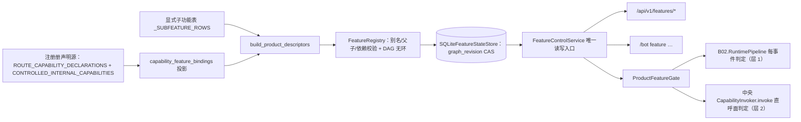

# B09.feature-switches 功能开关树

<!-- BOARD-AUTO:BEGIN -->
<!-- 本节由 scripts/board_doc_sync.py 生成，请勿手改；正文写在标记外 -->

## B09.feature-switches 功能开关树

> 组/插件/子功能/指令四级开关与依赖阻断显示。

- 归属板块：[B09](../README.md)
- 实现落点：`plugins/bot_unified_runtime/domains/ops/features`
- 帮助主题：运行开关

### 三级入口

| 三级入口 | 路由席位 | 能力 id | 别名/帮助页 | 优先级 |
|---|---|---|---|---|
| [父子继承与 blocked_by](feature-gate.md) | — | — | — | — |
<!-- BOARD-AUTO:END -->

## 这个功能解决什么

让"关掉某个功能"成为一个**有明确语义、可追溯、不会自欺**的操作。这句话听起来
平淡，但本项目在这上面吃过三类亏：开关写了没消费方（死开关）、关了但正在跑的
任务继续跑（假停）、以及关错了把审计/错误处理一起关掉导致故障时什么都看不见
（自毁式可控）。

四级树（组 → 插件 → 子功能 → 指令/自动回复/定时任务）解决的是"关父带子"的
继承表达；`blocked_by` 与 `inherited_from` 解决的是"为什么现在是关的"这个问题
——是有人显式关的，还是被父级/依赖带下来的，两者处置方式完全不同。

## 处理流程

一条主链路一张图：树构建与判定只在本板块，业务侧只有"被门挡住"这一个接触点。

## 边界与降级

- 树**不扫描源码**：节点全部由声明源投影 + 显式子功能表构造（"未登记即不受控"，
  而不是"猜一遍"）。
- 四个受保护 id（`bot.control_plane`、`bot.audit`、`bot.error_handling`、
  `bot.persona.safety`）+ `RECOVERY_CAPABILITIES` 里的恢复类能力**结构性关不掉**：
  关闭动作若波及它们，`PermissionError` → 403 `feature_protected`。这是防止
  "把眼睛和降落伞关掉"的硬护栏，不是配置项。
- 门查询故障 **fail-closed**：状态读取异常时快照 `available=False`，所有判定
  一律拒绝执行（除恢复类能力），回执「这项功能暂时不可用。」并落审计
  （stage=policy，event=失败原因），**绝不退化成"读不到就放行"**。
- 层 2 直呼面（绕过 pipeline 直接 `CapabilityInvoker.invoke`）自 2026-09-23/24 起同样过这道门：
  经唯一注入口 `attach_default_feature_gate` 复用同一判定真身 `check_capability`，三条边界=只对
  `gate_feature_bindings()` 在册受门者执法、未受门 pass-through、读不到状态 fail-closed；当前直呼
  入口的能力全部未受门 ⇒ 层 2 新增执法面为空（机制成立 ≠ 已对所有能力执法）。完整口径见
  [feature-gate.md](feature-gate.md) 与 `docs/design/control-plane-registry.md`。
- 并发用双 CAS：节点级 `version` + 图级 `graph_revision`，`None`/省略不视为
  "跳过校验"而是直接 422（不给绕过 CAS 的后门）。
- 不强杀在跑的任务：`/bot feature` 的回执文案就写明"已运行的任务不会被强杀"，
  变更只影响后续判定。

## 测试与验收

`tests/test_runtime_feature_gate.py`（放行/拒绝/未登记/故障 fail-closed/恢复能力豁免
五态与告警去重）、`tests/test_feature_gate_layer2.py`（层 2 直呼面：三边界与纯转发/不抄名单/根装配
结构锁）、`test_phase0_3_features.py`（树语义：父关带子、blocked_by、
inherited_from、受保护拒绝）、`tests/test_feature_store_integrity.py`
（revision CAS、坏状态拒绝恢复默认、legacy 导入封口）、`test_feature_store_integrity.py`、
`test_feature_cards.py`、`test_runtime_subfeatures.py`（显式子功能与实现坐标一致性）、
`test_control_plane_v1.py`（features 端点族）、`test_board_taxonomy_gate.py`
（板块树与声明源互锁）。真机：`/bot feature list` → `preview <id> off`（看 affected_ids）
→ `disable <id>` → 发一条该能力消息确认被拦并给温和文案 → `reset <id>` 复原。

## 现行缺陷

- **覆盖率不完整且已自报**：`GET /api/v1/protocol` 里
  `features.coverage="routes_internal_commands_and_explicit_subfeatures"`、
  `subfeatures_complete=false`、`reload_drain=false`。也就是说：路由席位与显式登记的
  子功能受控，**没有登记进去的内部步骤不受控**（会被门以 `feature_unregistered`
  拒绝执行，同时 WARNING 点名要求补登记，但那是"拒做"而不是"可控地关")。
- 没有 drain/reload 语义：关闭一个功能不会影响已在途的任务，也不会重建已装配的
  资源；对装配期烘进闭包的调度器/线程池/工厂，功能门本就管不到（那属于配置面
  `RESTART_REQUIRED_KEYS` 的辖区）。
- 因此准确说法是：**门在链路上是真执法的，但"停用某插件"不等于"该插件的所有
  活动都停了"**。谁把 `effective_enabled=false` 直接叙述成"生产已停止该功能"，
  就是虚报。
- 未登记能力的 WARNING 是进程级去重（每 id 一次），长期跑着不再提醒，需靠
  审计/日志回看，容易被忽略。
