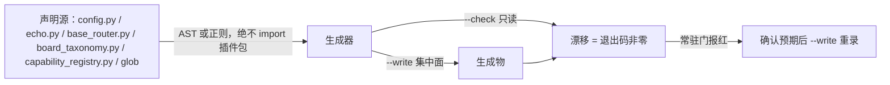

# B10.generated-artifacts 生成物与机器事实册

<!-- BOARD-AUTO:BEGIN -->
<!-- 本节由 scripts/board_doc_sync.py 生成，请勿手改；正文写在标记外 -->

## B10.generated-artifacts 生成物与机器事实册

> doc_sync / command_catalog / verify_hashes 三件与 auto-facts 投影。

- 归属板块：[B10](../README.md)
- 实现落点：`scripts/doc_sync.py`、`scripts/command_catalog.py`、`docs/auto-facts.md`

### 三级入口

| 三级入口 | 路由席位 | 能力 id | 别名/帮助页 | 优先级 |
|---|---|---|---|---|
| [会漂移计数的唯一落点](machine-ledger.md) | — | — | — | — |
| [交付物哈希与重录时机](hash-bookkeeping.md) | — | — | — | — |
<!-- BOARD-AUTO:END -->

## 这个功能解决什么

文档里的数字会过期，人会忘记同步。这个功能簇把「会漂移的事实」从叙述文档里搬进**机器所有**的生成物：谁问「有多少个配置字段」「模板全家是哪些」「路由席位清单」，答案只准出自生成物，不准出自任何手写的句子。

四件生成物、四个生成器，一一对应：

| 生成器 | 产物 | 派生方式 |
|---|---|---|
| `scripts/doc_sync.py` | `docs/auto-facts.md`（机器事实册） | 代码/清单机械推导，全册机器所有 |
| `scripts/command_catalog.py` | `docs/command-catalog.md`（逐参数命令教程目录） | 静态解析帮助注册表与路由 manifest |
| `tests/verify_hashes.py` | `tests/render_hashes.json`（交付物 SHA-256 台账） | 清单文件内容哈希 |
| `scripts/board_doc_sync.py` | `docs/boards/**`（十板块树自动生成段） | AST 解析三份声明源 |

## 处理流程



两层设计要记住：**声明源单点 → 生成物投影 → 常驻门比对**。生成器一律不 import 插件包（插件根 `__init__.py` 是重件，导入会触发 NoneBot 装配），全部走 AST/正则静态解析；这样生成物能脱离 bot 独立重算，也保证「读到的就是文件里写的」。

`command_catalog.py` 有个值得单独记的取舍：帮助 `detail` 的【指令与参数】段在 `echo.py` 里已不手写，由 `_compose_help_detail()` 装配期从 `lines[]` 派生。生成器**不复写**那段派生逻辑（复写即造第二事实源），而是按 AST 取 `echo.py` 中该定义的源码片段就地 `exec`——实现仍只有一份，它改这里自动跟随，它改名或删定义这里立刻抛错（宁红不静默漂移）。

## 边界与降级

- 生成物**只准机器写**：`docs/auto-facts.md`、`docs/command-catalog.md`、`docs/config-catalog-full.md` 头部、`tests/render_hashes.json` 属机器所有或半自动，人工正文只允许写在 `<!-- BOARD-AUTO:BEGIN -->…END` 标记之外。
- `--write` 是**集中面**：多席并发时只由主会话跑，各席只跑只读 `--check` 自检。理由很直白——`--write` 会把别席正在改的中间态固化成"基线"，等于替别人认账。
- 哈希口径统一「换行转 LF 后再算」：Windows 的 `core.autocrlf` 会把检出转成 CRLF，而 `.gitattributes` 要求 LF，直接哈希原始字节会让同一提交在主仓 / linked worktree / 干净克隆三处得出不同结果。
- 无源即诚实：生成器不猜、不补、不美化。清单里缺文件报 `MISSING`，未登记新交付物报 `NEW`，字节变更报 `DRIFT`，登记了但不在跟踪集报 `STALE`。

## 测试与验收

常驻门：`tests/test_cross_validation_gates.py` 两件（`verify_hashes --check`、`doc_sync --check`）；`tests/test_doc_sync_gates.py`（配置目录对 `config.py` 取集合比对、路由矩阵逐行对齐 `base_router`、matcher 名在代码存在）；`tests/test_verify_hashes_coverage.py`（清单覆盖范围自身）；`tests/test_board_taxonomy_gate.py`（板块生成物与代码同步）。

自检复跑（只读，安全）：

```
python scripts/doc_sync.py --check
python tests/verify_hashes.py --check
python scripts/command_catalog.py
python scripts/board_doc_sync.py --check
```

（直跑解释器须带 `PYTHONDONTWRITEBYTECODE=1`，不在源码树留 `__pycache__`。）

## 现行缺陷

- 生成物覆盖不对称：`docs/config-catalog-full.md` 是**半自动**（按功能域人工收录 + 门禁比对键集），新增键若忘了补录，只有 `tests/test_doc_sync_gates.py` 的覆盖门会红，正文描述可能长期失真（历史上出现过截断失实与语义过期两处，已修）。
- `doc_sync.py` 用正则从源码里"抠"事实（`RouteKind` 枚举体、`"topic":` 字面量、`bot_*:` 字段行），写法一变即静默失配——枚举体后面若不出现约定的空行分隔、或 topic 改用变量拼装，册子会少算而不报错。缓解手段是把提取器本身当被测对象（`tests/test_doc_sync_gates.py` 取集合比对）。
- 多波并发期间 `--write` 会把**他波在飞**的中间态写进生成物（历史上一次重录顺带写入了别波的路由/别名/模板计数漂移）。纪律：如实报备、不代修，由生成物 owner 在树稳定后统一收敛。
- 板块树生成段与叙述文档之间没有"内容一致性"门，只有"计数归属"门：正文说错了机制，机器不管，只能靠评审（见 `REVIEW-WORKFLOW.md` §4 固定清单的文档项）。
