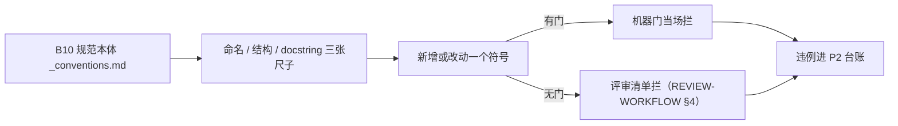

# B10.naming-conventions 命名与结构规范

<!-- BOARD-AUTO:BEGIN -->
<!-- 本节由 scripts/board_doc_sync.py 生成，请勿手改；正文写在标记外 -->

## B10.naming-conventions 命名与结构规范

> 模块/函数/参数/配置键命名与一功能一目录的结构规范。

- 归属板块：[B10](../README.md)
- 实现落点：`docs/boards/_conventions.md`

### 三级入口

| 三级入口 | 路由席位 | 能力 id | 别名/帮助页 | 优先级 |
|---|---|---|---|---|
| [标识符与参数命名规则](identifier-naming.md) | — | — | — | — |
| [模块与目录归属规则](module-layout.md) | — | — | — | — |
| [函数说明文档骨架](docstring-spec.md) | — | — | — | — |
<!-- BOARD-AUTO:END -->

## 这个功能解决什么

本簇是「一份规范 + 它的执法现实」。规范本体只有一处：`docs/boards/_conventions.md`——那是十板块文档树的宪法，规定三层结构、文件结构、命名、开发约束、自动化变更契约、统一口径、问题分级、代码质量红线。**规范正文见该件，本簇不抄第二份**（抄一份就是造第二事实源，正是本仓在治的病）。

本簇补的是规范里没写、但接手的人第一时间要问的三件事：

- 每条命名规则**由谁执法**：哪些是机器门，哪些只有评审。
- 一个东西该放哪个目录、什么情况下算「第二真身」。
- docstring 的骨架为什么长那样、以及它靠什么不被写成装饰。

## 处理流程

## 边界与降级

执法分三层，边界必须说白，否则会误以为「机器没红就是合规」：

- **静态门**：`tests/test_board_taxonomy_gate.py` 管板块 slug 全 kebab、二级 id 前缀、板块编号连续；`tests/test_documentation_consistency.py` 管帮助主题唯一性、别名冲突、配置键可解析、测试路径存在；`tests/test_doc_sync_gates.py` 管配置目录对 `config.py` 全覆盖；`tests/test_route_kind_values_complete` 类锁管路由枚举值形态。`dev.ps1 -Task lint` 只有 ruff 缺省规则集（`pyproject.toml` 的 `[tool.ruff]` 未 `select` 任何附加规则族），所以它抓语法错、未用导入之类，**不执法命名风格、不执法 docstring**。
- **结构门**：AST 扫「同一路辑第二真身」「旧路径残余」「直调中央件旁路」，如垫片退役与迁域各波的 AST 零残余核对、`tests/test_v21_wiredirect_unified_path.py` 的存量族结构锁、`tests/test_capability_result_unique.py` 的重名归并唯一性门。
- **评审**：其余靠 `REVIEW-WORKFLOW.md` 的固定清单与严重度定义（M 级即含「声称与实现不符」）。规范第七节的质量红线（一文件一职责、禁吞异常、禁未登记全局可变状态、禁空壳、删除即删除）**目前无静态门**，属人判面。

降级口径：规范件与代码事实冲突时以代码为准，并**立刻改规范件**；与本文件冲突的旧文档（`docs/HANDBOOK.md` 历史章节、各 `HANDOFF-*` 波次件）一律以规范件为准。

## 测试与验收

改任何命名/结构规范，验收动作是「三查」：查该条有无门（没有就在规范件写明靠评审）、查生成物是否要重录（板块树与机器册都派生自命名）、查叙述文档是否残留旧名（`tests/test_doc_link_integrity.py` 的坐标与载体门会报死引用）。

新增一个层名的唯一正路：先在 `docs/boards/_conventions.md` 第一节登记一行并说明为什么，再落代码。

## 现行缺陷

- 命名与 docstring 的自动化执法面偏薄：ruff 未开 `N`（pep8-naming）与 `D`（pydocstyle）族，规范里那两张表目前主要靠评审兜住。要不要开门是待裁项，开门会一次性爆出大量存量红，必须配棘轮而不是硬清。
- 配置键的「可热改性」历史上出现过假注释（把不可热改的键写成可热改），已由波次修正；此类语义错机器抓不到。
- 旧路径写法的存量仍未清零：域重组后多数旧路径「存在但只是垫片」，文档坐标必须现查真身（读法见 `docs/db-owners.md` 顶部的路径时效声明）。
