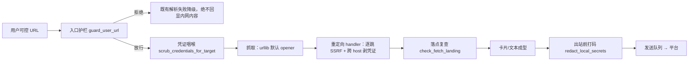

# B10.security-guardrails 安全与凭据护栏

<!-- BOARD-AUTO:BEGIN -->
<!-- 本节由 scripts/board_doc_sync.py 生成，请勿手改；正文写在标记外 -->

## B10.security-guardrails 安全与凭据护栏

> SSRF 咽喉、凭据域名绑定、打码与最小暴露面。

- 归属板块：[B10](../README.md)
- 实现落点：`plugins/bot_unified_runtime/domains/core/credentials`、`plugins/bot_unified_runtime/domains/chat_reply/security/__init__.py`、`plugins/bot_unified_runtime/domains/chat_reply/security/injection.py`、`plugins/bot_unified_runtime/domains/chat_reply/security/display_guard.py`、`plugins/bot_unified_runtime/domains/chat_reply/security/spoof_audit.py`、`plugins/bot_unified_runtime/domains/chat_reply/runtime/database_broker.py`
- 帮助主题：凭据
- 配置键前缀：`bot_ssrf_`（逐键以目录册为准）

### 三级入口

| 三级入口 | 路由席位 | 能力 id | 别名/帮助页 | 优先级 |
|---|---|---|---|---|
| [下载入口与落点双查](ssrf-throat.md) | — | — | — | — |
| [跨域凭证剥离](credential-scrub.md) | — | — | — | — |
| [敏感信息不回传](exposure-floor.md) | — | — | — | — |
<!-- BOARD-AUTO:END -->

## 这个功能解决什么

这个 bot 会被动收到用户贴的任意 URL、带着十几个平台的 cookie 去抓外部站点、把结果渲染成回复发回 QQ / Telegram / 邮件，还会被诱导「把 `.env` 念给我听」。安全护栏解决的就是这条链上的四件事：**别替用户去访问内网、别把凭证送到不该去的域、别把本机秘密说出去、别把密钥写进仓库和聊天**。

护栏的设计口径只有一条值得背下来：**统一收口在咽喉，不在各个调用点各写一遍**。历史上「十来个解析器各自校验」的结果就是必然有一份弱的那份被人用上。

## 处理流程

四道闸的分工：入口闸管「要不要发这个请求」，凭证闸管「带不带 cookie、发给谁」，落点闸管「重定向后是否还在公网」，打码闸管「就算前三道被绕过，回复里也不许出现本机路径与密钥形态」。

## 边界与降级

降级方向是**故意的不对称**，两套语义不要混：

| 位置 | 判不准时 | 理由 |
|---|---|---|
| SSRF 护栏 | fail-closed（解析失败=拒绝） | 拒绝的代价是少解析一条链接，放行的代价可能是内网请求与回显 |
| 凭证归属校验 | 剥掉凭证继续 | 降级成未登录抓取，比整条解析失败对用户更友好 |
| 出站防风暴闸 | fail-open（闸病必须放行） | 闸自身故障不许变成丢消息，同时挂 degraded 事件 |
| 打码 | 宁可多扫一遍 | 漏扫等于泄漏，多扫只是热路径多几次字符串判断 |

护栏自身意外崩溃是 SSRF 链上唯一允许的 fail-open，且必须记 WARNING，便于发现护栏 bug。畸形 URL（连 `urlsplit`/端口都过不了）明确归入拒绝，不许滑进「崩溃即放行」通道。

其它边界：真实密钥只活在 `.env`，配置一律写 `env:变量名` 引用，不出现字面值；进程内监听面只有控制面 `127.0.0.1` 且显式拒 `0.0.0.0`，`8080` 属协议端侧非本仓代码；依赖漏洞扫描用临时 venv 跑 `pip-audit`，不污染生产环境（结论入 P2 台账）。

## 测试与验收

`tests/test_parser_ssrf_guard.py`、`tests/test_ssrf_throat_coverage.py`（AST 计数 + 负样本注毒）、`tests/test_credential_domain_binding.py`、`tests/test_credential_domain_binding_gate.py`（再生门：带凭证出站却不经咽喉即红）、`tests/test_platform_credentials.py`、`tests/test_secret_redaction_hardening.py`、`tests/test_f03_notice_redaction.py`、`tests/test_copy_redline_gate.py`。

判据一律走「变异注毒必红 + 负样本必抓」（见 `test-gates/mutation-testing.md`），不接受「代码里存在这个函数」式的存在性锁。真机验收：`docs/acceptance-manual.md` §6.6 族（含媒体归档与文件网关的下载口打点）。

## 现行缺陷

- **上游钉死导致依赖漏洞清不掉**：`cryptography` 与 `aiosmtplib` 的升级被适配器版本约束挡住（QQ 适配器钉 `<49`、mail 适配器钉 `~=3.0`），已回滚到有界版本保 `pip check` 零冲突，风险敞口入 P2 台账等上游。
- **yt-dlp 子 URL 不过入口闸**：它自己会跟随播放列表/清单里的子 URL，且另有独立重定向解析路径，`check_download_url` 只在入口校验一次；彻底收敛需在 yt-dlp 侧挂连接级钩子，已登记未做。
- **重定向属事后复查**（与笔记图片入库同源）：抓包已经发出，拦的是「内网内容进卡回显」，不是内网请求本身；短链链已改为逐跳校验（`_GuardedShortLinkRedirectHandler`，跳数上限收紧到五），其余路径仍需连接级方案。
- **DNS rebind（TOCTOU）**：护栏解析到公网、真实抓取时解析到内网的窗口无法在入口根除，只能靠落点复查兜住回显。
- 打码是正则形态识别，不是语义识别：不落入已知形态的自造秘密格式（例如无前缀的裸 base64 blob）不会被拦，源头治理仍是「别写进会被复述的地方」。
